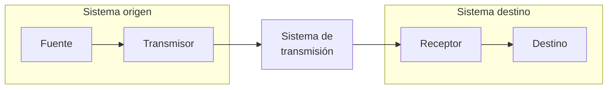
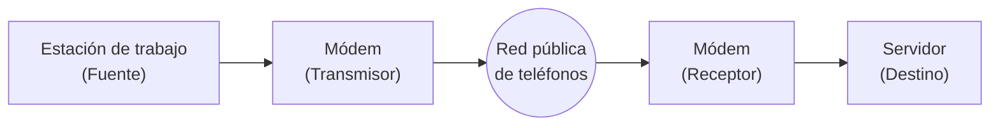
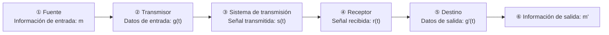
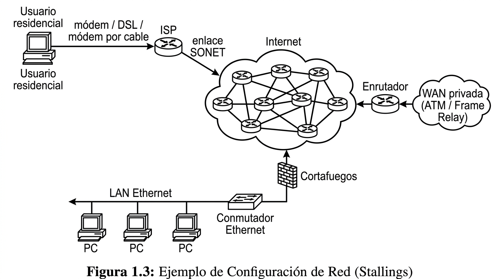

# Clase 1

## Logística del curso

No tiene parciales. 2 trabajos teóricos por grupos de unidades. Grupos de 6-7 personas.

## Bibliografía

Bibliografía según el plan de estudios.

Ver cronograma: se asigna lectura sugerida por cada clase.

## Lectura sugerida

STALLINGS William. Comunicaciones y Redes de Computadoras. 7ma. Edición

- PARTE I - Descripción general
  - Capítulo 1. Introducción a las comunicaciones de datos y redes
    - 1.1. Un modelo para las comunicaciones
    - 1.2. Comunicaciones de datos
    - 1.3. Redes de transmisión de datos
      - Redes de área amplia
      - Redes de área local
      - Redes inalámbricas
      - Redes de área metropolitana
    - 1.4. Un ejemplo de configuración

---

## Resumen — Capítulo 1: Introducción a las comunicaciones de datos y redes

El objetivo del capítulo es dar una visión general de tres grandes áreas que se desarrollan en el resto del libro: **comunicaciones**, **redes** y **protocolos**. Este resumen cubre las dos primeras (1.1 a 1.3) y el ejemplo integrador de 1.4.

### 1.1. Un modelo para las comunicaciones

Todo sistema de comunicación busca intercambiar información entre dos entidades. El libro lo representa con un modelo de bloques simple:

Ejemplo concreto (estación de trabajo — red telefónica — servidor):

**Elementos clave del modelo:**

| Elemento | Qué hace |
|---|---|
| **Fuente** | Genera los datos a transmitir (ej.: un teléfono, una PC). |
| **Transmisor** | Transforma y codifica los datos de la fuente en señales electromagnéticas transmisibles (ej.: un módem convierte bits en señal analógica). |
| **Sistema de transmisión** | El medio entre fuente y destino: desde una línea simple hasta una red compleja. |
| **Receptor** | Acepta la señal del sistema de transmisión y la convierte a una forma manejable por el destino (ej.: el módem receptor reconstruye la cadena de bits). |
| **Destino** | Toma los datos entregados por el receptor. |

Aunque el modelo parece simple, implica mucha complejidad. La **Tabla 1.1** del libro lista las tareas clave involucradas, agrupadas aquí con una clarificación breve de cada una:

| Tarea | Clarificación |
|---|---|
| **Utilización del sistema de transmisión** | Uso eficaz de un medio compartido entre varios dispositivos → técnicas de **multiplexación**; puede requerir **control de congestión**. |
| **Implementación de la interfaz** | Forma en que un dispositivo se conecta físicamente al medio de transmisión. |
| **Generación de la señal** | La señal debe tener forma e intensidad tales que se propague por el medio y sea interpretable en el receptor. |
| **Sincronización** | Emisor y receptor deben coordinar cuándo empieza/termina la señal y cuánto dura cada elemento de señal. |
| **Gestión del intercambio** | Convenciones para cooperar durante el intercambio: quién transmite y cuándo, formato y cantidad de datos, qué hacer ante errores. |
| **Detección y corrección de errores** | Toda señal se distorsiona algo en tránsito; en sistemas de datos suele ser inaceptable perder integridad (ej.: un archivo transferido). |
| **Control de flujo** | Evita que la fuente sature al destino enviando datos más rápido de lo que este puede procesar. |
| **Direccionamiento** | Cuando el medio se comparte entre más de dos dispositivos, hay que identificar al destinatario. |
| **Encaminamiento (routing)** | Si existe más de un camino posible hacia el destino, hay que elegir una ruta. |
| **Recuperación** | Distinto de corrección de errores: permite retomar o restaurar el estado de una transacción interrumpida por un fallo (ej.: transferencia de archivo cortada). |
| **Formato de mensajes** | Acuerdo entre las partes sobre cómo se representan los datos (ej.: codificación de caracteres). |
| **Seguridad** | Garantizar que solo el destino deseado reciba los datos y que estos no fueron alterados ni suplantados. |
| **Gestión de red** | Configurar, monitorizar, reaccionar ante fallos/sobrecargas y planificar el crecimiento del sistema. |

### 1.2. Comunicaciones de datos

Esta parte del libro se centra en transmitir señales de forma **fiable y eficiente**. Para explicarlo, se reutiliza el modelo anterior pero anotando las transformaciones que sufren los datos en cada etapa:

**Clarificación de la notación:**
- `m` → información de entrada (ej.: el texto que escribe el usuario).
- `g(t)` → esa información codificada como cadena de bits.
- `s(t)` → señal realmente transmitida por el medio (ej.: señal analógica de un módem).
- `r(t)` → señal recibida, que puede diferir de `s(t)` por el ruido/distorsión del medio.
- `g'(t)` → bits reconstruidos por el receptor a partir de `r(t)`.
- `m'` → mensaje final entregado al usuario destino.

**Dos ejemplos que ilustra el libro:**
- **Correo electrónico (dato digital):** el mensaje se transmite como bits; si se detecta un error, el sistema puede cooperar con el origen para recuperar el bloque completo → `m'` suele terminar siendo una copia exacta de `m`.
- **Llamada telefónica (dato analógico):** la voz se convierte directamente en señal eléctrica sin corrección de errores; `r(t)` sufre distorsión y `m'` **no** es una réplica exacta de `m`, pero sigue siendo comprensible.

Quedan pendientes para la Parte II del libro: control del enlace de datos (flujo y errores) y multiplexación.

### 1.3. Redes de transmisión de datos

No siempre es práctico conectar dos dispositivos con un enlace punto a punto dedicado, porque:
- están muy alejados geográficamente, o
- hay muchos dispositivos que deben conectarse entre sí en distintos momentos.

La solución es conectar cada dispositivo a una **red de comunicación**. El libro distingue tradicionalmente dos grandes categorías, aunque sus fronteras son cada vez más difusas: **WAN** y **LAN**.

#### Redes de área amplia (WAN)

Cubren un área geográfica extensa, usan rutas de acceso público y, al menos en parte, circuitos de un proveedor de telecomunicaciones. Consisten en nodos de conmutación interconectados que solo se ocupan de encaminar los datos, no de su contenido.

| Tecnología | Clarificación |
|---|---|
| **Conmutación de circuitos** | Se establece un camino dedicado (secuencia de enlaces con un canal lógico reservado) entre las dos estaciones antes de transmitir. Ejemplo típico: la red de telefonía. |
| **Conmutación de paquetes** | No hay reserva previa de recursos; los datos se envían en paquetes pequeños que se almacenan y retransmiten nodo a nodo. Usada sobre todo en comunicaciones terminal-computador y computador-computador. |
| **Retransmisión de tramas (frame relay)** | Evolución de la conmutación de paquetes para enlaces de alta velocidad y baja tasa de error: reduce la información redundante de control de errores para llegar a velocidades de usuario de hasta 2 Mbps. |
| **ATM (Asynchronous Transfer Mode)** | Evolución de frame relay que usa paquetes de tamaño **fijo** llamados celdas; casi no añade redundancia para control de errores, permitiendo velocidades de 10-100 Mbps o más. También se puede ver como una generalización de la conmutación de circuitos, ya que permite definir múltiples canales virtuales con velocidad asignada dinámicamente. |

#### Redes de área local (LAN)

Igual que las WAN, interconectan dispositivos, pero con diferencias clave:

1. **Cobertura**: pequeña — un edificio o conjunto de edificios próximos.
2. **Propiedad**: normalmente pertenece a la misma organización dueña de los dispositivos conectados (a diferencia de la WAN, que suele depender de un proveedor externo).
3. **Velocidad**: las velocidades de transmisión internas suelen ser mayores que en una WAN.

Configuraciones más habituales: LAN conmutadas (Ethernet, ATM, Fiber Channel) y LAN inalámbricas.

#### Redes inalámbricas

Tecnología muy usada tanto en LAN (típico en oficinas) como en WAN de voz y datos, aportando movilidad y facilidad de instalación.

#### Redes de área metropolitana (MAN)

Se ubican conceptualmente entre LAN y WAN: ofrecen alta capacidad a costo reducido dentro de un área metropolitana, para necesidades que ni la conmutación tradicional de WAN ni una LAN pueden cubrir bien.

### 1.4. Un ejemplo de configuración

El libro integra todo lo anterior en un escenario de red típico:

**Elementos del ejemplo:**
- **Usuario residencial**: se conecta a un **ISP** (proveedor de acceso a Internet) mediante módem de red telefónica (56 kbps), **DSL** (línea digital de abonado sobre el par telefónico) o **cable módem** (TV por cable).
- **ISP**: conjunto de servidores conectados a Internet mediante un enlace de alta velocidad (ej.: una línea **SONET**).
- **Internet**: formada por **encaminadores (routers)** interconectados globalmente que transmiten paquetes de origen a destino.
- **LAN Ethernet**: típica de una oficina/organización pequeña, implementada con un conmutador Ethernet; se conecta a Internet a través de un **firewall** que da seguridad.
- **WAN privada**: un encaminador adicional fuera de la LAN puede conectarse a una WAN privada (red ATM o de frame relay).

Cuestiones como la codificación de señal y el control de errores en cada enlace, y la estructura interna de cada tipo de red, se desarrollan en las Partes II, III y IV del libro.
