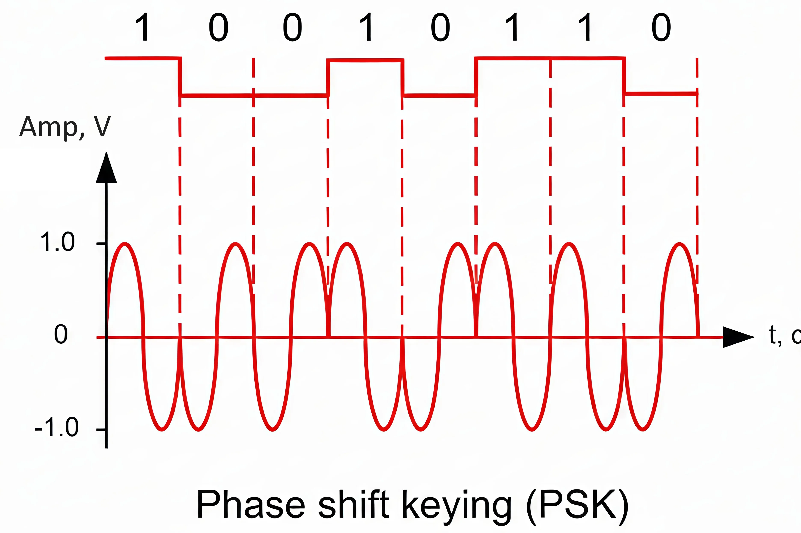

ejemplo comunicacion entre 2 dispositivos.

quiero leer la señal digital enviada entre ambos dispositivos
coloco un clock o heartbeat, cuando hau un flaco descendente, el receptor lee un dato.
al escribir en un puerto de mi pc, la placa madre direcciona un registro de memoria mapeado a ese puerto, donde puede enviar o recibir datos.
la placa de red lee ese puerto y envia los datos mediante utp, ethernet o wifi

problemas de la capa fisica: alta frecuencia genera sobrecalentamiento y deja de funcionar nuestro microcontrolador. limite de frecuencia 5-6GHz

cables usados para conectar computadoras: UTP, par trenzado universal. mas de 10 metros genera resistencias parasitas. al haber resistencias paracitas, el voltaje de mi señal disminuye poco a poco hasta llegar a tener la altura del ruido y pasa a ser indestinguible (SNR).

lo mismo que wifi, al alejarse, la comunicacion pierde mucha calidad.

MODEM: Modulador - Demulador. Para poder sacar estos problemas anteriores, pasaremos a modular los datos a fibra optica.
Modulacion por fase: fase es una de las variaciones que mas daño le hace a la transmision de datos. dificil de ver en cambios rapidos de fase. 

acomodamos los bloques de bits que van llegando, en chunks de 8 bits (byte). utiliza 8 bits debido a que es el tamaño utilizado anteriormete en pc, + actual tamaño de buffers. 

packet tracer
dispositivos -> se encuentran abajo en la capa fisica
dispositivos de fin: ultimo dispositivo en la cadena (ej:dispositivo al que llega un mail) 
