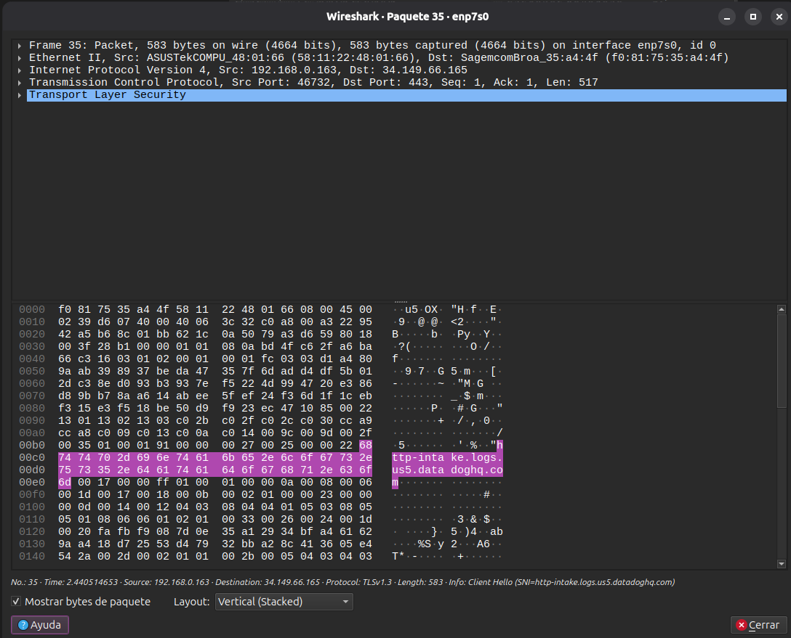
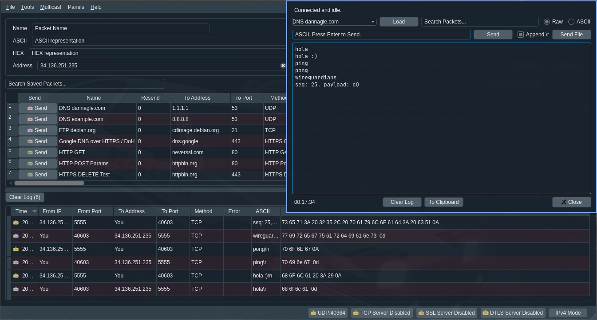
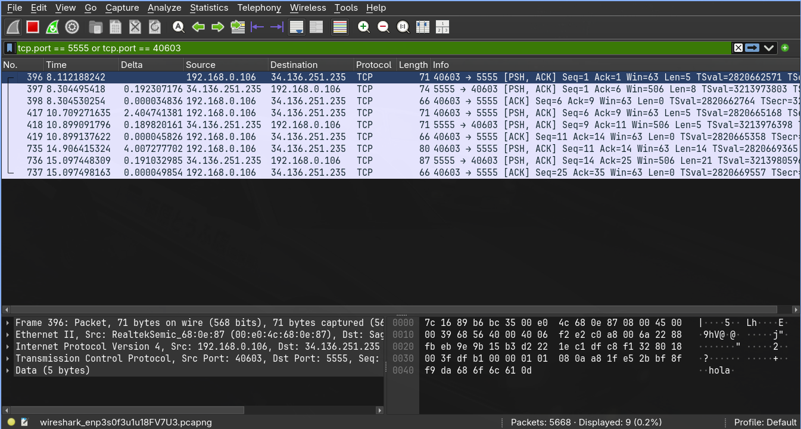

# Trabajo Práctico N°3 — Informe

**Grupo:** WireGuardians

**Integrantes del Grupo:**

| Name                            | DNI      | Mail UNC                          | Github                                                            |
| ------------------------------- | -------- | --------------------------------- | ----------------------------------------------------------------- |
| Viberti, Benjamin               | 46224179 | b.viberti@mi.unc.edu.ar           | [@benjaviberti](https://github.com/benjaviberti)                   |
| Espinoza Sutta, Aaron Alejandro | 96009173 | aaron.espinoza_4500@mi.unc.edu.ar | [@Aaron45000](https://github.com/Aaron45000)                       |
| Cleri, Juan Ignacio             | 46452662 | ignacio.cleri@mi.unc.edu.ar       | [@IgnaCleri](https://github.com/IgnaCleri)                         |
| Pineda, Juan Ignacio            | 45591343 | juan.ignacio.pineda@mi.unc.edu.ar | [@juanignaciopineda-dot](https://github.com/juanignaciopineda-dot) |
| Grafión, Atilio Leonel          | 43940195 | atilio.grafion@mi.unc.edu.ar      | [@Aollgn](https://github.com/Aollgn)                               |
| Badenes, Tomas                  | 44785038 | tomasbadenes@mi.unc.edu.ar        | [@b-Tomas](https://github.com/b-Tomas)                             |
| Oviedo, Ignacio Nicolas         | 43940195 | ignacio.oviedo.239@mi.unc.edu.ar  | [@GIX02](https://github.com/GIX02)                                 |
| Mendez, Jorge Nicolas           | 41301342 | jorge.mendez@mi.unc.edu.ar        | [@jorge088](https://github.com/jorge088)                           |

## Consigna 1

### a)

La ISO adoptó, para el diseño de OSI, el principio de división en capas: las funciones de comunicación se organizan en un conjunto jerárquico en el que cada capa se apoya en los servicios de la capa inmediatamente inferior y, a su vez, ofrece servicios a la capa superior, ocultándole los detalles de implementación. Esta separación permite que un cambio dentro de una capa no repercuta sobre el resto de la arquitectura.

Dentro de esa jerarquía, la **capa de enlace de datos** se ubica inmediatamente por encima de la capa física. Mientras que la capa física se limita a transmitir bits crudos por el medio —sin garantizar una tasa de error aceptable—, la capa de enlace existe para **fiabilizar ese enlace físico**. Concretamente, le presta a la capa de red los siguientes servicios:

- **Activación, mantenimiento y desactivación del enlace**: gestiona el ciclo de vida de la conexión punto a punto sobre el medio físico.
- **Detección y control de errores**: su servicio principal. Si el protocolo de enlace funciona correctamente, la capa superior puede asumir que la transmisión sobre *ese* enlace está libre de errores.
- **Estructuración en tramas**: organiza los bits en unidades delimitadas (tramas), en lugar del flujo continuo de bits que maneja la capa física.

#### Flujo de la información

La capa de enlace recibe de la capa de red (capa 3) el paquete a transmitir y le añade una cabecera y una cola (encapsulado), formando una **trama**. Esa trama se entrega a la capa física para su transmisión como una secuencia de bits sobre el medio. En el extremo receptor ocurre el proceso inverso: la capa física entrega los bits recibidos, la capa de enlace reconstruye la trama, verifica y retira su cabecera y su cola, y entrega el paquete resultante a la capa de red.

#### Tipo de comunicación que resuelve

La capa de enlace resuelve la comunicación **entre dos sistemas conectados directamente**, a través de un único enlace físico. De hecho, en ese caso puntual ni siquiera hace falta una capa de red: la propia capa de enlace alcanza para gestionar el enlace.

Cuando los sistemas **no** están conectados de forma directa, la ruta se compone de varios enlaces de datos en serie, cada uno operando de forma independiente (cada salto tiene su propia capa de enlace y su propia capa física). Esto tiene una consecuencia importante: la garantía de "transmisión libre de errores" que ofrece la capa de enlace es válida únicamente **por tramo**, no de punta a punta. La capa superior no queda liberada de la responsabilidad del control de errores a lo largo de todo el camino — esa es justamente la función que cumple la capa de red, que aparece recién cuando hace falta encaminar información a través de nodos intermedios.

### b)
Tanto la dirección MAC como la dirección IP identifican a un dispositivo dentro de una red, pero operan en capas distintas de la arquitectura de protocolos y resuelven problemas distintos.

#### ¿Qué es una dirección MAC?

La dirección MAC (*Media Access Control*) es el identificador que usa la **subcapa MAC**, dentro de la capa de enlace de datos, para reconocer el **punto de conexión físico** de un dispositivo en una LAN. Cada trama MAC incluye una dirección de origen y una de destino, que identifican respectivamente la interfaz física que emite y la que debe recibir esa trama.

Es una dirección de alcance **local**: solo tiene significado dentro del segmento de LAN en el que se transmite la trama, no viaja más allá del primer salto.

#### ¿Qué es una dirección IP?

La dirección IP es el identificador que usa la **capa de red** (capa internet en el modelo TCP/IP) para reconocer a un **sistema final** (computador) dentro del conjunto de redes interconectadas, y es la que habilita el servicio de encaminamiento a través de varias redes. A diferencia de la MAC, la dirección IP se implementa tanto en los sistemas finales como en los encaminadores (*routers*) intermedios, y es justamente la que estos últimos consultan para decidir hacia qué red reenviar cada paquete.

#### Diferencia principal

La diferencia se nota en lo que ocurre en cada salto del camino origen-destino:

- La **dirección IP** de destino permanece igual durante todo el trayecto: identifica al computador final y es la referencia que usa cada encaminador intermedio para decidir el próximo salto.
- La **dirección MAC**, en cambio, cambia en cada salto: identifica únicamente el próximo punto de conexión físico dentro del segmento de LAN actual. Al llegar a un encaminador intermedio, éste retira la cabecera de acceso a la red (con las direcciones MAC de ese salto) y agrega una nueva cabecera con nuevas direcciones MAC para reenviar el paquete por la siguiente subred, mientras que la dirección IP de destino dentro del datagrama se mantiene sin cambios.

En definitiva, la dirección MAC resuelve el direccionamiento **dentro de un único enlace o segmento físico** (coherente con el alcance de la capa de enlace descripto en el punto a), mientras que la dirección IP resuelve el direccionamiento **de punta a punta**, a través de una o varias redes interconectadas.

### c)
Que es una trama ethernet?
Una trama Ethernet es la unidad básica de datos (PDU) que se envía a través de una red local (LAN) en la capa de enlace de datos. Es el que empaqueta los datos reales para llevarlos de una tarjeta de red a otra mediante direcciones físicas MAC.

| Campo | Tamaño | Funcion |  
|--- |--- | --- |
| Preambulo y SFD | 8 bytes | Sincroniza el reloj receptor e indica el inicio exacto de la trama |
| MAC Destino| 6 bytes  | Direccion fisica del dispositivo que debe recibir el paquete|
| MAC origen| 6 bytes  | Direccion fisica del la tarjeta de red que envia el paquete |
|  EtherType / Longitud| 2 bytes| Identifica el protocolo de capa superior|
| Datos |  46 a 15000 bytes| La informacion real transportada |
| FCS (CRC)| 4 bytes|Secuencia de verificacion para detectar si la trama llego corrupta |
### d)
El EtherType es el campo de la trama que perimite identificar el protocolo de la capa superior. 

## Consigna 2

### Captura de tráfico

Se generó tráfico real navegando a GitHub desde el navegador, mientras Wireshark capturaba sobre la interfaz `enp7s0`. Para aislar la conversación de interés se aplicó el filtro de visualización `tls`:


De la lista filtrada se seleccionó el paquete N.º 35 (`Client Hello`, dirigido a `34.149.66.165`) para analizar en detalle sus distintas capas:



### a)
Se expandió la sección **Ethernet II** del panel de detalle, donde figuran las direcciones MAC de origen y destino de la trama:

| Campo | Dirección MAC | Fabricante (OUI) |
| --- | --- | --- |
| **Source** | `58:11:22:48:01:66` | ASUSTek Computer |
| **Destination** | `f0:81:75:35:a4:4f` | Sagemcom Broadband |

Wireshark resuelve automáticamente los primeros tres bytes de cada dirección MAC (el OUI, *Organizationally Unique Identifier*) contra el fabricante registrado de la tarjeta de red, lo que da una pista directa sobre a qué dispositivo pertenece cada una:

- La dirección **origen** corresponde a la **placa de red de la propia computadora** que realizó la captura (interfaz `enp7s0`): el fabricante ASUS es consistente con el hardware de esta máquina.
- La dirección **destino** corresponde al **router/módem del hogar**: Sagemcom es un fabricante conocido de equipos de acceso (módems/routers) entregados por proveedores de internet.

Vale la pena notar que el destino **no** es el servidor remoto (`datadoghq.com`, IP `34.149.66.165`): como se estableció en el punto 1-b, la dirección MAC solo tiene validez dentro del propio segmento de LAN. La computadora no conoce la MAC de un servidor ubicado en otra red; solo conoce la del siguiente salto dentro de su propia red local, que es el router. Es este último quien luego se encarga de reenviar el paquete hacia internet.

### b)

Dentro de la misma trama, se expandió la sección **Internet Protocol Version 4** del panel de detalle, donde está encapsulado el paquete IP:

| Campo | Dirección IP |
| --- | --- |
| **Source Address** | `192.168.0.163` |
| **Destination Address** | `34.149.66.165` |

La dirección de origen es la IP privada que el router le asignó a esta computadora dentro de la red local, osea, la misma máquina identificada por la MAC de origen en el punto a). La dirección de destino es la IP pública del servidor remoto al que se dirige la conexión: en este caso, el servidor de Datadog cuyo nombre (`http-intake.logs.us5.datadoghq.com`) ya se había visto en el campo SNI del *Client Hello* de TLS.

### c)

Comparando los cuatro valores obtenidos en los puntos a) y b):

| | MAC | IP |
| --- | --- | --- |
| **Origen** | `58:11:22:48:01:66` (esta PC) | `192.168.0.163` (esta PC) |
| **Destino** | `f0:81:75:35:a4:4f` (el router de casa) | `34.149.66.165` (el servidor de Datadog) |

**No representan lo mismo.** Del lado del origen coinciden en apuntar al mismo dispositivo físico (esta computadora), simplemente porque la trama analizada corresponde al primer tramo de la conexión, todavía dentro de la LAN. Pero del lado del destino la diferencia es evidente: la MAC destino es la del **router**, mientras que la IP destino es la del **servidor remoto final**. Si se capturara esta misma conexión en cualquier otro punto más adelante del camino (por ejemplo, del otro lado del router), la IP destino seguiría siendo `34.149.66.165`, pero la MAC destino ya sería otra completamente distinta.

Esto confirma, con datos reales, lo planteado en el punto 1-b): la dirección MAC identifica un punto de conexión físico válido solo dentro del segmento de LAN actual (cambia en cada salto), mientras que la dirección IP identifica al sistema final de la comunicación y se mantiene constante a lo largo de toda la ruta.

### d)

Dentro de la sección **Ethernet II** ya expandida en el punto a), el último campo es **Type**:

```
Type: IPv4 (0x0800)
```

El **EtherType** es el campo que le indica al receptor qué protocolo de capa superior viene encapsulado inmediatamente después de la cabecera Ethernet, para que sepa con qué reglas interpretar el resto de la trama. El valor `0x0800` es el código reservado para **IPv4**, y coincide exactamente con lo encontrado en el punto b): el paquete encapsulado en esta trama es, en efecto, un paquete **Internet Protocol Version 4**.

## Consigna 3

### a)

### b)

### c)

### d)

### e)

### f)

## Consigna 4

### Configuración del cliente

Se levantó una instancia de **PacketSender** en modo cliente y se estableció una conexión TCP
contra el servidor, utilizando la opción **Persistent TCP** para mantener la sesión abierta durante todo el intercambio:

Cada comando se envió como carga útil ASCII, tal como pedia la consigna.

### Comandos enviados y respuestas obtenidas



| Comando enviado  | Respuesta del servidor  |
| ---------------- | ----------------------- |
| `hola\r`         | `hola :)\n`             |
| `ping\r`         | `pong\n`                |
| `wireguardians\r`| `seq: 25, payload: cQ\n`|

El comando correspondiente a nuestro grupo (**wireguardians**) fue reconocido como comando
válido por el servidor, que respondió con el par `seq: 25, payload: cQ`: el número de secuencia
que nos corresponde dentro del conjunto de grupos y el fragmento de información que nos tocó.

### Captura de la sesión con Wireshark



La captura se filtró con `tcp.port == 5555 or tcp.port == 40527` para aislar únicamente la
conversación con el servidor. Sobre los paquetes capturados se puede observar:

- El intercambio sigue el patrón **pedido / respuesta / confirmación**: por cada comando el
  cliente envía un segmento `[PSH, ACK]`, el servidor contesta con otro `[PSH, ACK]` que
  transporta la respuesta y el cliente cierra el ciclo con un `[ACK]` sin datos (`Len=0`).
- Los números de secuencia y de acuse avanzan exactamente en la cantidad de bytes
  transportados: `Seq=1 Len=5` (`hola\r`) → el servidor responde con `Ack=6` y `Len=8`
  (`hola :)\n`), y así sucesivamente hasta `Seq=25 Ack=35`
- El detalle del *frame* 182 muestra el encapsulamiento completo de las capas **Ethernet II** (Src `00:e0:4c:68:0e:87`) → **IPv4** (Src `192.168.0.106`,
  Dst `34.136.251.235`) → **TCP** (Src Port `40527`, Dst Port `5555`) → **Data (5 bytes)**.
- En el panel de bytes se lee la carga útil en claro: `hola\r`.

La captura completa se encuentra en
[`Captura de Paquetes/Ejercicio4-CapturaPaquetes.pcapng`](Captura%20de%20Paquetes/Ejercicio4-CapturaPaquetes.pcapng)
(interfaz `enp3s0f3u1u1`, 3789 paquetes registrados a lo largo de 191 s). De ese total, el
filtro aísla **16 paquetes** que constituyen la totalidad de la conexión con el servidor, desde
su apertura hasta su cierre.

#### Detalle de los 16 paquetes de la conversación

| N.º  | t (s)   | Origen → Destino               | Flags    | Seq | Ack | Len | Frame | Carga útil               |
| ---- | ------- | ------------------------------ | -------- | --- | --- | --- | ----- | ------------------------ |
| 75   | 6,011   | 192.168.0.106 → 34.136.251.235 | SYN      | 0   | 0   | 0   | 74 B  | —                        |
| 78   | 6,206   | 34.136.251.235 → 192.168.0.106 | SYN, ACK | 0   | 1   | 0   | 74 B  | —                        |
| 79   | 6,206   | 192.168.0.106 → 34.136.251.235 | ACK      | 1   | 1   | 0   | 66 B  | —                        |
| 182  | 13,218  | 192.168.0.106 → 34.136.251.235 | PSH, ACK | 1   | 1   | 5   | 71 B  | `hola\r`                 |
| 185  | 13,412  | 34.136.251.235 → 192.168.0.106 | ACK      | 1   | 6   | 0   | 66 B  | —                        |
| 186  | 13,412  | 34.136.251.235 → 192.168.0.106 | PSH, ACK | 1   | 6   | 8   | 74 B  | `hola :)\n`              |
| 187  | 13,412  | 192.168.0.106 → 34.136.251.235 | ACK      | 6   | 9   | 0   | 66 B  | —                        |
| 324  | 22,629  | 192.168.0.106 → 34.136.251.235 | PSH, ACK | 6   | 9   | 5   | 71 B  | `ping\r`                 |
| 325  | 22,817  | 34.136.251.235 → 192.168.0.106 | PSH, ACK | 9   | 11  | 5   | 71 B  | `pong\n`                 |
| 326  | 22,817  | 192.168.0.106 → 34.136.251.235 | ACK      | 11  | 14  | 0   | 66 B  | —                        |
| 413  | 29,230  | 192.168.0.106 → 34.136.251.235 | PSH, ACK | 11  | 14  | 14  | 80 B  | `wireguardians\r`        |
| 418  | 29,421  | 34.136.251.235 → 192.168.0.106 | PSH, ACK | 14  | 25  | 21  | 87 B  | `seq: 25, payload: cQ\n` |
| 419  | 29,421  | 192.168.0.106 → 34.136.251.235 | ACK      | 25  | 35  | 0   | 66 B  | —                        |
| 3113 | 151,020 | 192.168.0.106 → 34.136.251.235 | FIN, ACK | 25  | 35  | 0   | 66 B  | —                        |
| 3119 | 151,220 | 34.136.251.235 → 192.168.0.106 | FIN, ACK | 35  | 26  | 0   | 66 B  | —                        |
| 3120 | 151,220 | 192.168.0.106 → 34.136.251.235 | ACK      | 26  | 36  | 0   | 66 B  | —                        |

#### Apertura de la conexión: three-way handshake

Los frames 75, 78 y 79 registran el establecimiento de la conexión:

1. **`SYN`** (75): el cliente propone la conexión desde el puerto 40527
2. **`SYN, ACK`** (78): envía su propio número de secuencia inicial y acusa el del cliente con `Ack=1`.
3. **`ACK`** (79): el cliente confirma. A partir de aquí la conexión está establecida y ambos extremos pueden enviar datos.

Nótese que los dos primeros segmentos miden 74 bytes y llevan cabecera TCP de **40 bytes** (20 fijos
+ 20 de opciones), mientras que del `ACK` en adelante la cabecera baja a **32 bytes**: las opciones
de negociación sólo se transmiten en el handshake.

#### Cierre de la conexión: four-way handshake

Al cerrar la ventana de chat de PacketSender se capturó el cierre:

1. **`FIN, ACK`** (3113): el cliente indica que no tiene más datos para enviar.
2. **`FIN, ACK`** (3119): el servidor acusa el `FIN` del cliente (`Ack=26`) y, en el mismo segmento,
   envía su propio `FIN`.
3. **`ACK`** (3120): el cliente acusa el `FIN` del servidor (`Ack=36`) y la conexión queda cerrada.

Aunque el cierre son cuatro pasos (`FIN` → `ACK` → `FIN` → `ACK`), en la práctica se
observan **sólo tres segmentos**: el servidor fusionó su `ACK` con su propio `FIN` en un único
paquete, optimización habitual cuando el extremo pasivo tampoco tiene datos pendientes.

Wireshark confirma que la conversación quedó registrada íntegramente:

```
[Conversation completeness: Complete, WITH_DATA (31)]
    RST: Absent   FIN: Present   Data: Present
    ACK: Present  SYN-ACK: Present   SYN: Present
    [Completeness Flags: ·FDASS]
```

### Resultado colectivo

Al reunir realizar el experimento con el nombre de todos los demas grupos  y ordenarlos por número de secuencia, los fragmentos se concatenan reconstruyendo el mensaje oculto que el servidor repartió entre todos los grupos:

[Link de Resultado nada sospechoso](https://www.youtube.com/watch?v=dQw4w9WgXcQ)


| Nombre | Seq | Payload |
|--------|-----|---------|
|#hiddenSSID| 1   | ht      |
|Auracast| 2   | tp      |
|BitBros| 3   | s:      |
|Bitless| 4   | //      |
|ClickByte| 5   | ww      |
|Death Net| 6   | w.      |
|Fernet Modulation| 7   | yo      |
|Group Not Found :(| 8   | u       |
|Grupo| 9   | t       |
|LA LA LAN| 10  | ub      |
|LAN-gustia| 11  | e       |
|Los Red(ondos)| 12  | .c      |
|Los simuLANdores| 13  | om      |
|Los_CondIPcionales| 14  | /w      |
|Los-Tios-Networks| 15  | a       |
|Lost-Pointer-2.4| 16  | t       |
|MACac OS| 17  | ch      |
|MiLANesas| 18  | ?       |
|NetRunners| 19  | v=      |
|PandaBasic| 20  | d       |
|Ping Floyd| 21  | Qw      |
|Red Hot Chilli Packets| 22  | 4w      |
|TCPanico| 23  | 9W      |
|WAN-direction| 24  | gX      |
|WireGuardians| 25  | cQ      |


