# Trabajo Práctico N°4 — Informe

**Grupo:** WireGuardians

**Integrantes del Grupo:**

| Name                            | DNI      | Mail UNC                          | Github                                                             |
| ------------------------------- | -------- | --------------------------------- | ------------------------------------------------------------------ |
| Viberti, Benjamin               | 46224179 | b.viberti@mi.unc.edu.ar           | [@benjaviberti](https://github.com/benjaviberti)                   |
| Espinoza Sutta, Aaron Alejandro | 96009173 | aaron.espinoza_4500@mi.unc.edu.ar | [@Aaron45000](https://github.com/Aaron45000)                       |
| Cleri, Juan Ignacio             | 46452662 | ignacio.cleri@mi.unc.edu.ar       | [@IgnaCleri](https://github.com/IgnaCleri)                         |
| Pineda, Juan Ignacio            | 45591343 | juan.ignacio.pineda@mi.unc.edu.ar | [@juanignaciopineda-dot](https://github.com/juanignaciopineda-dot) |
| Grafión, Atilio Leonel          | 43940195 | atilio.grafion@mi.unc.edu.ar      | [@Aollgn](https://github.com/Aollgn)                               |
| Badenes, Tomás                  | 44785038 | tomasbadenes@mi.unc.edu.ar        | [@b-Tomas](https://github.com/b-Tomas)                             |
| Oviedo, Ignacio Nicolas         | 43940195 | ignacio.oviedo.239@mi.unc.edu.ar  | [@GIX02](https://github.com/GIX02)                                 |
| Mendez, Jorge Nicolas           | 41301342 | jorge.mendez@mi.unc.edu.ar        | [@jorge088](https://github.com/jorge088)                           |

## Consigna 1 — Alcance de Redes y Virtualización

### a)

> Investigar cómo se clasifican las redes según su alcance. Mencionar brevemente las características principales de cada una y colocar en cada cuadro de la Figura el acrónimo de red que corresponda.

A falta una figura provista, se presenta la siguiente tabla con información relacionada. Notar que las fronteras entre las clasificaciones son difusas, conceptuales y no estrictas.

| Nombre                      | Acrónimo | Alcance                                                | Características                                                                                                                                                                                                                        |
| --------------------------- | -------- | ------------------------------------------------------ | -------------------------------------------------------------------------------------------------------------------------------------------------------------------------------------------------------------------------------------- |
| Redes de Área Amplia        | WAN      | Áreas geográficas extensas                             | En ocasiones combinan infraestructura administrada por distintos proveedores. Compuesta por una gran cantidad de nodos internos que rutean tráfico. No tiene mayor importancia el contenido de los datos.                              |
| Redes de Área Metropolitana | MAN      | Múltiples edificios, regiones metropolitanas, ciudades | Punto medio entre LAN y WAN, en general administradas por una sola organización con una necesidad específica para conectar campus o ubicaciones particulares mediante redes privadas o públicas.                                       |
| Redes de Área Local         | LAN      | Hogares, edificios, campus, oficinas                     | Generalmente administradas por una sola organización. Suelen ser privadas y de alta velocidad.                                                                                                                                         |
| Redes de Área Personal      | PAN      | Entorno personal, pocos metros                         | Generalmente de corto alcance, para conectar dispositivos personales como teléfonos, computadoras y periféricos. Puede ser cableada (por ejemplo, mediante USB) o inalámbrica, también llamada WPAN (por ejemplo, mediante Bluetooth). |

Notar las redes PAN no estan cubiertas por el libro de referencia "Comunicaciones y Redes de Computadoras" 7ma edición, William Stallings, que data del año 2004. La terminología PAN se popularizó con la masificación de tecnologías como Bluetooth y fue reconocida por Stallings en ediciones posteriores del mismo libro.

### b)

> ¿Qué es una vLAN? ¿Cómo se clasifican?

Una vLAN o *virtual* LAN es una red LAN lógica independiente de otras vLAN adyacentes pero contenida dentro de una red mayor. Se implementa mediante software en dispositivos de capa 2 y 3 (*switches* y *routers*) y permite que dispositivos de una misma vLAN se comuniquen entre sí como si estuvieran en la misma LAN, estando o no en la misma red física, y que dispositivos de distintas vLAN no se comuniquen entre sí, como si estuviesen en distintas redes físicas.

Las vLAN se pueden clasificar por el modo de gestión de pertenencia a las vLAN de las estaciones:
- **vLANs estáticas**: la pertenencia a una vLAN se define por la configuración del puerto del switch al que se conecta el dispositivo. La pertenencia no cambia a menos que un administrador cambie la configuración del puerto o la estación se conecte a un puerto distinto configurado para otra vLAN.
- **vLANs dinámicas**: la pertenencia a una vLAN se define dinámicamente por atributos de la trama Ethernet como la dirección MAC, el protocolo de red usado, u otros factores. La pertenencia de un usuario a una vLAN puede cambiar automáticamente según estos criterios.

### c)

> Investigar y resumir el protocolo IEEE 802.1Q. ¿Cómo se relaciona con las VLAN?

El protocolo IEEE 802.1Q es el estándar de red que define las vLAN en una red IEEE 802.3 (Ethernet). Define la manera en que las tramas Ethernet son etiquetadas para identificar a qué vLAN pertenecen y así permitir el ruteo hecho por *switches* y *routers* en redes vLAN.

A dia de hoy es el único estándar comúnmente soportad para la implementación de vLANs, existiendo otros estándares anteriores como Cisco ISL.

### d)

> En el contexto de los dos ítems anteriores ¿Qué es el Tagging?


Porciones de una red LAN pueden ser *vLAN aware*. Cuando una trama Ethernet entra a una porción *vLAN aware* de la red, el dispositivo que recibe la trama lo etiqueta (*tagging*) indicando a qué vLAN pertenece la trama. Cuando la trama sale de la porción *vLAN aware* de la red la etiqueta es eliminada.

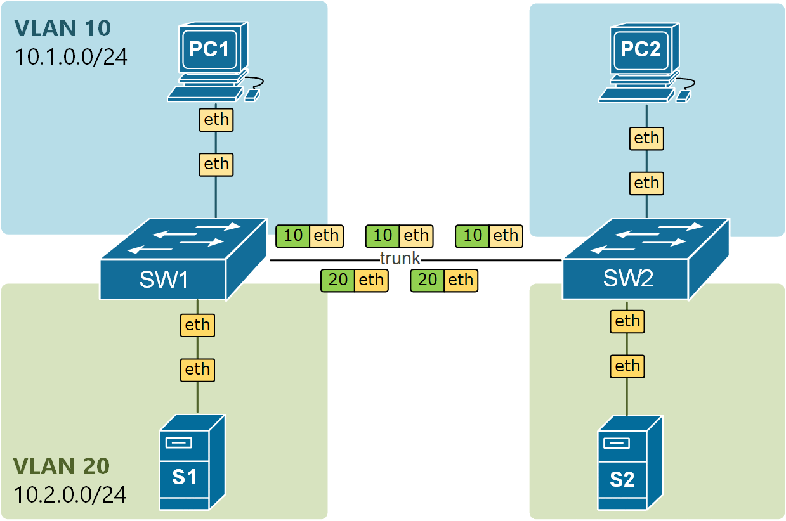

De esta manera, una estación puede producir normalmente tramas Ethernet de forma transparente a las vLAN en un enlace de acceso y en el momento en que, por ejemplo, la trama ingresa a un *switch* ésta es etiquetada para luego continuar viaje por los denominados enlaces *trunk* que transportan tramas de múltiples vLAN. Cuando la trama llega al último nodo la etiqueta es eliminada y la trama es entregada a la estación destino normalmente.

El estándar IEEE 802.1Q define 4 bytes a insertar en la trama Ethernet al momento de etiquetarla:
- 2 bytes para el campo de tipo de protocolo (TPID) que identifica la trama como una trama etiquetada mediante IEEE 802.1Q (valor `0x8100`).
- 3 bits para el código de prioridad (PCP) que indica la prioridad de la trama.
- 1 bit para un flag que indica si la trama es descartable o no (DEI).
- 12 bits para el campo de identificación de la vLAN (VID) que indica a qué vLAN pertenece la trama, permitiendo hasta 4096 vLANs distintas en una misma red física.

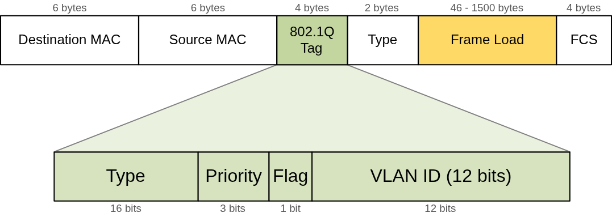

## Consigna 2 — VLANs entre dos switches en Packet Tracer

Topología a implementar:

```
PC-A --F0/6-- [SW-1] --F0/1<->F0/1-- [SW-2] --F0/18-- PC-B
```

Tabla de direccionamiento:

| Device | Interface | IP Address    | Subnet Mask   | Default Gateway |
| ------ | --------- | ------------- | ------------- | --------------- |
| SW-1   | VLAN 1    | 192.168.1.11  | 255.255.255.0 | N/A             |
| SW-2   | VLAN 1    | 192.168.1.12  | 255.255.255.0 | N/A             |
| PC-A   | NIC       | 192.168.10.3  | 255.255.255.0 | 192.168.10.1    |
| PC-B   | NIC       | 192.168.10.4  | 255.255.255.0 | 192.168.10.1    |

### a)

> Desde cada computadora, ingresar a la terminal y configurar los switch. Nombrar a los mismos sw1 y sw2 respectivamente.

#### Topologia implementada

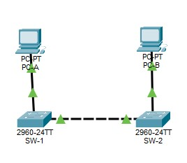

```text
Switch>enable
Switch#configure terminal
Switch(config)#hostname sw1
```

```text
Switch>enable
Switch#configure terminal
Switch(config)#hostname sw2
```

### b)

> Asignar contraseñas privilegiadas, de consola y vty.

```text
sw1(config)#enable secret admin123
sw1(config)#line console 0
sw1(config-line)#password console123
sw1(config-line)#login
sw1(config-line)#exit
sw1(config)#line vty 0 15
sw1(config-line)#password vty123
sw1(config-line)#login
```
```text
sw2(config)#enable secret admin123
sw2(config)#line console 0
sw2(config-line)#password console123
sw2(config-line)#login
sw2(config-line)#exit
sw2(config)#line vty 0 15
sw2(config-line)#password vty123
sw2(config-line)#login
```

Se verificó el funcionamiento al reingresar a la terminal: el sistema solicitó la contraseña de consola ("User Access Verification / Password:") antes de otorgar acceso al modo usuario (sw1>), y luego la contraseña de enable secret al ejecutar enable para acceder al modo privilegiado (sw1#).

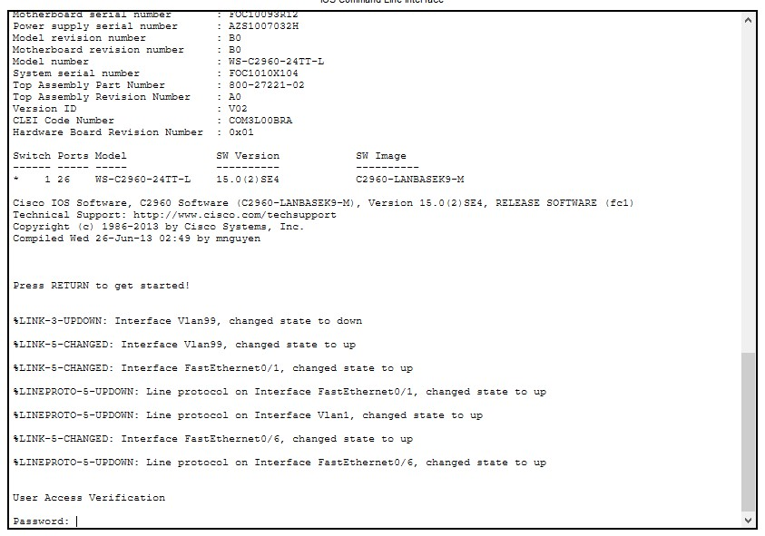

### c)

> Encriptar las contraseñas (`service password-encryption`).

#### SW-1
```text
sw1(config)#service password-encryption
```

#### SW-2
```text
sw2(config)#service password-encryption
```

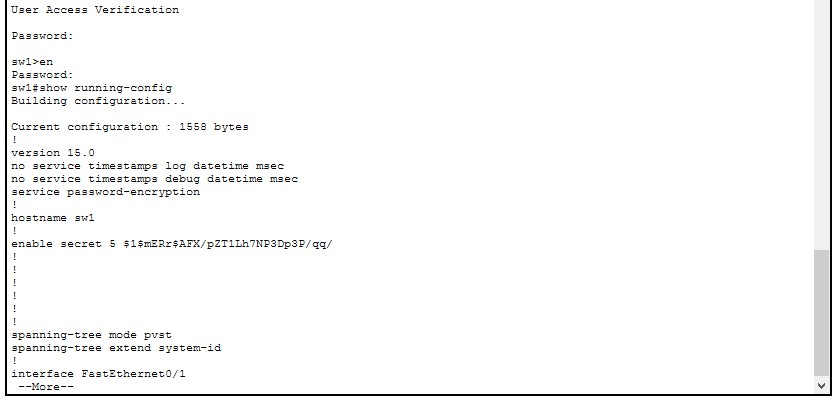

### d)

> Configurar las redes VLAN para ambos switch según la tabla de direcciones provista.

#### SW-1
```text
sw1(config)#interface vlan 1
sw1(config-if)#ip address 192.168.1.11 255.255.255.0
sw1(config-if)#no shutdown
```

#### SW-2
```text
sw2(config)#interface vlan 1
sw2(config-if)#ip address 192.168.1.12 255.255.255.0
sw2(config-if)#no shutdown
```

### e)

> Desconectar todas las interfaces que no estén siendo utilizadas.

#### SW-1
```text
sw1(config)#interface range f0/2-5, f0/7-24
sw1(config-if-range)#shutdown
sw1(config)#interface range gi0/1-2
sw1(config-if-range)#shutdown
sw1(config-if-range)#exit
```
```text
sw1#show ip interface brief
```
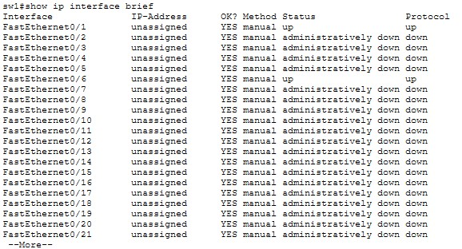

#### SW-2
```text
sw2(config)#interface range f0/2-17, f0/19-24
sw2(config-if-range)#shutdown
sw1(config)#interface range gi0/1-2
sw1(config-if-range)#shutdown
sw1(config-if-range)#exit
```
```text
sw2#show ip interface brief
```
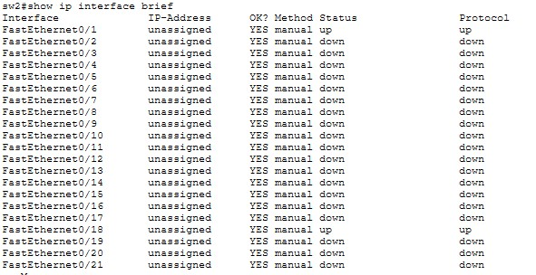


### f)

> Guardar la configuración (`write memory`).

#### SW-1
```text
sw1#write memory
```
#### SW-2
```text
sw2#write memory
```

### g)

> Testear comunicación usando pings entre las computadoras.

#### PC-A
```text
>ping 192.168.10.4
```
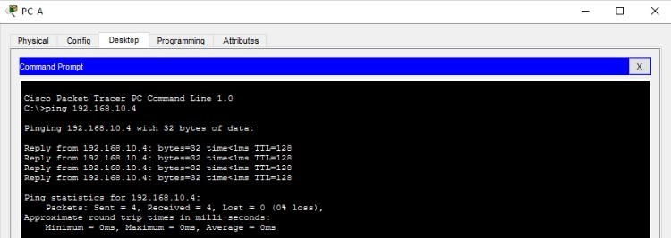


#### PC-B
```text
>ping 192.168.10.3
```
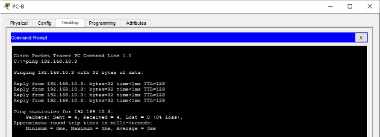


El ping fue exitoso en ambos sentidos: PC-A → PC-B y PC-B → PC-A.

### h)

> Crear VLANs en ambos switches: 10 (Laboratorio), 20 (Bar), 99 (Management).

#### SW-1

```text
sw1(config)#vlan 10
sw1(config-vlan)#name Laboratorio
sw1(config-vlan)#vlan 20
sw1(config-vlan)#name Bar
sw1(config-vlan)#vlan 99
sw1(config-vlan)#name Management
```

#### SW-2

```text
sw2(config)#vlan 10
sw2(config-vlan)#name Laboratorio
sw2(config-vlan)#vlan 20
sw2(config-vlan)#name Bar
sw2(config-vlan)#vlan 99
sw2(config-vlan)#name Management
```

### i)

> Utilizar `show vlan brief` para visualizar la lista de VLANs en alguno de los switch. ¿Cuál es la VLAN utilizada por defecto? Colocar el output en el informe.

#### SW-1

```text
sw1#show vlan brief
```
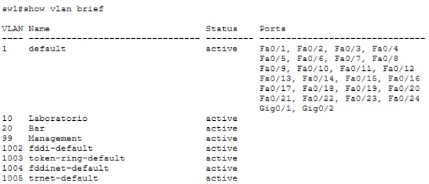

#### SW-2

```text
sw2#show vlan brief
```
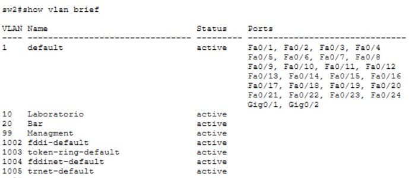

La VLAN 1 es la VLAN por defecto en dondde todos los puertos pertenecen a ella automáticamente si no se les asigna otra VLAN.

### j)

> Asignar la PC-A a la VLAN Laboratorio.

#### SW-1

```text
sw1(config)# interface f0/6
sw1(config-if)# switchport mode access
sw1(config-if)# switchport access vlan 10
```

### k)

> Desde la VLAN 1, remover la ip de Management y configurarla para funcionar en la VLAN 99 (que configuramos como Management).

#### SW-1

```text
sw1(config)#interface vlan 1
sw1(config-if)#no ip address
sw1(config-if)#exit
sw1(config)#interface vlan 99
sw1(config-if)#ip address 192.168.1.11 255.255.255.0
sw1(config-if)#no shutdown
```

### l)

> Verificar el estado de la VLAN utilizando `show vlan brief` y el estado de las interfaces utilizando `show ip interface brief`. Colocar los output en el informe e interpretar.

#### SW-1
```text
sw1#show vlan brief
```
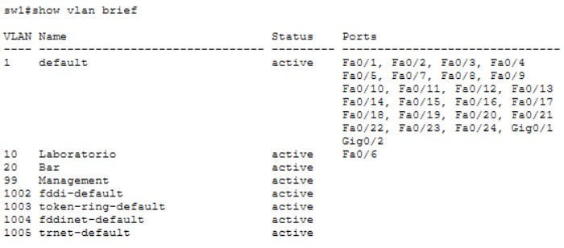

```text
sw1#show ip interface brief
```

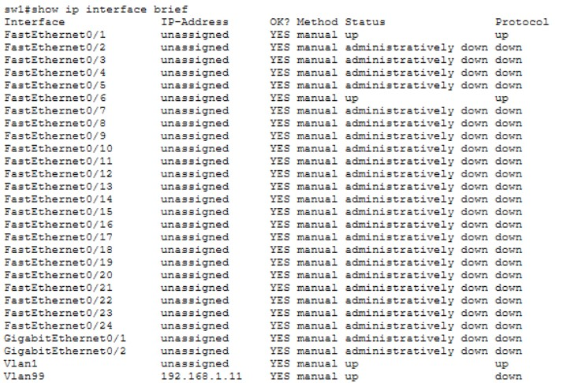

Se observa que la interfaz Vlan99 queda con **Status** "up" pero **Protocol** "down". El estado "up" indica que la interfaz fue habilitada administrativamente (no shutdown), mientras que el protocolo de línea solo pasa a "up" cuando existe al menos un puerto físico **activo** (up/up) asignado a esa misma VLAN. En este punto, ningún puerto físico de sw1 pertenece todavía a la VLAN 99 y su dirección IP administrativa (192.168.1.11) no es aún alcanzable por el comando **ping**.

### m)

> Asignar la PC-B a la VLAN Laboratorio en el sw2. Repetir el inciso k) pero para el sw2.

#### SW-2
```text
sw2(config)#interface f0/18
sw2(config-if)#switchport mode access
sw2(config-if)#switchport access vlan 10
sw2(config-if)#exit
sw2(config)#interface vlan 1
sw2(config-if)#no ip address
sw2(config-if)#exit
sw2(config)#interface vlan 99
sw2(config-if)#ip address 192.168.1.12 255.255.255.0
sw2(config-if)#no shutdown
```

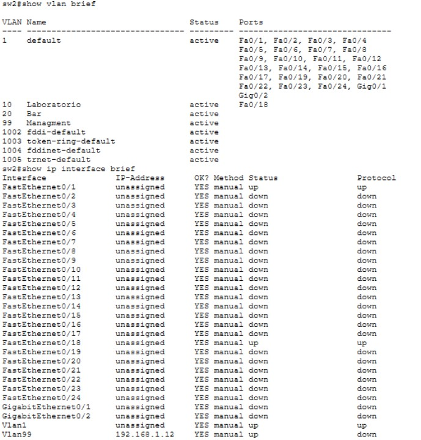

### n)

> Verificar la conectividad entre PC-A y PC-B utilizando pings. Verificar conectividad entre sw1 y sw2 utilizando pings. Interpretar los resultados.

#### PC-A

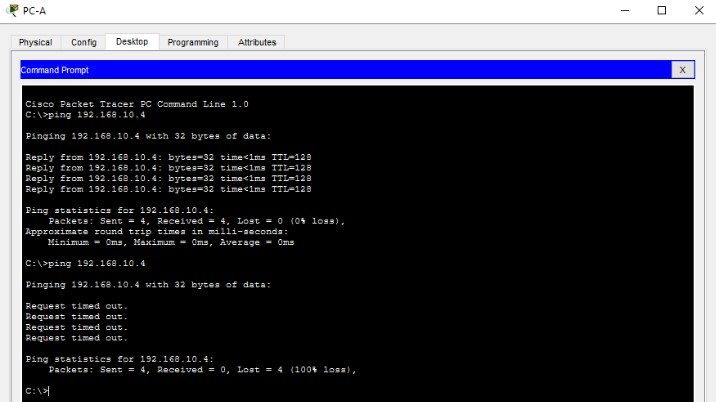


#### PC-B
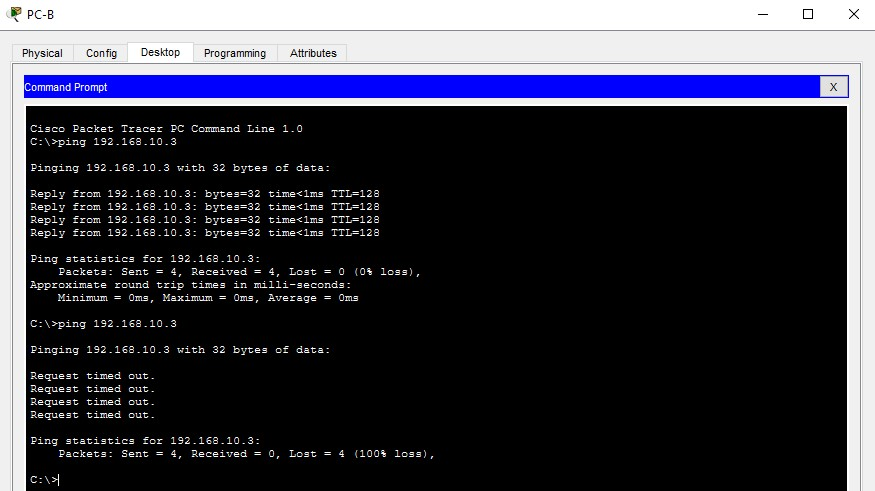

Ambas pruebas de conectividad fallan (Request timed out) ya que el enlace físico entre SW-1 y SW-2 (F0/1 de sw1 con F0/1 de sw2) permanece configurado como puerto de acceso (access) perteneciente únicamente a la VLAN 1, ya que en ningún paso del ejercicio se modificó su configuración. Un puerto de acceso solo puede transportar el tráfico de una única VLAN. En consecuencia:
- El tráfico de la VLAN 10 (PC-A y PC-B) no puede atravesar el enlace entre switches, ya que dicho enlace únicamente transporta VLAN 1.
- El tráfico de la VLAN 99 (direcciones de gestión 192.168.1.11 y 192.168.1.12) tampoco puede cruzar entre switches, por el mismo motivo.
- Al haberse retirado además la dirección IP de la VLAN 1 en ambos switches, no queda ninguna VLAN común con IP configurada que permita una comunicación de respaldo.

## Consigna 3 — VLANs, NAT y ACLs: red LAN a bordo de una aeronave

> Utilizando lo que aprendimos sobre VLAN, e investigando la configuración de NAT y ACLs, simularemos el despliegue de una red LAN a bordo de una aeronave, con tres segmentos: Clase Turista (acceso solo a un sistema de entretenimiento), Clase Business (acceso a entretenimiento e internet) y Administración (acceso total).

Tabla de direccionamiento:

| VLAN | Nombre         | Red IP         | Gateway     | Acceso              |
| ---- | -------------- | -------------- | ----------- | ------------------- |
| 10   | Turista        | 10.10.10.0/24  | 10.10.10.1  | Solo servidor        |
| 20   | Business       | 10.10.20.0/24  | 10.10.20.1  | Servidor + Internet  |
| 99   | Administración | 10.10.99.0/24  | 10.10.99.1  | Acceso total         |
| —    | Enlace ISP     | 200.0.0.0/30   | 200.0.0.1–.2| —                    |

Pruebas a realizar:

| Prueba                              | Desde       | Hacia               | Resultado esperado |
| ------------------------------------ | ----------- | -------------------- | ------------------- |
| Ping al servidor de entretenimiento   | PC Turista  | 10.10.99.10           | ✅ Responde          |
| Acceso HTTP a servidor local          | PC Turista  | http://10.10.99.10    | ✅ Carga la página   |
| Ping a Internet                       | PC Turista  | —                     | ❌ Bloqueado         |
| Acceso HTTP a servidor local          | PC Business | http://10.10.99.10    | ✅ Carga             |
| Ping a Internet (ej: 8.8.8.8)         | PC Business | —                     | ✅ Funciona          |
| Ping entre Admin y todos              | Admin PC    | —                     | ✅ Todos             |

### Diagrama de red

### Configuración (VLANs, NAT, ACLs)

### Capturas de pantalla y pruebas

### Conclusiones