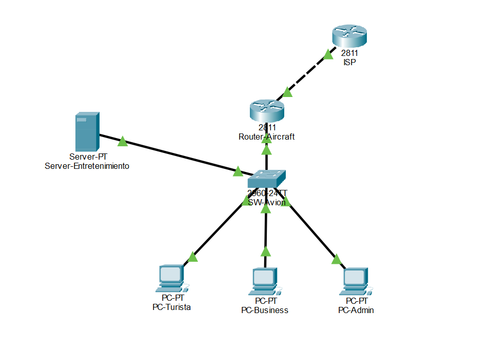
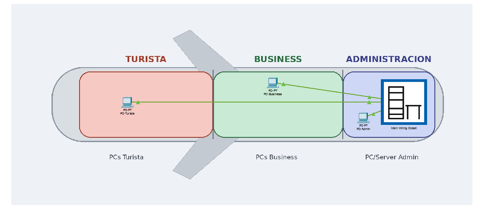
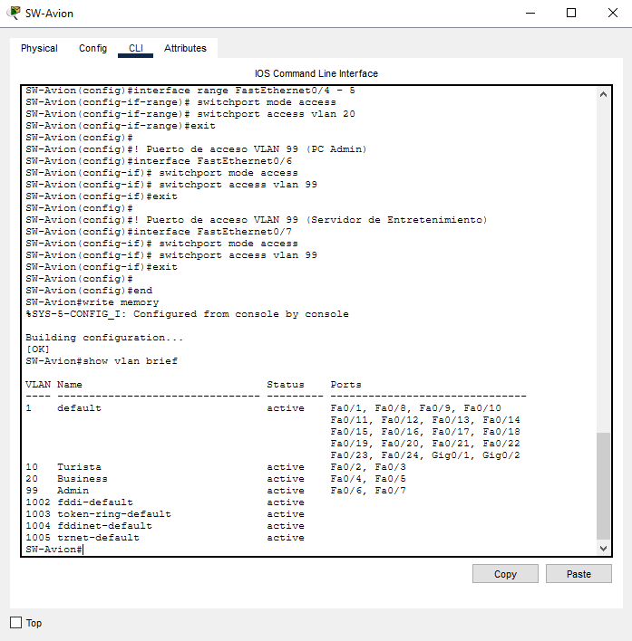
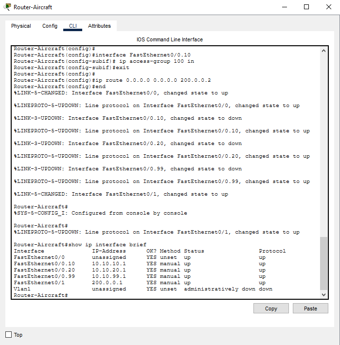
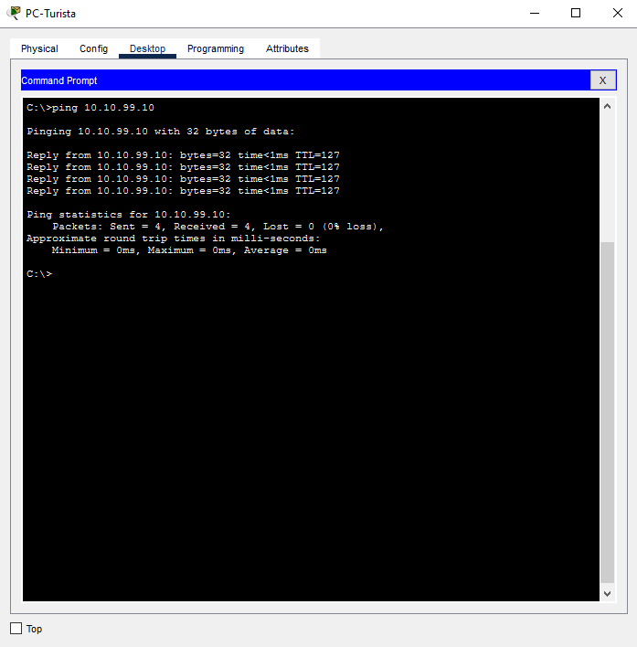
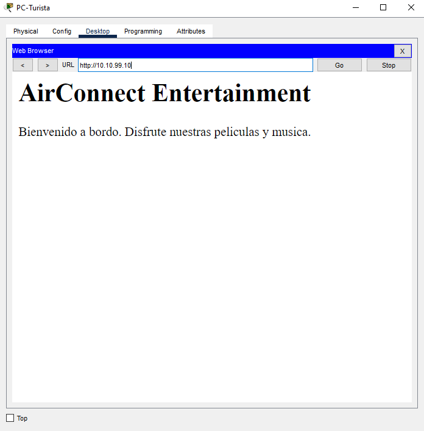
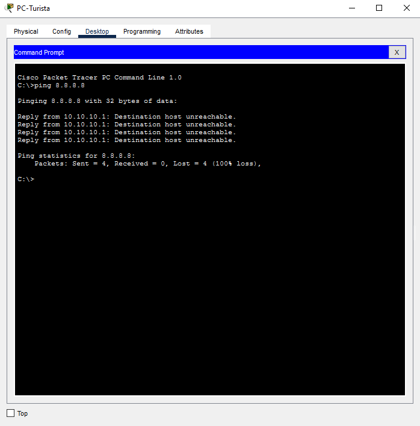
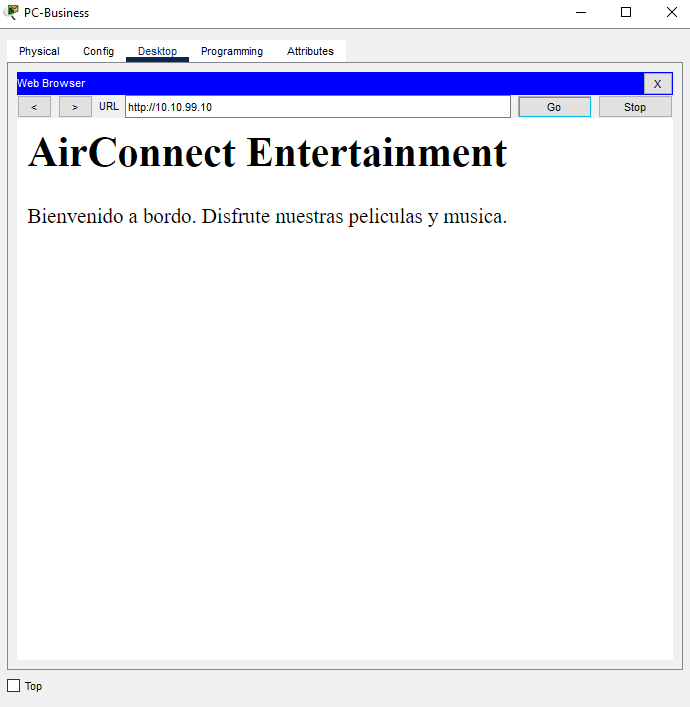
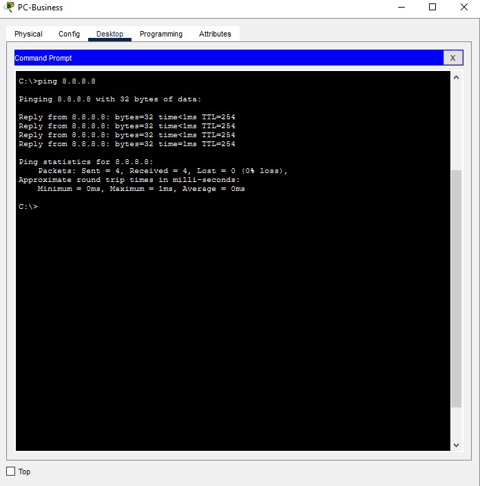
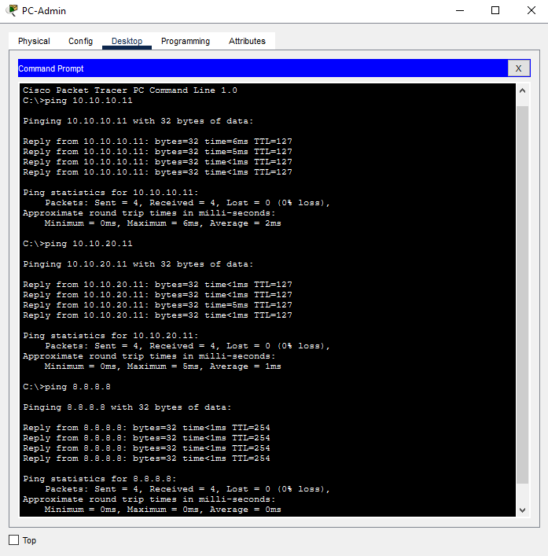

# Trabajo Práctico N°4 — Informe

**Grupo:** WireGuardians

**Integrantes del Grupo:**

| Name                            | DNI      | Mail UNC                          | Github                                                             |
| ------------------------------- | -------- | --------------------------------- | ------------------------------------------------------------------ |
| Viberti, Benjamin               | 46224179 | b.viberti@mi.unc.edu.ar           | [@benjaviberti](https://github.com/benjaviberti)                   |
| Espinoza Sutta, Aaron Alejandro | 96009173 | aaron.espinoza_4500@mi.unc.edu.ar | [@Aaron45000](https://github.com/Aaron45000)                       |
| Cleri, Juan Ignacio             | 46452662 | ignacio.cleri@mi.unc.edu.ar       | [@IgnaCleri](https://github.com/IgnaCleri)                         |
| Pineda, Juan Ignacio            | 45591343 | juan.ignacio.pineda@mi.unc.edu.ar | [@juanignaciopineda-dot](https://github.com/juanignaciopineda-dot) |
| Grafión, Atilio Leonel          | 43940195 | atilio.grafion@mi.unc.edu.ar      | [@Aollgn](https://github.com/Aollgn)                               |
| Badenes, Tomás                  | 44785038 | tomasbadenes@mi.unc.edu.ar        | [@b-Tomas](https://github.com/b-Tomas)                             |
| Oviedo, Ignacio Nicolas         | 43940195 | ignacio.oviedo.239@mi.unc.edu.ar  | [@GIX02](https://github.com/GIX02)                                 |
| Mendez, Jorge Nicolas           | 41301342 | jorge.mendez@mi.unc.edu.ar        | [@jorge088](https://github.com/jorge088)                           |

## Consigna 1 — Alcance de Redes y Virtualización

### a)

> Investigar cómo se clasifican las redes según su alcance. Mencionar brevemente las características principales de cada una y colocar en cada cuadro de la Figura el acrónimo de red que corresponda.

A falta una figura provista, se presenta la siguiente tabla con información relacionada. Notar que las fronteras entre las clasificaciones son difusas, conceptuales y no estrictas.

| Nombre                      | Acrónimo | Alcance                                                | Características                                                                                                                                                                                                                        |
| --------------------------- | -------- | ------------------------------------------------------ | -------------------------------------------------------------------------------------------------------------------------------------------------------------------------------------------------------------------------------------- |
| Redes de Área Amplia        | WAN      | Áreas geográficas extensas                             | En ocasiones combinan infraestructura administrada por distintos proveedores. Compuesta por una gran cantidad de nodos internos que rutean tráfico. No tiene mayor importancia el contenido de los datos.                              |
| Redes de Área Metropolitana | MAN      | Múltiples edificios, regiones metropolitanas, ciudades | Punto medio entre LAN y WAN, en general administradas por una sola organización con una necesidad específica para conectar campus o ubicaciones particulares mediante redes privadas o públicas.                                       |
| Redes de Área Local         | LAN      | Hogares, edificios, campus, oficinas                     | Generalmente administradas por una sola organización. Suelen ser privadas y de alta velocidad.                                                                                                                                         |
| Redes de Área Personal      | PAN      | Entorno personal, pocos metros                         | Generalmente de corto alcance, para conectar dispositivos personales como teléfonos, computadoras y periféricos. Puede ser cableada (por ejemplo, mediante USB) o inalámbrica, también llamada WPAN (por ejemplo, mediante Bluetooth). |

Notar las redes PAN no estan cubiertas por el libro de referencia "Comunicaciones y Redes de Computadoras" 7ma edición, William Stallings, que data del año 2004. La terminología PAN se popularizó con la masificación de tecnologías como Bluetooth y fue reconocida por Stallings en ediciones posteriores del mismo libro.

### b)

> ¿Qué es una vLAN? ¿Cómo se clasifican?

Una vLAN o *virtual* LAN es una red LAN lógica independiente de otras vLAN adyacentes pero contenida dentro de una red mayor. Se implementa mediante software en dispositivos de capa 2 y 3 (*switches* y *routers*) y permite que dispositivos de una misma vLAN se comuniquen entre sí como si estuvieran en la misma LAN, estando o no en la misma red física, y que dispositivos de distintas vLAN no se comuniquen entre sí, como si estuviesen en distintas redes físicas.

Las vLAN se pueden clasificar por el modo de gestión de pertenencia a las vLAN de las estaciones:
- **vLANs estáticas**: la pertenencia a una vLAN se define por la configuración del puerto del switch al que se conecta el dispositivo. La pertenencia no cambia a menos que un administrador cambie la configuración del puerto o la estación se conecte a un puerto distinto configurado para otra vLAN.
- **vLANs dinámicas**: la pertenencia a una vLAN se define dinámicamente por atributos de la trama Ethernet como la dirección MAC, el protocolo de red usado, u otros factores. La pertenencia de un usuario a una vLAN puede cambiar automáticamente según estos criterios.

### c)

> Investigar y resumir el protocolo IEEE 802.1Q. ¿Cómo se relaciona con las VLAN?

El protocolo IEEE 802.1Q es el estándar de red que define las vLAN en una red IEEE 802.3 (Ethernet). Define la manera en que las tramas Ethernet son etiquetadas para identificar a qué vLAN pertenecen y así permitir el ruteo hecho por *switches* y *routers* en redes vLAN.

A dia de hoy es el único estándar comúnmente soportad para la implementación de vLANs, existiendo otros estándares anteriores como Cisco ISL.

### d)

> En el contexto de los dos ítems anteriores ¿Qué es el Tagging?


Porciones de una red LAN pueden ser *vLAN aware*. Cuando una trama Ethernet entra a una porción *vLAN aware* de la red, el dispositivo que recibe la trama lo etiqueta (*tagging*) indicando a qué vLAN pertenece la trama. Cuando la trama sale de la porción *vLAN aware* de la red la etiqueta es eliminada.


De esta manera, una estación puede producir normalmente tramas Ethernet de forma transparente a las vLAN en un enlace de acceso y en el momento en que, por ejemplo, la trama ingresa a un *switch* ésta es etiquetada para luego continuar viaje por los denominados enlaces *trunk* que transportan tramas de múltiples vLAN. Cuando la trama llega al último nodo la etiqueta es eliminada y la trama es entregada a la estación destino normalmente.

El estándar IEEE 802.1Q define 4 bytes a insertar en la trama Ethernet al momento de etiquetarla:
- 2 bytes para el campo de tipo de protocolo (TPID) que identifica la trama como una trama etiquetada mediante IEEE 802.1Q (valor `0x8100`).
- 3 bits para el código de prioridad (PCP) que indica la prioridad de la trama.
- 1 bit para un flag que indica si la trama es descartable o no (DEI).
- 12 bits para el campo de identificación de la vLAN (VID) que indica a qué vLAN pertenece la trama, permitiendo hasta 4096 vLANs distintas en una misma red física.


## Consigna 2 — VLANs entre dos switches en Packet Tracer

Topología a implementar:

```
PC-A --F0/6-- [SW-1] --F0/1<->F0/1-- [SW-2] --F0/18-- PC-B
```

Tabla de direccionamiento:

| Device | Interface | IP Address    | Subnet Mask   | Default Gateway |
| ------ | --------- | ------------- | ------------- | --------------- |
| SW-1   | VLAN 1    | 192.168.1.11  | 255.255.255.0 | N/A             |
| SW-2   | VLAN 1    | 192.168.1.12  | 255.255.255.0 | N/A             |
| PC-A   | NIC       | 192.168.10.3  | 255.255.255.0 | 192.168.10.1    |
| PC-B   | NIC       | 192.168.10.4  | 255.255.255.0 | 192.168.10.1    |

### a)

> Desde cada computadora, ingresar a la terminal y configurar los switch. Nombrar a los mismos sw1 y sw2 respectivamente.

### b)

> Asignar contraseñas privilegiadas, de consola y vty.

### c)

> Encriptar las contraseñas (`service password-encryption`).

### d)

> Configurar las redes VLAN para ambos switch según la tabla de direcciones provista.

### e)

> Desconectar todas las interfaces que no estén siendo utilizadas.

### f)

> Guardar la configuración (`write memory`).

### g)

> Testear comunicación usando pings entre las computadoras.

### h)

> Crear VLANs en ambos switches: 10 (Laboratorio), 20 (Bar), 99 (Management).

### i)

> Utilizar `show vlan brief` para visualizar la lista de VLANs en alguno de los switch. ¿Cuál es la VLAN utilizada por defecto? Colocar el output en el informe.

### j)

> Asignar la PC-A a la VLAN Laboratorio.

### k)

> Desde la VLAN 1, remover la ip de Management y configurarla para funcionar en la VLAN 99 (que configuramos como Management).

### l)

> Verificar el estado de la VLAN utilizando `show vlan brief` y el estado de las interfaces utilizando `show ip interface brief`. Colocar los output en el informe e interpretar.

### m)

> Asignar la PC-B a la VLAN Laboratorio en el sw2. Repetir el inciso k) pero para el sw2.

### n)

> Verificar la conectividad entre PC-A y PC-B utilizando pings. Verificar conectividad entre sw1 y sw2 utilizando pings. Interpretar los resultados.

## Consigna 3 — VLANs, NAT y ACLs: red LAN a bordo de una aeronave

> Utilizando lo que aprendimos sobre VLAN, e investigando la configuración de NAT y ACLs, simularemos el despliegue de una red LAN a bordo de una aeronave, con tres segmentos: Clase Turista (acceso solo a un sistema de entretenimiento), Clase Business (acceso a entretenimiento e internet) y Administración (acceso total).

Tabla de direccionamiento:

| VLAN | Nombre         | Red IP         | Gateway     | Acceso              |
| ---- | -------------- | -------------- | ----------- | ------------------- |
| 10   | Turista        | 10.10.10.0/24  | 10.10.10.1  | Solo servidor        |
| 20   | Business       | 10.10.20.0/24  | 10.10.20.1  | Servidor + Internet  |
| 99   | Administración | 10.10.99.0/24  | 10.10.99.1  | Acceso total         |
| —    | Enlace ISP     | 200.0.0.0/30   | 200.0.0.1–.2| —                    |

Pruebas a realizar:

| Prueba                              | Desde       | Hacia               | Resultado esperado |
| ------------------------------------ | ----------- | -------------------- | ------------------- |
| Ping al servidor de entretenimiento   | PC Turista  | 10.10.99.10           | ✅ Responde          |
| Acceso HTTP a servidor local          | PC Turista  | http://10.10.99.10    | ✅ Carga la página   |
| Ping a Internet                       | PC Turista  | —                     | ❌ Bloqueado         |
| Acceso HTTP a servidor local          | PC Business | http://10.10.99.10    | ✅ Carga             |
| Ping a Internet (ej: 8.8.8.8)         | PC Business | —                     | ✅ Funciona          |
| Ping entre Admin y todos              | Admin PC    | —                     | ✅ Todos             |

## Diagrama de red
 
### a) Vista lógica de la topología
 

 
*Router Aircraft conectado al ISP y al switch. Del switch cuelgan las PCs de cada VLAN y el servidor de entretenimiento.*
 
### b) Vista conceptual (segmentos a bordo)
 

 
## Configuración
 
### a) VLANs y puertos de acceso (Switch SW-Avion)
 
Se crearon las VLANs 10 (Turista), 20 (Business) y 99 (Admin), se asignaron los puertos de acceso correspondientes y se configuró el puerto hacia el router.
 

 
### b) Subinterfaces y ruteo (Router-Aircraft)
 
Se configuraron subinterfaces, una por cada VLAN.
 

 
## Capturas de pantalla y pruebas
 
Se ejecutaron las pruebas indicadas en la consigna, con el siguiente resultado:
 
**Ping al servidor de entretenimiento desde PC-Turista** — ✅ Responde correctamente (0% de pérdida).
 

 
**Acceso HTTP al servidor desde PC-Turista** — ✅ Carga la página correctamente.
 

 
**Ping a Internet bloqueado desde PC-Turista** — ❌ Bloqueado, tal como se esperaba (*Destination host unreachable*).
 

 
**Acceso HTTP al servidor desde PC-Business** — ✅ Carga la página correctamente.
 

 
**Ping a Internet funcionando desde PC-Business** — ✅ Funciona, 0% de pérdida.
 

 
**Ping desde PC-Admin hacia todos los segmentos** — ✅ Responden todos los destinos.
 

 
### Análisis de resultados
 
- **Turista** queda restringido exclusivamente al servidor de entretenimiento.
- **Business** puede tanto acceder al servidor de entretenimiento como navegar a Internet.
- **Administración** tiene visibilidad total de la red: alcanza tanto a Turista como a Business y a Internet.