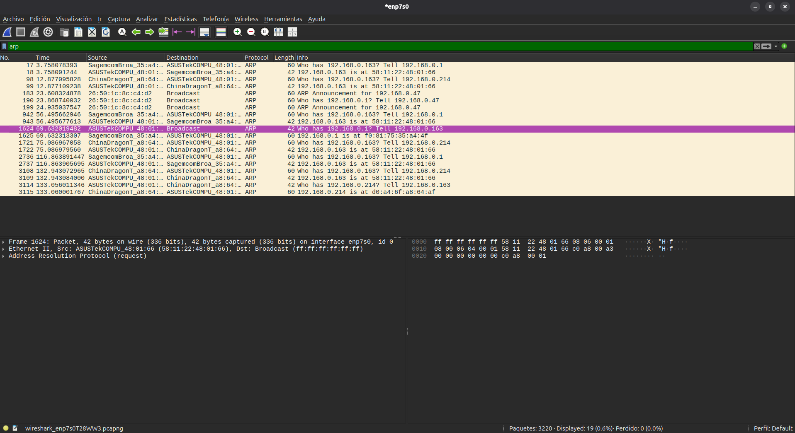
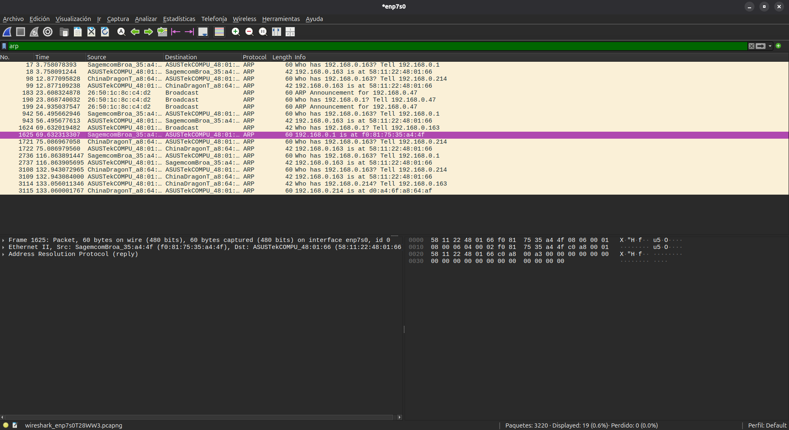
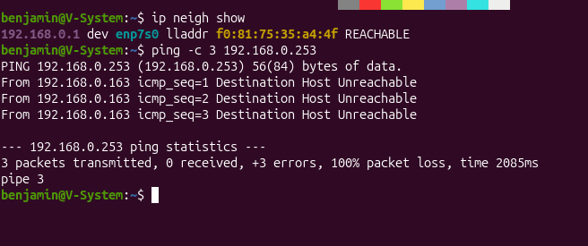
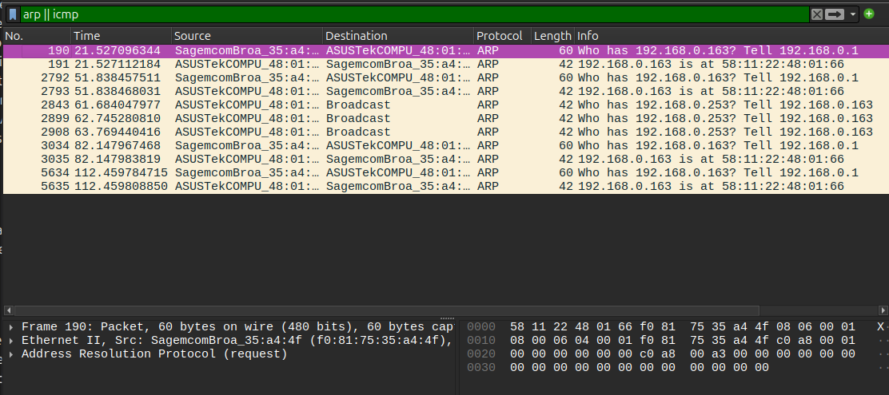
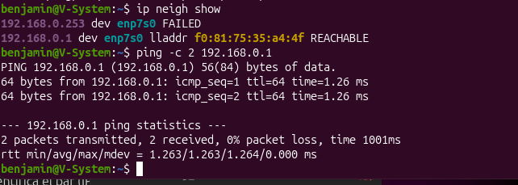
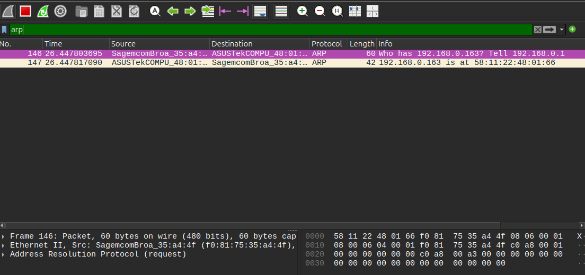
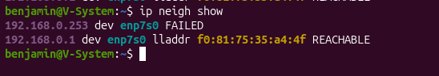

# Trabajo Práctico N° 5 — Informe

**Grupo:** WireGuardians

**Integrantes del Grupo:**

| Name                            | DNI      | Mail UNC                          | Github                                                             |
| ------------------------------- | -------- | --------------------------------- | ------------------------------------------------------------------ |
| Viberti, Benjamin               | 46224179 | b.viberti@mi.unc.edu.ar           | [@benjaviberti](https://github.com/benjaviberti)                   |
| Espinoza Sutta, Aaron Alejandro | 96009173 | aaron.espinoza_4500@mi.unc.edu.ar | [@Aaron45000](https://github.com/Aaron45000)                       |
| Cleri, Juan Ignacio             | 46452662 | ignacio.cleri@mi.unc.edu.ar       | [@IgnaCleri](https://github.com/IgnaCleri)                         |
| Pineda, Juan Ignacio            | 45591343 | juan.ignacio.pineda@mi.unc.edu.ar | [@juanignaciopineda-dot](https://github.com/juanignaciopineda-dot) |
| Grafión, Atilio Leonel          | 43940195 | atilio.grafion@mi.unc.edu.ar      | [@Aollgn](https://github.com/Aollgn)                               |
| Badenes, Tomás                  | 44785038 | tomasbadenes@mi.unc.edu.ar        | [@b-Tomas](https://github.com/b-Tomas)                             |
| Oviedo, Ignacio Nicolas         | 43940195 | ignacio.oviedo.239@mi.unc.edu.ar  | [@GIX02](https://github.com/GIX02)                                 |
| Mendez, Jorge Nicolas           | 41301342 | jorge.mendez@mi.unc.edu.ar        | [@jorge088](https://github.com/jorge088)                           |

## Consigna 1 — ICMP y primer contacto con Wireshark

### Investigación

#### a)

> ¿Qué es ICMP y para qué se usa? ¿Transporta datos de aplicaciones como lo hacen TCP o UDP?

ICMP (Protocolo de Mensajes de Control de Internet) es un protocolo de la capa de red que se utiliza para realizar diagnósticos y reportar errores. No transporta datos de aplicaciones de usuario, sino información de control exclusiva para el funcionamiento de la red.

#### b)

> ¿Qué relación tiene con IP? ¿Viaja dentro de IP, al lado de IP o debajo de IP? ¿Cómo sabe el receptor que el contenido de un paquete IP es ICMP?

ICMP es uno de los protocolos principales del conjunto IP.  El mensaje ICMP se coloca dentro del área de datos de un paquete IP normal. El receptor identifica un mensaje ICMP por medio del encabezado del paquete IP que lo envuelve. Cuando el valor del campo 'Protocolo' del encabezado IPv4 es 1, el equipo receptor identifica que los datos que viajan dentro de ese paquete IP corresponden a un mensaje ICMP.

#### c)

> ¿Qué hace ping? ¿Qué son un Echo Request y un Echo Reply? ¿Qué campos de ICMP permiten distinguirlos?

 El comando ping verifica la conectividad y mide el tiempo de latencia entre un emisor y un destino. Por ejemplo, una computadora envía un mensaje de consulta llamado Echo Request, y el equipo destino contesta con un mensaje de confirmación llamado Echo Reply. Se distinguen por el campo "Type" (Tipo) en la cabecera ICMP, en donde el valor 8 corresponde al Echo Request y el valor 0 al Echo Reply.
#### d)

> ¿Qué información mínima contiene un mensaje ICMP de tipo Echo?

 El encabezado mínimo de un mensaje Echo contiene 5 campos esenciales:

* Tipo (Type): 8 o 0.
* Código (Code): Generalmente 0 para los Echo.
* Suma de comprobación (Checksum): Para detectar errores de corrupción.
* Identificador (Identifier): Para vincular las respuestas con el programa que las solicitó.
* Número de secuencia (Sequence Number): Para saber qué paquete específico se está respondiendo.

### Configuración de red

> Averiguar la configuración de red de alguna de las computadoras del grupo: dirección IPv4, máscara, gateway por defecto y dirección MAC de la interfaz que usan (Wi-Fi o cableada).

| Parámetro      | Valor |
| -------------- | ----- |
| Interfaz       |       |
| Dirección IPv4 |       |
| Máscara        |       |
| Gateway        |       |
| Dirección MAC  |       |

### Capas del Echo Request

> Seleccionar un Echo Request y desplegar el panel de detalles. Identificar las capas que muestra Wireshark y completar la tabla.

| Capa (como la nombra Wireshark)   | Dirección/identificador origen | Dirección/identificador destino | ¿Qué campo indica qué protocolo viene "adentro"? |
| --------------------------------- | ------------------------------ | ------------------------------- | ------------------------------------------------ |
| Ethernet II                       |                                |                                 |                                                  |
| Internet Protocol Version 4       |                                |                                 |                                                  |
| Internet Control Message Protocol |                                |                                 |                                                  |
| Datos / payload                   |                                |                                 |                                                  |

### Análisis de la captura

#### a)

> La MAC destino del Echo Request enviado a 8.8.8.8, ¿es la MAC de 8.8.8.8? ¿De qué equipo es? Compárenla con la MAC destino del ping al gateway. ¿Qué conclusión sacan sobre el alcance de una dirección MAC frente al de una dirección IP?

#### b)

> Comparen un Echo Request con su Echo Reply (Wireshark los vincula en el campo `[Response frame: …]`). Hagan una lista de los campos que cambian y de los que se mantienen en Ethernet, IP e ICMP. ¿Por qué tiene sentido cada cambio? ¿Por qué el identificador y el número de secuencia se mantienen?

#### c)

> ¿Dónde está el payload de ping? ¿Cuántos bytes tiene y qué contiene? ¿Es igual en el Reply? Si en el grupo hay una computadora con Windows y otra con Linux, compárenlos: ¿qué les sugiere que sean distintos?

#### d)

> ¿Qué valor de TTL tiene el Echo Request que ustedes enviaron? ¿Y el Reply que llegó de 8.8.8.8? ¿Por qué no son iguales?

#### e)

> Dibujen la encapsulación del paquete que eligieron como "cajas dentro de cajas", indicando para cada caja qué tamaño en bytes tiene según Wireshark.

## Consigna 2 — ARP: de una IP a una dirección MAC

### Investigación

#### a)

> ¿Qué problema resuelve ARP? ¿En qué capa lo ubicarían y por qué es discutible?

ARP (Address Resolution Protocol) resuelve el problema de traducir una dirección IP (capa de red) en la dirección MAC (capa de enlace) correspondiente dentro de una misma red local. Sin esa traducción, un host tiene la IP de destino pero no puede armar la trama Ethernet, ya que esta necesita una MAC destino para que el hardware de red la entregue al equipo correcto.
Ubicar a ARP en una capa es discutible porque no encaja limpiamente en el modelo de capas: conceptualmente resuelve un problema de la capa de red (direccionamiento IP), pero sus mensajes se encapsulan directamente en tramas Ethernet, sin encabezado IP de por medio, igual que si fuera un protocolo de la capa de enlace. Por eso suele describirse como un protocolo "intermedio": algunos lo ubican en la capa de red, otros en la de enlace, y otros lo consideran una capa propia entre ambas.

#### b)

> ¿Qué es un ARP Request y un ARP Reply? ¿A quién se envía cada uno?

Un **ARP Request** es un mensaje que pregunta "¿quién tiene esta dirección IP? decime tu MAC". Se envía a la dirección de broadcast de la LAN (`ff:ff:ff:ff:ff:ff`), porque el emisor todavía no sabe qué MAC corresponde a esa IP, así que no puede dirigirlo a nadie en particular: lo tiene que recibir toda la red para que el dueño de esa IP se reconozca y responda.
Un **ARP Reply** es la respuesta del equipo que sí tiene esa IP, informando su propia MAC. A diferencia del Request, el Reply se envía de forma unicast, directamente a la MAC del equipo que preguntó (dato que ya viene incluido en el Request).

#### c)

> ¿Qué es la caché ARP y por qué existe?

La caché ARP es una tabla que cada equipo mantiene localmente, con las asociaciones IP-MAC que ya resolvió previamente. Existe por una razón de eficiencia: resolver una IP a MAC mediante Request/Reply implica tráfico de broadcast y una espera por la respuesta. Si hubiera que repetir ese proceso para cada paquete enviado, se generaría tráfico innecesario en la red y se introduciría latencia en cada comunicación. Guardando el resultado en caché, solo se dispara un nuevo Request/Reply cuando la IP no está (o cuando la entrada caducó), y el resto de las veces la MAC se obtiene de forma inmediata consultando la tabla local.

#### d)

> Traten de responder con sus palabras: "Tengo la IP de una máquina de mi red local. ¿Cómo sé a qué dirección MAC debo enviarle la trama?"

Hay 2 formas, y se hacen de manera secuencial:
1- Desde mi computadora se revisa mi caché ARP que coincida con dicha dirección IP. Si es así, se resuelve la trama de IP a MAC directo y se envía el paquete. Caso contrario, se ejecuta la segunda forma.
2- Se hace un ARP Request, en el que se consulta a toda la red quién es al que le pertenece dicha IP. Aquellos que no, ignoran, y el que sí responde con un ARP Reply. Se envía la trama (IP a MAC) y se almacena en la caché dicha dirección IP.

#### e)

> Ver la caché ARP de su computadora y buscar la entrada del gateway. ¿La MAC asociada al gateway coincide con la MAC destino que vieron anteriormente?

EL QUE HIZO LA CONSIGNA 1 ES EL QUE TIENE QUE HACER ESTE PUNTO!!!!
### f) Análisis de la captura

**Opción elegida para generar tráfico ARP:** Opción B (se borró la entrada del gateway de la caché ARP con `ip neigh del` y se volvió a hacer `ping` al gateway para forzar un nuevo ARP Request/Reply). Se capturó con Wireshark en la interfaz `enp7s0`, filtro `arp`, y se identificó el par generado por ese ping: el paquete #1624 (Request) y su correspondiente #1625 (Reply).

ARP Request (paquete #1624):



ARP Reply (paquete #1625):



| Campo                             | ARP Request                   | ARP Reply          |
| --------------------------------- | ------------------------------ | ------------------- |
| MAC destino (encabezado Ethernet) | ff:ff:ff:ff:ff:ff (Broadcast) | 58:11:22:48:01:66   |
| MAC origen (encabezado Ethernet)  | 58:11:22:48:01:66             | f0:81:75:35:a4:4f   |
| Opcode                            | 1 (request)                   | 2 (reply)            |
| Sender MAC address                | 58:11:22:48:01:66             | f0:81:75:35:a4:4f   |
| Sender IP address                 | 192.168.0.163                 | 192.168.0.1          |
| Target MAC address                | 00:00:00:00:00:00             | 58:11:22:48:01:66   |
| Target IP address                 | 192.168.0.1                   | 192.168.0.163        |

#### a)

> ¿Por qué el Request va a una dirección broadcast y el Reply no? ¿Qué valor tiene Target MAC address en el Request y por qué?

El Request va a broadcast (`ff:ff:ff:ff:ff:ff`) porque el emisor todavía no sabe qué MAC corresponde a la IP que busca (`192.168.0.1`): ese es justamente el dato que está preguntando. Como no puede dirigirse a un destinatario puntual que desconoce, lo envía a toda la red local para que el dueño de esa IP se identifique (que es lo que hace el ARP Request).
Por esa misma razón, el campo **Target MAC address** del Request viene en `00:00:00:00:00:00`: es un valor "relleno" que indica que esa dirección todavía no se conoce, es precisamente el dato que la Request busca obtener.
El Reply, en cambio, se envía de forma unicast (`58:11:22:48:01:66`) porque para ese momento el que responde (el gateway) ya sabe exactamente quién preguntó: lo leyó directamente del Sender MAC del Request que recibió. No hace falta volver a preguntarle a toda la red, el Reply se dirige directo al interesado.

#### b)

> En el encabezado Ethernet de la trama ARP, ¿qué valor tiene el campo Type? ¿Hay un encabezado IP? ¿Qué les dice eso sobre dónde "vive" ARP?

El campo **Type** del encabezado Ethernet vale `0x0806`, que es el EtherType reservado para identificar que lo que viene a continuación es una trama ARP (se puede ver en el hexdump de ambos paquetes capturados, el `08 06` justo después de las direcciones MAC).
No hay encabezado IP: inmediatamente después de esos 14 bytes de encabezado Ethernet viene directo el contenido de ARP (HTYPE, PTYPE, HLEN, PLEN, opcode, direcciones), sin ningún datagrama IPv4 de por medio. Esto confirma lo que se planteaba como discutible en el punto a de la Investigación: ARP resuelve un problema que conceptualmente pertenece a la capa de red (direccionamiento IP), pero sus mensajes viajan encapsulados directamente en Ethernet, como si fuera un protocolo de la capa de enlace. A diferencia de ICMP (Consigna 1), que sí viaja dentro de un paquete IP, ARP no tiene ese nivel extra de encapsulamiento.

#### c)

> Con la Opción A (IP inexistente): ¿cuántos ARP Request aparecieron? ¿Hubo Reply? ¿Apareció algún ICMP Echo Request en la captura? Expliquen por qué.

Para esta pregunta se volvió a generar tráfico ARP, esta vez usando específicamente la **Opción A** (ping a una IP inexistente de la subred), ya que es la que pide este punto en particular.

Antes de pingear, se verificó con `ip neigh show` que la IP elegida (`192.168.0.253`) no estuviera ya en la caché:


Se ejecutó el ping desde la Terminal:



Y se analizó la captura en Wireshark con el filtro `arp || icmp`:



Se pingeó la IP `192.168.0.253` (verificada de antemano con `ip neigh show` como inexistente en la red) con `ping -c 3`. En la captura (filtro `arp || icmp`) aparecieron **3 ARP Request**, uno por cada intento de ping, todos a Broadcast preguntando *"Who has 192.168.0.253? Tell 192.168.0.163"*, espaciados aproximadamente 1 segundo entre sí.
**No hubo ningún ARP Reply**, y **tampoco apareció ningún paquete ICMP** en toda la captura (ni Echo Request ni ningún otro).
Esto se debe a que como nadie en la red tiene asignada la IP `192.168.0.253`, ningún equipo respondió al Request, por lo que nunca se pudo resolver una MAC destino para esa IP. Sin esa MAC, el sistema operativo no tiene forma de armar la trama Ethernet necesaria para sacar el Echo Request a la red, así que el ping ni siquiera llega a transmitirse a nivel de paquete. Por eso la Terminal mostró "Destination Host Unreachable": es un mensaje generado **localmente** por el propio sistema operativo al fallar la resolución ARP, no una respuesta real recibida de la red. Esto también explica por qué se repite el Request 3 veces (una por cada intento de `ping`): como nunca hay Reply, nunca se llega a cachear nada, y cada intento vuelve a disparar su propia resolución ARP desde cero.

#### d)

> Volvieron a hacer ping al mismo destino un minuto después: ¿apareció ARP de nuevo? Revisen la caché ARP. ¿Qué ventaja tiene la caché y qué problema podría causar si una entrada quedara vieja?

Se repitió el ping al gateway bastante más de un minuto después del original, revisando la caché antes y analizando la nueva captura de Wireshark para ver si se disparaba un nuevo ARP.

Terminal: estado de la caché antes del segundo ping, y ejecución de `ping -c 2 192.168.0.1`:



Wireshark (nueva captura, filtro `arp`): no aparece ningún Request nuevo preguntando por el gateway, solo tráfico de fondo no relacionado:



Terminal: estado de la caché después del segundo ping:



Antes de repetir el ping, `ip neigh show` ya mostraba la entrada del gateway como `REACHABLE` (y, de paso, quedó registrada como `FAILED` la IP inexistente usada en el punto c, la caché también guarda por un tiempo los intentos fallidos). Se volvió a ejecutar `ping -c 2 192.168.0.1` bastante más de un minuto después del ping original, y la resolución **no se repitió**: en la nueva captura de Wireshark (filtro `arp`) no apareció ningún "Who has 192.168.0.1? Tell 192.168.0.163". El ping funcionó igual, de forma exitosa (`ttl=64`, ~1.26 ms), usando directamente la MAC que ya estaba cacheada, y `ip neigh show` después del ping mostró exactamente el mismo estado (`REACHABLE`, misma MAC).
Esto confirma el comportamiento esperado: mientras la entrada siga vigente (`REACHABLE`), el sistema la reutiliza directamente y no vuelve a disparar un ARP Request/Reply.
**Ventaja de la caché:** evita repetir el proceso de broadcast Request/Reply antes de cada paquete, ahorrando tráfico de red y latencia. La trama se arma de inmediato con la MAC ya conocida, en vez de esperar una ronda completa de resolución.
**Problema si una entrada queda vieja:** si el dispositivo dueño de esa IP cambia de MAC, pero la caché todavía apunta a la MAC anterior, las tramas seguirán enviándose a un destino que ya no corresponde. Los paquetes se perderían (o llegarían a un equipo distinto) hasta que esa entrada caduque o se invalide de alguna forma.

## Consigna 3 — TCP y UDP "a mano" con ncat

### Investigación

#### a)

> ¿Qué significa "establecer una conexión"? ¿Dónde "existe" una conexión TCP: en los cables, en los routers o en los extremos?

#### b)

> ¿Qué es un puerto? ¿Qué identifica el par (IP, puerto)?

#### c)

> ¿Qué significa que un proceso esté "escuchando" en un puerto?

### Análisis de las capturas

#### a)

> ¿Qué pasó en la red cuando ejecutaron el comando del cliente, antes de escribir el primer mensaje? Compárenlo con TCP.

#### b)

> ¿Cuántos datagramas generó cada mensaje? ¿Hay algo parecido a un ACK?

#### c)

> Comparen el encabezado UDP con el encabezado TCP de un segmento con datos: ¿qué campos tiene cada uno? ¿Cuántos bytes ocupa cada encabezado?

#### d)

> ¿Qué pasó en la red al cerrar el cliente con Ctrl+C? ¿Y en TCP?

#### e)

> Para enviar la misma frase, ¿cuántos paquetes necesitaron en total con TCP y cuántos con UDP? ¿Qué "compran" con los paquetes extra de TCP?

#### f)

> ¿Y si nadie escucha? Con Wireshark capturando en loopback y el filtro `tcp.port == 12000 || udp.port == 12001 || icmp`, sin servidores corriendo:

```text
ncat -v 127.0.0.1 12000       # TCP a un puerto cerrado
ncat -v -u 127.0.0.1 12001    # UDP a un puerto cerrado, escribir y enter
```

## Consigna 4 — Servidor TCP mínimo

> Capturando en loopback con el filtro `tcp.port == 12000` la ejecución de `tcp_server.py` y `tcp_client.py`, completar la tabla. Para cada llamada, indicar si genera tráfico y, si lo genera, qué segmentos (número de paquete en Wireshark y flags).

| Llamada     | ¿Dónde se ejecuta? | ¿Genera tráfico? | Segmentos que observan |
| ----------- | ------------------ | ---------------- | ---------------------- |
| `socket()`  | servidor y cliente |                  |                        |
| `bind()`    | servidor           |                  |                        |
| `listen()`  | servidor           |                  |                        |
| `connect()` | cliente            |                  |                        |
| `accept()`  | servidor           |                  |                        |
| `sendall()` | servidor           |                  |                        |
| `recv()`    | servidor           |                  |                        |
| `close()`   | ambos              |                  |                        |
