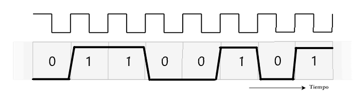

# Trabajo Práctico N°1 — Informe

**Integrantes del Grupo:**

| Name                          | DNI | Mail UNC | Github |
|-------------------------------|-----|----------|--------|
| Viberti, Benjamin | 46224179 | b.viberti@mi.unc.edu.ar | [@benjaviberti](https://github.com/benjaviberti) |
| Espinoza Sutta, Aaron Alejandro | 96009173| aaron.espinoza_4500@mi.unc.edu.ar| [@Aaron45000](https://github.com/Aaron45000) | 
| Cleri, Juan Ignacio | 46452662 | ignacio.cleri@mi.unc.edu.ar | [@IgnaCleri](https://github.com/IgnaCleri)|
| Pineda, Juan Ignacio | 45591343 | juan.ignacio.pineda@mi.unc.edu.ar | [@juanignaciopineda-dot](https://github.com/juanignaciopineda-dot)|
| Grafión, Atilio Leonel | 43940195 | atilio.grafion@mi.unc.edu.ar | [@Aollgn](https://github.com/Aollgn) |
| Badenes, Tomas | 44785038 | tomasbadenes@mi.unc.edu.ar | NA |
| Oviedo, Ignacio Nicolas | 43940195 | ignacio.oviedo.239@mi.unc.edu.ar | NA |

## 1) Consigna 1

### Parte 1: Resumen de Conceptos Teóricos

#### 1.1. Onda Electromagnética

##### Definición

Una onda electromagnética es la propagación de energía producida por campos eléctricos y magnéticos que varían periódicamente en el tiempo y el espacio. En el contexto de redes de computadoras, **es el medio fundamental para la transmisión de datos** tanto en medios guiados (cables de cobre, fibra óptica) como no guiados (aire, espacio libre).

##### Características Principales

**Naturaleza de la señal:** Toda onda electromagnética, considerada como función del tiempo, puede representarse como una señal analógica o digital.

**Composición en frecuencia:** Según el análisis de Fourier, cualquier onda electromagnética está constituida por una superposición de componentes sinusoidales, cada una con:

- Amplitud específica
- Frecuencia propia
- Fase característica

**Universalidad:** Sumando un número suficiente de señales sinusoidales con sus correspondientes amplitudes, frecuencias y fases, se puede construir y representar cualquier onda electromagnética.

#### 1.2. Señal de Tiempo Continuo

##### Definición

Una señal de tiempo continuo es aquella que está definida para cualquier valor de tiempo y varía de manera continua sin saltos ni discontinuidades. En el dominio de la transmisión de datos, una **señal analógica** es una onda electromagnética que varía continuamente en el tiempo.

##### Características

- Varía suavemente en el tiempo
- Los datos analógicos (voz, vídeo, temperatura) ocupan un espectro de frecuencias limitado
- Se pueden representar mediante ondas electromagnéticas que ocupen el mismo espectro
- Pueden propagarse a través de medios guiados (par trenzado, cable coaxial, fibra óptica) o no guiados (atmósfera, espacio)

##### Parámetros de una Onda Sinusoidal

Base del análisis de Fourier:

- **Amplitud:** valor máximo de la señal (medido en voltios)
- **Frecuencia:** razón de repetición (ciclos por segundo o Hertz)
- **Fase:** posición relativa de la señal dentro de un período

#### 1.3. Señal de Tiempo Discreto

##### Definición

Una señal de tiempo discreto es aquella que solo está definida en valores específicos y separados del tiempo. En el contexto de transmisión de datos, una **señal digital** es una secuencia de pulsos de tensión con valores constantes durante intervalos de tiempo determinados.

##### Características

- La intensidad se mantiene constante durante intervalos de tiempo, luego cambia a otro valor constante
- Los datos digitales toman valores discretos (ejemplo: cadenas de texto, números enteros)
- Se puede transmitir a través de medios conductores usando diferentes niveles de tensión
- Ejemplo: nivel de tensión positiva representa un bit 0, nivel negativo representa un bit 1

##### Ventajas sobre Señales Analógicas

- Más económica en términos generales
- Menos susceptible a interferencias de ruido
- Mejor integridad de datos en transmisión digital

#### 1.4. Modulación/Demodulación

##### Modulación

La modulación es el proceso mediante el cual se codifican datos en una onda electromagnética variando alguno de los parámetros característicos de una señal denominada **portadora**. Permite adaptar los datos al canal de transmisión disponible, haciendo posible la transmisión de datos digitales a través de medios diseñados para señales analógicas.

**Proceso de modulación digital (módem):**

- Convierte una serie de pulsos binarios discretos (datos digitales en tiempo discreto) en una señal analógica de tiempo continuo
- Codifica los datos digitales variando la amplitud, frecuencia o fase de la portadora
- La señal resultante ocupa un espectro de frecuencias centrado en la frecuencia de la portadora

**Aplicación práctica:** Los módems convencionales representan datos binarios en el espectro de la voz, permitiendo que datos digitales se transmitan a través de líneas telefónicas convencionales (medios diseñados originalmente para señales analógicas).

##### Demodulación

La demodulación es el proceso inverso a la modulación: recupera los datos originales a partir de una señal modulada. Es esencial para recibir e interpretar correctamente la información transmitida.

**Proceso de demodulación (módem receptor):**

- Recibe la señal modulada en tiempo continuo
- Extrae los datos digitales originales (en tiempo discreto) que fueron codificados en la portadora
- Recupera la secuencia de bits binarios original

**Analogía con datos analógicos (codec):** Un codec (codificador-decodificador) realiza una operación similar pero en dirección opuesta a los módems: toma una señal analógica (tiempo continuo) y la aproxima mediante una cadena de bits (tiempo discreto). En el receptor, estos bits se usan para reconstruir la señal analógica original.

### Parte 2: Análisis Práctico

#### Punto b

**Datos extraídos del gráfico:**

A partir del gráfico se identifica que la onda completa un ciclo cada 60 mm, por lo que la longitud de onda es:

$$
\lambda = 60 \text{ mm} = 0{,}06 \text{ m}
$$

**Cálculo de la frecuencia:**

La longitud de onda se relaciona con la velocidad de propagación y la frecuencia mediante la expresión:

$$
\lambda \cdot f = v
$$

Dado que la onda viaja exactamente a la velocidad de la luz ($c \approx 3 \times 10^8 \text{ m/s}$), despejando la frecuencia se obtiene:

$$
f = \frac{c}{\lambda} = \frac{3 \times 10^8 \text{ m/s}}{0{,}06 \text{ m}} = 5 \times 10^9 \text{ Hz} = 5 \text{ GHz}
$$

**Resultado:**

| Parámetro            | Valor                |
| --------------------- | -------------------- |
| Longitud de onda (λ) | 0,06 m (60 mm)       |
| Frecuencia (f)        | 5 × 10⁹ Hz = 5 GHz |

#### Punto c

**Marco de referencia normativo:**

Para la clasificación sistemática del espectro electromagnético, se consulta el Artículo 2, Sección 2.1 de las Regulaciones de Radiocomunicaciones de la Unión Internacional de Telecomunicaciones (ITU-R Radio Regulations). Este documento establece la división internacional del espectro de radiofrecuencias en bandas designadas, cada una identificada por un rango específico de frecuencias.

**Bandas de frecuencia según ITU-R (Artículo 2, Sección 2.1):**

El espectro se organiza en las siguientes bandas principales:

| Designación  | Rango de Frecuencia       | Región del Espectro EM        |
| ------------- | ------------------------- | ------------------------------ |
| VHF           | 30 MHz – 300 MHz         | Ondas de Radio                 |
| UHF           | 300 MHz – 3 GHz          | Ondas de Radio/Microondas      |
| **SHF** | **3 GHz – 30 GHz** | **Microondas**           |
| EHF           | 30 GHz – 300 GHz         | Microondas/Ondas Milimétricas |

**Clasificación de la onda analizada:**

Con una frecuencia de **5 GHz**, la onda electromagnética estudiada se ubica específicamente en:

- **Banda ITU:** SHF (Super High Frequency)
- **Región del Espectro EM:** Microondas
- **Rango:** 3 GHz < 5 GHz < 30 GHz

**Conclusión:**

La onda electromagnética con frecuencia de 5 GHz opera en la **banda SHF del espectro de radiofrecuencias** según las definiciones de la ITU, perteneciendo a la región de **microondas** del espectro electromagnético.

#### Punto c

Los sistemas de comunicacion mas usados dentro de la banda SHF, son:

En comunicaciones satelitales:

* Antenas VSAT

- Antenas de receptores TV (DIRECTV, MovistarTV)

En Redes Wifi y conectividad local

- Routers Wifi (Wifi 2.4Ghz - Wifi 5Ghz)
- Telefonía móvil
- Las redes 5G

Radares (aunque no sean para comunicación principalmente)

- Radares meteorológicos
- Radares de aeropuertos
- Radares militares

#### Punto D

La linea roja visualizada en la imagen, se puede ver la en la grafica la inscripcion "amplitud" resulta ser la grafica envolvente de la señal que indica la aplitud de esta y su atenuacion.
## 2) Consigna 2

### a) Tipo y modo de transmisión 

En el gráfico se pueden ver dos módulos de comunicación conectados por dos flechas: una encargada de la transferencia de datos y otra destinada al reloj. Ambas señales viajan en un único sentido, de izquierda a derecha.

- **Tipo:** Se trata de una transmisión **simplex**. En este tipo de esquema las señales se transmiten en una sola dirección. Al no existir ningún canal o línea de retorno en el diagrama, el módulo de la izquierda solo transmite y el módulo de la derecha solo recibe.
- **Modo:** Es una transmisión **síncrona**. En lugar de ir integrada dentro de la propia señal de datos, la señal de reloj se envía a través de una línea independiente y dedicada.

### b) ¿Es el mejor paradigma para transmitir rápido y de forma bidireccional?

No es el esquema adecuado por dos motivos:

- **No es bidireccional**: El modo **simplex** solo permite transmitir en un único sentido. Para comunicar en ambos lados se necesitaría un esquema **half-duplex** o **full-duplex**.
- **La línea de reloj no escala**: Mantener un cable dedicado para el reloj solo sirve a **cortas distancias**. Al aumentar la distancia o la velocidad, el reloj sufre **atenuaciones y desfasajes**.

Para lograr una comunicación **rápida y bidireccional** se debe utilizar un enlace **full-duplex** y aplicar la **codificación Manchester**, la cual integra la señal de reloj directamente dentro de los datos.

### c) Codificar la 4ª letra del nombre del grupo

La cuarta letra del nombre de nuestro grupo es la letra 'e', que en ASCII es `0 1 1 0 0 1 0 1`

### d) ¿Dónde conviene muestrear la señal considerando las pendientes?

Las flechas rojas del gráfico muestran que el cambio entre un 0 y un 1 no ocurre de forma instantanea, sino que tiene un tiempo de subida y bajada. Si tomáramos la muestra durante ese tramo inclinado, el nivel de tensión sería ***ambiguo** y el receptor no sabría si interpretar un valor **alto o bajo**.

Por eso, se debe muestrear justo en el **centro** de cada bit, alejándose de las transiciones para tomar la señal cuando su nivel ya está **estabilizado**. En el gráfico de ejemplo son los instantes T0, T2 y T4.

## 3) Modulación de señales digitales

### Por qué no conviene transmitir una señal escalonada de forma inalámbrica

Una señal digital escalonada (como las señales de tiempo discreto vistas en 1.3) mantiene niveles de tensión constantes durante intervalos de tiempo, con transiciones abruptas entre ellos. Por análisis de Fourier (ver 1.1), esa forma de onda se descompone en una suma de componentes senoidales que se extiende desde muy baja frecuencia —incluso continua, ya que la señal permanece tramos largos en un mismo nivel— hasta frecuencias muy altas, ya que los flancos abruptos requieren armónicos de orden elevado para reconstruirse. Es decir, su espectro es, en la práctica, de ancho muy amplio y con energía significativa cerca de los 0 Hz.

Eso la vuelve poco apta para un medio no guiado, por dos razones que son en realidad las dos caras de un mismo problema:

- **Ningún canal tiene ancho de banda infinito.** Un canal inalámbrico real está limitado en frecuencia, tanto por la regulación del espectro como por las propias características del medio; al transmitir una señal de espectro tan amplio sin adaptarla, se pierden o distorsionan sus componentes de alta frecuencia, degradando la señal recibida.
- **Las antenas no pueden radiar eficientemente componentes de muy baja frecuencia.** Para irradiar con eficiencia a una frecuencia $f$, una antena necesita un tamaño del orden de la longitud de onda asociada (típicamente $\lambda/2$); a frecuencias muy bajas (cercanas a continua), $\lambda$ es enorme, del orden de kilómetros. Como una señal escalonada tiene justamente energía concentrada cerca de esas frecuencias, transmitirla directamente por el aire exigiría antenas de un tamaño completamente impracticable.

Por eso, para transmitir de forma inalámbrica es necesario **modular** la señal: trasladar su espectro desde banda base hacia una banda angosta centrada en una portadora $f_c$, elegida de forma compatible con el tamaño práctico de antena y con las bandas de frecuencia asignadas por la regulación (ver 1.c y el Ejercicio 4, donde el router opera en la banda ITU SHF). Como beneficio adicional, modular también permite que varias transmisiones convivan en el mismo medio compartido, asignando a cada una una banda distinta (multiplexación por división en frecuencia).

Las preguntas sobre el gráfico de ejemplo mencionado en la consigna se responden en los puntos a), b), c) y d) a continuación.

### a) Técnica de modulación representada

La técnica representada es **PSK (Phase Shift Keying / Modulación por desplazamiento de fase)**, en su variante binaria (**BPSK**).

En el gráfico, la portadora senoidal mantiene su **amplitud y frecuencia constantes** a lo largo de toda la transmisión; lo único que cambia entre símbolos es su **fase**: los intervalos donde el bit vale "1" muestran la onda con una fase (por ejemplo 0°), y los intervalos donde el bit vale "0" muestran la misma onda invertida 180° respecto a la anterior. Por eso se ve un "quiebre" o inversión en la forma de onda justo en las transiciones entre bits distintos, mientras que entre bits iguales consecutivos la señal continúa sin discontinuidad. Como el parámetro modulado es la fase de la portadora (y no su amplitud ni su frecuencia), se trata de PSK.

### b) Señal modulada para la secuencia `0 1 1 1 0 1 1 0`

Aplicando el mismo principio (PSK) a la secuencia de bits `0 1 1 1 0 1 1 0`, la señal digital de entrada y su correspondiente portadora modulada en fase se ven así:

Arriba se muestra la señal digital (nivel bajo = "0", nivel alto = "1") y abajo la portadora senoidal resultante: amplitud y frecuencia constantes en toda la señal, con un cambio (inversión) de fase de 180° cada vez que el bit cambia de valor respecto al anterior.

### c) Otras técnicas de modulación basadas en los mismos principios

En el punto anterior vimos que PSK codifica los bits variando la **fase** de la portadora, dejando fijas su amplitud y su frecuencia. La fase es solo uno de los tres parámetros modulables de una onda senoidal (ver 1.2); existen técnicas análogas para los otros dos parámetros, además de variantes multinivel y combinaciones de ellas:

**Basadas en los otros parámetros de la portadora:**

- **ASK (Amplitude Shift Keying):** varía la **amplitud** de la portadora, con frecuencia y fase constantes. Su caso binario más simple, en el que un bit se representa con presencia/ausencia de portadora, se conoce como **OOK (On-Off Keying)**.
- **FSK (Frequency Shift Keying):** varía la **frecuencia** de la portadora, con amplitud y fase constantes. En su forma binaria (BFSK), cada bit se asocia a una de dos frecuencias distintas.

**Variantes multinivel (M-arias) de PSK:** en lugar de codificar un único bit por símbolo, se usa un conjunto de $M = 2^L$ fases posibles para codificar $L$ bits por cada elemento de señal, aumentando la velocidad de transmisión sin aumentar el ancho de banda:

- **QPSK (Quadrature PSK):** 4 fases posibles (desplazadas 90° entre sí), codifica 2 bits por símbolo.
- **M-PSK (8-PSK, 16-PSK, ...):** generaliza el esquema a 8, 16 o más fases, codificando 3, 4 o más bits por símbolo.
- **DPSK (Differential PSK):** la información se codifica en el *cambio* de fase respecto al símbolo anterior en lugar de en la fase absoluta, evitando que el receptor necesite una referencia de fase coherente.

**Técnica híbrida:**

- **QAM (Quadrature Amplitude Modulation):** combina ASK y PSK, modulando simultáneamente amplitud y fase. Puede verse como una generalización de QPSK en la que, además de la fase, también varía la amplitud, permitiendo constelaciones de 16, 64 o 256 estados (16-QAM, 64-QAM, 256-QAM). Es la técnica que usan, por ejemplo, las redes Wi-Fi (como la del Ejercicio 4) y los módems de banda ancha (ADSL, DOCSIS).

Todas estas técnicas comparten el principio de la Sección 3.a: codificar información digital modificando uno o más parámetros (amplitud, frecuencia, fase) de una portadora senoidal.

### d) Bit Error Rate (BER) y comparación de prestaciones

**¿Qué es el BER?**

El **Bit Error Rate (BER)**, o tasa de error de bit, es la fracción de bits recibidos con error respecto del total de bits transmitidos:

$$BER = \frac{\text{bits erróneos}}{\text{bits totales transmitidos}}$$

Es la métrica de referencia para evaluar la calidad de un enlace digital. El BER es función decreciente del cociente $E_b/N_0$ (energía de la señal por bit sobre densidad de potencia de ruido): a mayor $E_b/N_0$, menor BER, para una técnica de modulación dada. A diferencia de la SNR, $E_b/N_0$ no depende del ancho de banda utilizado, por lo que es el parámetro adecuado para comparar de forma justa distintas técnicas de modulación.

**Comparación de prestaciones**

La comparación entre técnicas solo es válida a **igual $E_b/N_0$** (no a igual potencia de señal ni igual SNR), ya que ese cociente ya normaliza por la energía empleada en cada bit transmitido. Bajo ese criterio:

| Técnica | Parámetro modulado | Prestación de BER (a igual $E_b/N_0$) |
|---|---|---|
| ASK / OOK | Amplitud | Peor |
| FSK binaria | Frecuencia | Peor (equivalente a ASK) |
| **PSK / BPSK** | Fase | **Mejor** |
| DPSK | Fase (diferencial) | Equivalente a BPSK |
| QPSK (M = 4) | Fase (multinivel) | Equivalente a BPSK (2 bits/símbolo) |
| M-PSK (M ≥ 8) | Fase (multinivel) | Empeora a medida que crece M |
| QAM (M niveles) | Amplitud y fase | Empeora a medida que crece M |

Las técnicas basadas en fase (PSK, DPSK) presentan, para un mismo $E_b/N_0$, una tasa de error menor que ASK y FSK binarias: las mejoran en aproximadamente **3 dB**. Dicho de otro modo, para alcanzar el mismo BER, ASK y FSK necesitan aproximadamente el doble de energía por bit ($E_b/N_0$) que PSK.

Dentro de las variantes multinivel, QPSK es un caso particular: duplica la eficiencia espectral respecto de BPSK (2 bits por símbolo en lugar de 1) **sin penalizar el BER**, porque equivale a transmitir dos canales BPSK ortogonales de forma simultánea (uno en fase y otro en cuadratura). La degradación del BER para un mismo $E_b/N_0$ recién aparece a partir de 8-PSK en adelante: a mayor cantidad de estados M, mayor la velocidad de transmisión alcanzable para un ancho de banda dado, pero los símbolos quedan más próximos entre sí en la constelación y el ruido los confunde con mayor facilidad. Existe entonces un **compromiso entre eficiencia espectral (bits por símbolo) y prestaciones de BER**, salvo en el salto puntual de BPSK a QPSK.

**Conclusión:** de las técnicas presentadas, **PSK (en su forma binaria, BPSK)** es la que ofrece las mejores prestaciones en términos de BER para un mismo $E_b/N_0$, superando a ASK y FSK binarias en aproximadamente 3 dB.

## 4 Red simple en Packet Tracer

### Router

En nuestro caso, el router que utilizamos para la red fue el genérico Home Router con la siguiente configuración:

IP y máscara de subred:

Seguridad WPA2-PSK:

1) Este router está trabajando con una frecuencia de 2.4 GHz (este router también tiene la posibilidad de trabajar con frecuencia de 5 GHz, pero la desactivé para mantener la simplicidad).

2) El router, independientemente de si es 2.4 GHz o 5 GHz, está trabajando en la banda de microondas del espectro electromagnético.

3) Este opera entre las frecuencias $(2,412Ghz , 2,462Ghz)$, el ancho de banda de operacion es $2,412Ghz - 2,462Ghz = 0.050Ghz$ en la clasificacion de la ITU entra en la banda SHF (Super High Frecuency).

### PC de escritorio

La PC de escritorio ya está conectada a la red con la IP 192.168.0.101 vía Ethernet.

### Laptop

La laptop ya está conectada a la red con la IP 192.168.0.100 vía Wi-Fi.

Ahora comprobemos si tiene conexión con la PC que está conectada a la red vía Ethernet.

### Comprobación de conexiones

Ahora comprobaremos la conexión entre la PC y la laptop en distintas posiciones:

#### Caso 1: Ambas en la oficina

En este caso, el ping salió de esta manera:

#### Caso 2: En el borde interno del límite

En este caso, el ping salió de esta manera:

Un poco mayor al anterior.

#### Caso 3: Fuera del límite

En este caso, el comando ping con la PC de escritorio no devolvió nada, ya que al estar fuera del límite de operación del router la laptop se desconectó.

