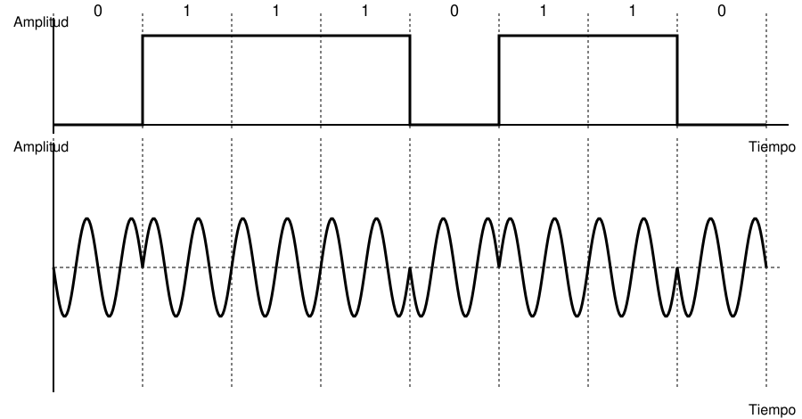
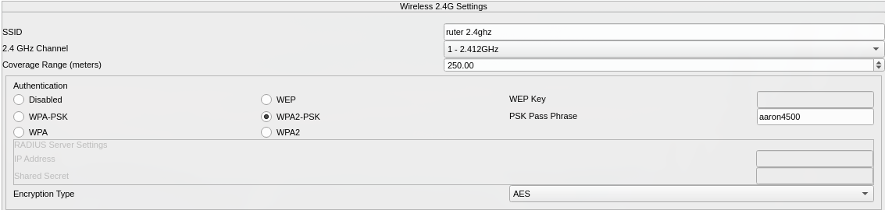
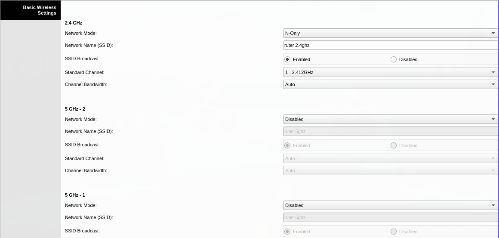
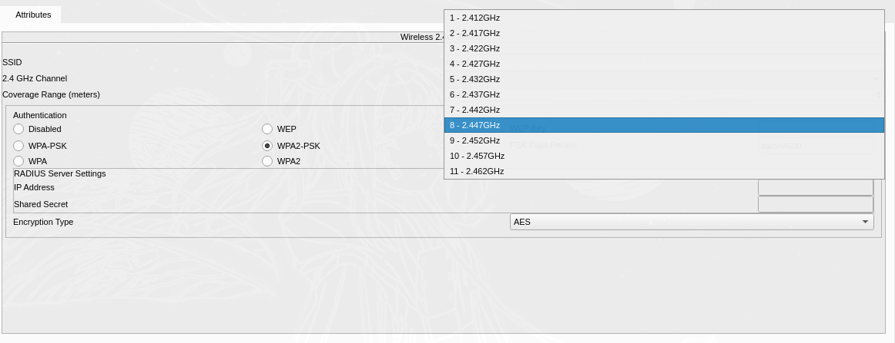
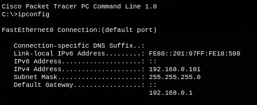
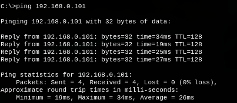
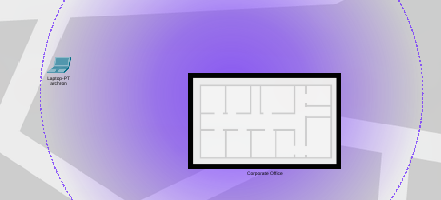
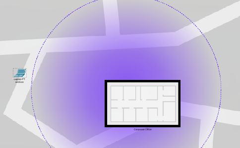
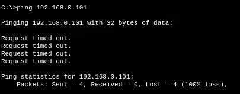

# Trabajo Práctico N°1 — Informe

**Integrantes del Grupo:**

| Name                            | DNI      | Mail UNC                          | Github                                                            |
| ------------------------------- | -------- | --------------------------------- | ----------------------------------------------------------------- |
| Viberti, Benjamin               | 46224179 | b.viberti@mi.unc.edu.ar           | [@benjaviberti](https://github.com/benjaviberti)                   |
| Espinoza Sutta, Aaron Alejandro | 96009173 | aaron.espinoza_4500@mi.unc.edu.ar | [@Aaron45000](https://github.com/Aaron45000)                       |
| Cleri, Juan Ignacio             | 46452662 | ignacio.cleri@mi.unc.edu.ar       | [@IgnaCleri](https://github.com/IgnaCleri)                         |
| Pineda, Juan Ignacio            | 45591343 | juan.ignacio.pineda@mi.unc.edu.ar | [@juanignaciopineda-dot](https://github.com/juanignaciopineda-dot) |
| Grafión, Atilio Leonel         | 43940195 | atilio.grafion@mi.unc.edu.ar      | NA                                                                |
| Badenes, Tomas                  | 44785038 | tomasbadenes@mi.unc.edu.ar        | NA                                                                |
| Oviedo, Ignacio Nicolas         | 43940195 | ignacio.oviedo.239@mi.unc.edu.ar  | NA                                                                |

## 1) Consigna 1

### Parte 1: Resumen de Conceptos Teóricos

#### 1.1. Onda Electromagnética

##### Definición

Una onda electromagnética es la propagación de energía producida por campos eléctricos y magnéticos que varían periódicamente en el tiempo y el espacio. En el contexto de redes de computadoras, **es el medio fundamental para la transmisión de datos** tanto en medios guiados (cables de cobre, fibra óptica) como no guiados (aire, espacio libre).

##### Características Principales

**Naturaleza de la señal:** Toda onda electromagnética, considerada como función del tiempo, puede representarse como una señal analógica o digital.

**Composición en frecuencia:** Según el análisis de Fourier, cualquier onda electromagnética está constituida por una superposición de componentes sinusoidales, cada una con:

- Amplitud específica
- Frecuencia propia
- Fase característica

**Universalidad:** Sumando un número suficiente de señales sinusoidales con sus correspondientes amplitudes, frecuencias y fases, se puede construir y representar cualquier onda electromagnética.

#### 1.2. Señal de Tiempo Continuo

##### Definición

Una señal de tiempo continuo es aquella que está definida para cualquier valor de tiempo y varía de manera continua sin saltos ni discontinuidades. En el dominio de la transmisión de datos, una **señal analógica** es una onda electromagnética que varía continuamente en el tiempo.

##### Características

- Varía suavemente en el tiempo
- Los datos analógicos (voz, vídeo, temperatura) ocupan un espectro de frecuencias limitado
- Se pueden representar mediante ondas electromagnéticas que ocupen el mismo espectro
- Pueden propagarse a través de medios guiados (par trenzado, cable coaxial, fibra óptica) o no guiados (atmósfera, espacio)

##### Parámetros de una Onda Sinusoidal

Base del análisis de Fourier:

- **Amplitud:** valor máximo de la señal (medido en voltios)
- **Frecuencia:** razón de repetición (ciclos por segundo o Hertz)
- **Fase:** posición relativa de la señal dentro de un período

#### 1.3. Señal de Tiempo Discreto

##### Definición

Una señal de tiempo discreto es aquella que solo está definida en valores específicos y separados del tiempo. En el contexto de transmisión de datos, una **señal digital** es una secuencia de pulsos de tensión con valores constantes durante intervalos de tiempo determinados.

##### Características

- La intensidad se mantiene constante durante intervalos de tiempo, luego cambia a otro valor constante
- Los datos digitales toman valores discretos (ejemplo: cadenas de texto, números enteros)
- Se puede transmitir a través de medios conductores usando diferentes niveles de tensión
- Ejemplo: nivel de tensión positiva representa un bit 0, nivel negativo representa un bit 1

##### Ventajas sobre Señales Analógicas

- Más económica en términos generales
- Menos susceptible a interferencias de ruido
- Mejor integridad de datos en transmisión digital

#### 1.4. Modulación/Demodulación

##### Modulación

La modulación es el proceso mediante el cual se codifican datos en una onda electromagnética variando alguno de los parámetros característicos de una señal denominada **portadora**. Permite adaptar los datos al canal de transmisión disponible, haciendo posible la transmisión de datos digitales a través de medios diseñados para señales analógicas.

**Proceso de modulación digital (módem):**

- Convierte una serie de pulsos binarios discretos (datos digitales en tiempo discreto) en una señal analógica de tiempo continuo
- Codifica los datos digitales variando la amplitud, frecuencia o fase de la portadora
- La señal resultante ocupa un espectro de frecuencias centrado en la frecuencia de la portadora

**Aplicación práctica:** Los módems convencionales representan datos binarios en el espectro de la voz, permitiendo que datos digitales se transmitan a través de líneas telefónicas convencionales (medios diseñados originalmente para señales analógicas).

##### Demodulación

La demodulación es el proceso inverso a la modulación: recupera los datos originales a partir de una señal modulada. Es esencial para recibir e interpretar correctamente la información transmitida.

**Proceso de demodulación (módem receptor):**

- Recibe la señal modulada en tiempo continuo
- Extrae los datos digitales originales (en tiempo discreto) que fueron codificados en la portadora
- Recupera la secuencia de bits binarios original

**Analogía con datos analógicos (codec):** Un codec (codificador-decodificador) realiza una operación similar pero en dirección opuesta a los módems: toma una señal analógica (tiempo continuo) y la aproxima mediante una cadena de bits (tiempo discreto). En el receptor, estos bits se usan para reconstruir la señal analógica original.

### Parte 2: Análisis Práctico

#### Punto b

**Datos extraídos del gráfico:**

A partir del gráfico se identifica que la onda completa un ciclo cada 60 mm, por lo que la longitud de onda es:

$$
\lambda = 60 \text{ mm} = 0{,}06 \text{ m}
$$

**Cálculo de la frecuencia:**

La longitud de onda se relaciona con la velocidad de propagación y la frecuencia mediante la expresión:

$$
\lambda \cdot f = v
$$

Dado que la onda viaja exactamente a la velocidad de la luz ($c \approx 3 \times 10^8 \text{ m/s}$), despejando la frecuencia se obtiene:

$$
f = \frac{c}{\lambda} = \frac{3 \times 10^8 \text{ m/s}}{0{,}06 \text{ m}} = 5 \times 10^9 \text{ Hz} = 5 \text{ GHz}
$$

**Resultado:**

| Parámetro            | Valor                |
| --------------------- | -------------------- |
| Longitud de onda (λ) | 0,06 m (60 mm)       |
| Frecuencia (f)        | 5 × 10⁹ Hz = 5 GHz |

#### Punto c

**Marco de referencia normativo:**

Para la clasificación sistemática del espectro electromagnético, se consulta el Artículo 2, Sección 2.1 de las Regulaciones de Radiocomunicaciones de la Unión Internacional de Telecomunicaciones (ITU-R Radio Regulations). Este documento establece la división internacional del espectro de radiofrecuencias en bandas designadas, cada una identificada por un rango específico de frecuencias.

**Bandas de frecuencia según ITU-R (Artículo 2, Sección 2.1):**

El espectro se organiza en las siguientes bandas principales:

| Designación  | Rango de Frecuencia       | Región del Espectro EM        |
| ------------- | ------------------------- | ------------------------------ |
| VHF           | 30 MHz – 300 MHz         | Ondas de Radio                 |
| UHF           | 300 MHz – 3 GHz          | Ondas de Radio/Microondas      |
| **SHF** | **3 GHz – 30 GHz** | **Microondas**           |
| EHF           | 30 GHz – 300 GHz         | Microondas/Ondas Milimétricas |

**Clasificación de la onda analizada:**

Con una frecuencia de **5 GHz**, la onda electromagnética estudiada se ubica específicamente en:

- **Banda ITU:** SHF (Super High Frequency)
- **Región del Espectro EM:** Microondas
- **Rango:** 3 GHz < 5 GHz < 30 GHz

**Conclusión:**

La onda electromagnética con frecuencia de 5 GHz opera en la **banda SHF del espectro de radiofrecuencias** según las definiciones de la ITU, perteneciendo a la región de **microondas** del espectro electromagnético.

#### Punto c

Los sistemas de comunicacion mas usados dentro de la banda SHF, son:

En comunicaciones satelitales:

* Antenas VSAT

- Antenas de receptores TV (DIRECTV, MovistarTV)

En Redes Wifi y conectividad local

- Routers Wifi (Wifi 2.4Ghz - Wifi 5Ghz)

- Telefonía móvil

- Las redes 5G

Radares (aunque no sean para comunicación principalmente)

- Radares meteorológicos
- Radares de aeropuertos
- Radares militares

## 3) Modulación de señales digitales

### a) Técnica de modulación representada

La técnica representada es **PSK (Phase Shift Keying / Modulación por desplazamiento de fase)**, en su variante binaria (**BPSK**).

En el gráfico, la portadora senoidal mantiene su **amplitud y frecuencia constantes** a lo largo de toda la transmisión; lo único que cambia entre símbolos es su **fase**: los intervalos donde el bit vale "1" muestran la onda con una fase (por ejemplo 0°), y los intervalos donde el bit vale "0" muestran la misma onda invertida 180° respecto a la anterior. Por eso se ve un "quiebre" o inversión en la forma de onda justo en las transiciones entre bits distintos, mientras que entre bits iguales consecutivos la señal continúa sin discontinuidad. Como el parámetro modulado es la fase de la portadora (y no su amplitud ni su frecuencia), se trata de PSK.

### b) Señal modulada para la secuencia `0 1 1 1 0 1 1 0`

Aplicando el mismo principio (PSK) a la secuencia de bits `0 1 1 1 0 1 1 0`, la señal digital de entrada y su correspondiente portadora modulada en fase se ven así:

Arriba se muestra la señal digital (nivel bajo = "0", nivel alto = "1") y abajo la portadora senoidal resultante: amplitud y frecuencia constantes en toda la señal, con un cambio (inversión) de fase de 180° cada vez que el bit cambia de valor respecto al anterior.

## 4 Red simple en Packet Tracer

### Router

En nuestro caso, el router que utilizamos para la red fue el genérico Home Router con la siguiente configuración:

IP y máscara de subred:

Seguridad WPA2-PSK:

1) Este router está trabajando con una frecuencia de 2.4 GHz (este router también tiene la posibilidad de trabajar con frecuencia de 5 GHz, pero la desactivé para mantener la simplicidad).

2) El router, independientemente de si es 2.4 GHz o 5 GHz, está trabajando en la banda de microondas del espectro electromagnético.

3) Este opera entre las frecuencias $(2,412Ghz , 2,462Ghz)$, el ancho de banda de operacion es $2,412Ghz - 2,462Ghz = 0.050Ghz$ en la clasificacion de la ITU entra en la banda SHF (Super High Frecuency).

### PC de escritorio

La PC de escritorio ya está conectada a la red con la IP 192.168.0.101 vía Ethernet.

### Laptop

La laptop ya está conectada a la red con la IP 192.168.0.100 vía Wi-Fi.

Ahora comprobemos si tiene conexión con la PC que está conectada a la red vía Ethernet.

### Comprobación de conexiones

Ahora comprobaremos la conexión entre la PC y la laptop en distintas posiciones:

#### Caso 1: Ambas en la oficina

En este caso, el ping salió de esta manera:

#### Caso 2: En el borde interno del límite

En este caso, el ping salió de esta manera:

Un poco mayor al anterior.

#### Caso 3: Fuera del límite

En este caso, el comando ping con la PC de escritorio no devolvió nada, ya que al estar fuera del límite de operación del router la laptop se desconectó.

