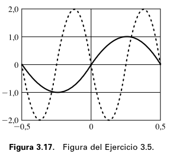
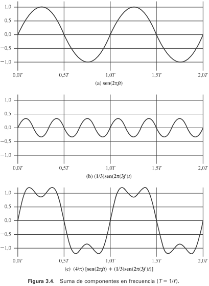
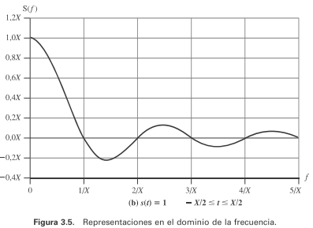

# Trabajo Práctico N°2

**Integrantes del Grupo:**

| Name                            | DNI      | Mail UNC                          | Github                                                            |
| ------------------------------- | -------- | --------------------------------- | ----------------------------------------------------------------- |
| Viberti, Benjamin               | 46224179 | b.viberti@mi.unc.edu.ar           | [@benjaviberti](https://github.com/benjaviberti)                   |
| Espinoza Sutta, Aaron Alejandro | 96009173 | aaron.espinoza_4500@mi.unc.edu.ar | [@Aaron45000](https://github.com/Aaron45000)                       |
| Cleri, Juan Ignacio             | 46452662 | ignacio.cleri@mi.unc.edu.ar       | [@IgnaCleri](https://github.com/IgnaCleri)                         |
| Pineda, Juan Ignacio            | 45591343 | juan.ignacio.pineda@mi.unc.edu.ar | [@juanignaciopineda-dot](https://github.com/juanignaciopineda-dot) |
| Grafión, Atilio Leonel         | 43940195 | atilio.grafion@mi.unc.edu.ar      | [@Aollgn](https://github.com/Aollgn)                               |
| Badenes, Tomas                  | 44785038 | tomasbadenes@mi.unc.edu.ar        | NA                                                                |
| Oviedo, Ignacio Nicolas         | 43940195 | ignacio.oviedo.239@mi.unc.edu.ar  | NA                                                                |

# a) Leer: Stallings - Comunicaciones y Redes de Computadores 7ed. PARTE II –

Comunicaciones de Datos: Capítulo 3. Transmisión de Datos.

3.1. Conceptos y terminología
• Terminología utilizada en transmisión de datos
• Frecuencia, espectro y ancho de banda
3.2. Transmisión de datos analógicos y digitales
• Datos analógicos y digitales
• Señales analógicas y digitales
• Transmisión analógica y digital
3.3. Dificultades en la transmisión
• Atenuación
• Distorsión de retardo
• Ruido

# b) PREGUNTAS DE REPASO

## 3.1. ¿En qué se diferencia un medio guiado de un medio no guiado?

En ambos tipos de medios la comunicación se realiza mediante ondas electromagnéticas; la diferencia radica en **cómo se propaga la onda**:

- **Medio guiado:** La onda se transmite confinada a lo largo de un camino físico. Ejemplos: par trenzado, cable coaxial, fibra óptica.
- **Medio no guiado (inalámbrico):** La onda se propaga libremente, sin estar confinada a un camino físico. Ejemplos: propagación a través del aire, el mar o el vacío.

## 3.2. ¿Cuáles son las diferencias entre una señal electromagnética analógica y una digital?

Toda señal electromagnética, considerada como función del tiempo, puede ser tanto analógica como digital. La diferencia entre ambas está en cómo varía la intensidad de la señal en el tiempo:

- **Señal analógica:** Es una onda electromagnética que varía continuamente en el tiempo, sin saltos ni discontinuidades, y puede tomar cualquier valor dentro de un rango continuo. Según su espectro, puede propagarse tanto por medios guiados (par trenzado, cable coaxial, fibra óptica) como no guiados (atmósfera, espacio).
- **Señal digital:** Es una secuencia de pulsos de tensión que se mantiene constante durante un intervalo de tiempo, tras el cual cambia abruptamente a otro valor constante. Por ejemplo, un nivel de tensión positiva puede representar un bit 0 y un nivel de tensión negativa un bit 1.

**Ventajas y desventajas de la señalización digital frente a la analógica:**

- *Ventaja:* en términos generales es más económica y menos susceptible a las interferencias de ruido.
- *Desventaja:* las señales digitales sufren más con la atenuación que las señales analógicas.

## 3.3. ¿Cuáles son las tres características más importantes de una señal periódica?

Una señal periódica se caracteriza por contener un patrón que se repite a lo largo del tiempo. Matemáticamente, una señal s(t) es periódica si y solo si:

$$
s(t + T) = s(t), \quad -\infty < t < \infty
$$

donde T es el período de la señal (el menor valor que verifica la ecuación).

Las **tres características más importantes** que definene a una señal periódica son:

- **Amplitud (A):** El valor máximo que alcanza la señal en el tiempo (amplitud de pico), normalmente medido en voltios.
- **Frecuencia (f):** La razón, en ciclos por segundo o Hercios (Hz), a la que la señal se repite. Su parámetro equivalente es el período (T), definido como el tiempo transcurrido entre dos repeticiones consecutivas, cumpliéndose que T = 1/f.
- **Fase (φ):** Una medida de la posición relativa de la señal dentro de un período de la misma.

## 3.4. ¿Cuántos radianes hay en 360°?

El radián es la unidad de medida angular basada en la relación entre el arco y el radio de una circunferencia: un ángulo de 1 radián es aquel que subtiende un arco de longitud igual al radio.

Dado que el perímetro completo de una circunferencia equivale a $2\pi$ veces su radio, una vuelta completa (360°) equivale a $2\pi$ radianes:

$$
360° = 2\pi \text{ radianes}
$$

## 3.5. ¿Cuál es la relación entre la longitud de onda y la frecuencia en una onda seno?

La longitud de onda ($\lambda$) se define como la distancia que ocupa un ciclo de la señal, o equivalentemente, la distancia entre dos puntos de igual fase en dos ciclos consecutivos. Representa la contraparte espacial del período (T), que es su equivalente en el dominio temporal.

Si la señal se propaga a una velocidad $v$, la longitud de onda se relaciona con el período mediante:

$$
\lambda = v \cdot T
$$

Dado que $T = 1/f$, esta expresión es equivalente a:

$$
\lambda \cdot f = v
$$

Es decir, **la longitud de onda y la frecuencia son inversamente proporcionales**: a mayor frecuencia, menor longitud de onda, y viceversa, para una misma velocidad de propagación $v$.

## 3.6. ¿Cuál es la relación entre el espectro de una señal y su ancho de banda?

Según el análisis de Fourier, cualquier señal electromagnética puede descomponerse en una colección de componentes sinusoidales (ondas seno), cada una con su propia amplitud, frecuencia y fase. Mientras la señal $s(t)$ describe su comportamiento en el dominio del tiempo, la función $S(f)$ la describe en el dominio de la frecuencia, especificando las amplitudes de sus componentes.

A partir de esto:

- **Espectro:** Es el conjunto de frecuencias que constituyen una señal.
- **Ancho de banda absoluto:** Es la anchura de ese espectro, es decir, la diferencia entre su frecuencia más alta y más baja.

En la práctica, muchas señales (por ejemplo, cualquier onda digital) tienen un espectro y, por lo tanto, un ancho de banda absolutoinfinito. Sin embargo, la mayor parte de su energía se concentra en una banda de frecuencias relativamente estrecha; a esa banda se la denomina **ancho de banda efectivo** (o simplemente ancho de banda).

**Relación con la transmisión real:** Ningún sistema de transmisión puede portar un ancho de banda infinito, y cuanto mayor es el ancho de banda transmitido, mayor es el costo. Por eso, en la práctica se transmite una versión de ancho de banda limitado de la señal original. Esta limitación introduce distorsión: cuanto más se restringe el ancho de banda respecto del espectro original, mayor es la distorsión y mayor la probabilidad de errores en el receptor.

## 3.7. ¿Qué es la atenuación?

La atenuación es la pérdida de energía que sufre una señal a medida que se propaga a través de un medio de transmisión, decayendo con la distancia recorrida. Es una de las dificultades fundamentales de la transmisión, junto con la distorsión de retardo y el ruido, y provoca que la señal recibida difiera de la señal originalmente transmitida (degradando su calidad en señales analógicas, o generando bits erróneos en señales digitales).

**Comportamiento según el tipo de medio:**

- **Medios guiados:** La atenuación suele ser exponencial, por lo que se expresa como un valor constante en decibelios por unidad de longitud.
- **Medios no guiados:** La atenuación es una función más compleja de la distancia, dependiente además de las condiciones atmosféricas.

**Consideraciones respecto a la atenuación:**

1. La señal recibida debe tener suficiente energía para que el receptor pueda detectarla adecuadamente.
2. Debe conservar un nivel notoriamente mayor que el del ruido para poder recibirse sin error.
3. La atenuación es, habitualmente, una función creciente de la frecuencia (afecta más a las frecuencias altas).

**Mitigación:** Los dos primeros problemas se resuelven controlando la energía de la señal mediante amplificadores o repetidores, ubicados a distancias adecuadas cuando la atenuación acumulada se vuelve inaceptable. El tercer problema se aborda con técnicas de ecualización de la atenuación en una banda de frecuencias dada.

## 3.8. Defina la capacidad de un canal

Se denomina **capacidad del canal** a la velocidad máxima a la que se pueden transmitir datos en un canal (o ruta de comunicación de datos) bajo unas condiciones dadas. Para el caso de datos digitales, la pregunta que responde es en qué medida los efectos nocivos que distorsionan o corrompen la señal limitan la velocidad de transmisión.

## 3.9. ¿Qué factores clave afectan a la capacidad de un canal?

Hay **cuatro conceptos relacionados entre sí** que determinan la capacidad de un canal:

- **La velocidad de transmisión de los datos:** Velocidad, expresada en bits por segundo (bps), a la que se pueden transmitir los datos.
- **El ancho de banda:** Ancho de banda de la señal transmitida, limitado por el transmisor y por la naturaleza del medio; se mide en hercios.
- **El ruido:** Nivel medio de ruido presente en el camino de transmisión.
- **La tasa de errores:** Tasa a la que ocurren errores (recibir un 1 habiendo transmitido un 0, o viceversa).

**Relación entre estos factores:**

- **Ancho de banda de Nyquist** (canal sin ruido): dado un ancho de banda $B$, la máxima velocidad de señal alcanzable es $2B$. Para señales con $M$ niveles discretos, la capacidad es
  $C = 2B \log_2 M$.
- **Capacidad de Shannon** (canal con ruido): relaciona la capacidad con el ancho de banda y la relación señal-ruido (SNR):

$$
C = B \log_2(1 + SNR)
$$

Esta fórmula representa el límite teórico máximo: dado un ancho de banda y un nivel de ruido, mayor SNR permite mayor capacidad. En la práctica se obtienen velocidades menores, ya que la fórmula supone únicamente ruido térmico y no contempla otros efectos como el ruido impulsivo o las distorsiones de atenuación y retardo.

---

# c) Ejercicios (3.1 a 3.20)

## 3.1

### a)

#### Pregunta:

En una configuración multipunto, sólo un dispositivo puede trasmitir cada vez, ¿por qué?

#### Respuesta:

En este caso depende exactamente de como este implementado el medio de transmisión, si este cuenta con mas de un canal de transmisión de datos (usando Multiplexación por División de Frecuencias), pero en un caso basico con un unico canal, si se puede decir que solo se puede transmitir un dispositivo a la vez.

### b)

#### Pregunta:

Hay dos posibles aproximaciones que refuerzan la idea de que, en un momento dado, sólo un dispositivo puede transmitir. En un sistema centralizado, una estación es la responsable del control y podrá transmitir o decidir que lo haga cualquier otra. En el método descentralizado, las estaciones cooperan entre sí, estableciéndose una serie de turnos. ¿Qué ventajas y desventajas presentan ambas aproximaciones?

#### Respuesta:

##### Caso 1: Sistema Centralizado.

- Ventajas:
  Es mas sencillo evitar transmisiones a la vez ya que el que daria la orden directamente seria la estación de control, tambien al evitar el sistema de turnos en teoria puedes optimizar el uso del medio de transmisión.
- Desventajas:
  Todo el control depende de una unica estación la cual puede quedar fuera de servicio y parar en seco las transmisiones todas las demas estaciones.

##### Caso 2: Sistema Descentralizado.

- Ventajas:
  Puede seguir funcionando incluso si una o varias estaciones estan fuera de servicio
- Desventajas:
  El sistema es menos optimo ya que puede que el canal sea necesitado por alguna central pero no usado ya que no es el turno de la central que la necesita

## 3.2

### Pregunta:

Una señal tiene una frecuencia fundamental de 1000 Hz. ¿Cuál es su periodo?

### Respuesta:

Si una señal tiene una frencuencia fundamental $f=1000hz \rightarrow T=\frac{1}{f}=\frac{1}{1000hz}= 1ms$

## 3.3

### Pregunta:

Simplifique las siguientes expresiones:

a) $\sin(2\pi ft - \pi) + \sin(2\pi ft + \pi)$

b) $\sin(2\pi f t) + \sin(2\pi f t - \pi)$

### Respuesta:

#### a)

$$
\sin(2\pi ft - \pi) + \sin(2\pi ft + \pi) = -\sin(2\pi ft) + \left(-\sin(2\pi ft)\right) = -2\sin(2\pi ft)
$$

#### b)

$$
\sin(2\pi f t) + \sin(2\pi f t - \pi) = \sin(2\pi f t) + (-\sin(2\pi f t)) = 0
$$

## 3.4

### Pregunta:

El sonido se puede modelar mediante funciones sinusoidales. Compare la frecuencia relativa y la longitud de onda de las notas musicales. Piense que la velocidad del sonido es igual a 330 m/s y que las frecuencias de una escala musical son:

### Respuesta:

Sea $v$ velocidad del sonido, $\lambda$ la longitud de onda y $f$ frecuencia de la nota

$$
\lambda = \frac{v}{f}
$$

| Nota             | DO     | RE     | MI     | FA     | SOL    | LA     | SI     | DO     |
| ---------------- | ------ | ------ | ------ | ------ | ------ | ------ | ------ | ------ |
| **f (Hz)** | 264    | 297    | 330    | 352    | 396    | 440    | 495    | 528    |
| **λ (m)** | 1.2500 | 1.1111 | 1.0000 | 0.9375 | 0.8333 | 0.7500 | 0.6667 | 0.6250 |

Podemos ver como a mayor la frecuencia de la nota, menor es la longitud de onda.

## 3.5

### Pregunta:

Si la curva trazada con una línea continua de la Figura 3.17 representa al $\sin(2nt)$, ¿qué función corresponde a la línea discontinua? En otras palabras, la línea discontinua se puede expresar como $A\sin(2nft+\phi)$, ¿qué son $A$, $f$ y $\phi$?

### Respuesta:

La linea discontinua corresponda a una funcion seno a la cual se le cambio la frecuencia $f$ (esta paso a ser el doble de la anterior), se le aplico un desfasaje $\phi$ (de mas o menos $0.5$) y ademas se le aumento la amplitud $A$ (Una amplitud mayor a 1)

## 3.6

### Pregunta:

Exprese la señal _(1 + 0,1 $\cos 5t$) $\cos 100t$_ como combinación lineal de funciones sinusoidales; encuentre la amplitud, frecuencia y fase de cada una de las componentes. _(Sugerencia: use la expresión del cos a cos b)_.

### Respuesta:

- Distribuímos el producto

$$
s(t) = (1)(\cos100t) + (0{,}1\cos5t)(\cos100t) = \cos100t + 0{,}1\cos5t\cos100t
$$

- Aplicamos la identidad trigonométrica que nos suguiere la consigna en el segundo termino: $\cos a\cos b=\tfrac12[\cos(a-b)+\cos(a+b)]$

$$
0{,}1\cos100t\cos5t = 0{,}1\cdot\frac12\big[\cos(100t-5t)+\cos(100t+5t)\big] = 0{,}1\cdot\frac12\big[\cos95t+\cos105t\big] = 0{,}05\cos95t+0{,}05\cos105t
$$

$$
s(t) = \cos100t + 0{,}05\cos95t + 0{,}05\cos105t
$$

| Término           | Amplitud | ω (rad/s) | f = ω/2π (Hz) | Fase |
| ------------------ | -------- | ---------- | --------------- | ---- |
| $\cos100t$       | 1        | 100        | ≈15,92         | 0    |
| $0{,}05\cos95t$  | 0,05     | 95         | ≈15,12         | 0    |
| $0{,}05\cos105t$ | 0,05     | 105        | ≈16,71         | 0    |

## 3.7

### Pregunta:

Encuentre el periodo de la función $f(t)=(10\cos t)^2$.

### Respuesta:

$$
f(t) = (10\cos t)^2 = 100\cos^2t
$$

- Usar la identidad de ángulo doble $\cos^2t = \dfrac{1+\cos2t}{2}$:

$$
f(t) = 100\cdot\frac{1+\cos2t}{2}= 50 + 50\cos2t
$$

- Frecuencia angular es $\omega=2$ rad/s, y el periodo es $T=2\pi/\omega$:

$$
T = \frac{2\pi}{2} = \pi
$$

## 3.9

### Pregunta:

La Figura 3.4 muestra el efecto resultante al eliminar las componentes de alta frecuencia de un pulso cuadrado, considerando sólo las componentes de baja frecuencia. ¿Cómo sería la señal resultante en el caso contrario (es decir, quedándose con todos los armónicos de frecuencia alta y eliminando los de bajas frecuencias)?
_

### Respuesta:

La señal resultante quedándose con todos los armónicos de frecuencias altas y eliminando los de bajas frecuencias, se pierde todo lo "plano" de la onda cuadrada. Lo que sobrevive son unos picos angostos justo donde antes había un salto brusco (los flancos).

## 3.10

### Pregunta:

La Figura 3.5b muestra la función correspondiente a un pulso rectangular en el dominio de la frecuencia. Este pulso puede corresponder a un 1 digital en un sistema de comunicación. Obsérvese que se necesita un número infinito de frecuencias (con amplitud decreciente cuanto mayor es la frecuencia). ¿Qué implicaciones tiene este hecho en un sistema de transmisión real?

### Respuesta:

Las implicaciones que tiene este hecho en un sistema real son: como ningún canal de transmisión tiene ancho de banda infinito, en algún punto se pierden las componentes de frecuencia más alta del pulso, que son justamente las que le dan sus bordes filosos. Como consecuencia, el pulso que llega al receptor ya no conserva la forma rectangular ideal, sino que aparece con los flancos redondeados y estirado en el tiempo. Cuanto menor sea el ancho de banda disponible, mayor es esa distorsión.

## 3.11

### Pregunta:

El IRA es un código de 7 bits que permite la definición de 128 caracteres. En los años setenta, muchos medios de comunicación recibían las noticias a través de un servicio que usaba 6 bits denominado TTS. Este código transmitía caracteres en mayúsculas y minúsculas, así como caracteres especiales y órdenes de control. Generalmente, se utilizan 100 caracteres. ¿Cómo cree que se puede conseguir esto? 

### Respuesta: 

Un código de 6 bits ofrece $2^6 = 64$ combinaciones distintas. Para transmitir más de 100 caracteres diferentes utilizando solo 6 bits, el sistema TTS empleaba caracteres especiales de control o desplazamiento (shift codes, equivalentes a Shift In / Shift Out o Letters / Figures). Al transmitir un código de cambio de modo, el receptor reinterpreta las siguientes combinaciones dentro de un segundo conjunto de caracteres (por ejemplo, alternando entre el modo letras y el modo números/símbolos), lo que permite duplicar la capacidad efectiva a casi 126 caracteres distintos.  

## 3.12

### Pregunta:

¿Cuál es el incremento posible en la resolución horizontal para una señal de vídeo de ancho de banda 5 MHz? ¿Y para la resolución vertical? Responda ambas cuestiones por separado;es decir, utilice el incremento de ancho de banda para aumentar la resolución horizontal o la vertical, pero no ambas. 

### Respuesta: 

Partimos sabiendo que el ancho de banda de una señal de video es aproximadamente 4 MHz con:

**Resolucion vertical: $N_v$ = 483 líneas**

**Resolucion horizontal: $N_h$ = 450 línea**

**frecuencia de barrido: $f$ = 30 barridos/s**

**- Solo resolución horizontal**
Como el ancho de banda es proporcional a la cantidad de elementos horizontales por línea.

**Nueva resolucion horizontal: $N'_h$**

$$N'_h = N_h \times \frac{B_{\text{nuevo}}}{B_{\text{base}}}$$
$$N'_h = 450 \times \frac{5\text{ MHz}}{4\text{ MHz}} = 450 \times 1{,}25 = 562{,}5\text{ elementos}$$

Por lo que hay un incremento de 112 elementos, o sea aproximadamente un 25%

**- Solo resolución vertical**

**Nueva resolucion horizontal: $N'_v$**

$$N'_v = N_v \times \frac{B_{\text{nuevo}}}{B_{\text{base}}}$$

$$N'_v = 483 \times \frac{5\text{ MHz}}{4\text{ MHz}} = 483 \times 1{,}25 = 603{,}75\text{ líneas}$$

Por lo que hay un incremento de 121 elementos, o sea aproximadamente un 25%

## 3.13

### Pregunta:

**a)** Suponga que se transmite una imagen digitalizada de TV de 480 x 500 puntos, en la que cada punto puede tomar uno de entre 32 posibles valores de intensidad. Supóngase que se envían 30 imágenes por segundo (esta fuente digital es aproximadamente igual que los estándares adoptados para la difusión de TV). Determine la velocidad de transmisión R de la fuente en bps.

**b)** Suponga que la fuente anterior se transmite por un canal de 4,5 MHz de ancho de banda con una relación señal-ruido de 35 dB. Encuentre la capacidad del canal en bps.

**c)** ¿Cómo se deberían modificar los parámetros del apartado (a) para permitir la transmisión de la señal de TV en color sin incrementar el valor de R? 

### Respuesta: 

**a)**

**Puntos por imagen =** $480 \times 500 = 240000\ puntos$

**Bits por punto =** $log_2(32) = 5\ bits/punto$

**imágenes por segundo =** $30\ imágenes/s$

$R = 30\ \times 240 000\ \times 5 = 36 000 000\ bps = 36\ Mbps$

**b)**

**Ancho de banda:** $B = 4,5 MHz$

$SNR = 35\ dB = 10 ^ {35/10} = 3 162,3$

$C = B \times log_2(1 + SNR)$

$C = 4,5 \times 10 ^ 6 \times log_2(1 + 3162,3) = 52322466,01\ bps = 52,32\ Mbps$

La velocidadde transmision de la fuente es de  **36 000 000 bps**
  
**c)**

**Reducir el número de niveles de cuantificación:** (menos de 32, es decir, menos de 5 bits/punto) para la luminancia y/o crominancia, liberando bits para las nuevas componentes de color.

**Reducir la resolución espacial de las componentes de color** (submuestreo de crominancia, el mismo principio que usan los formatos 4:2:2 o 4:2:0 reales): reducir la resolución espacial del color en comparación con la luminancia (brillo), aprovechando la menor sensibilidad del ojo humano al detalle del color. 

## 3.14

### Pregunta:

Dado un amplificador con una temperatura efectiva de ruido de 10.000°K y con un ancho de banda de 10 MHz, ¿cuánto será el nivel de ruido térmico a la salida? 

### Respuesta: 

**constante de Boltzmann:** $k = 1,38 \times 10^{-23} J/K$

$T = 10000\ K$

$B = 10\ MHz$

$N = k \times T \times B = 1,38 \times 10^{-12} \times 10 \times 10^6 =  1,38 \times 10^{-12}$

## 3.15

### Pregunta:

¿Cuál es la capacidad para un canal de un «teletipo» de 300 Hz de ancho de banda con una relación señal-ruido de 3 dB?

### Respuesta: 

$B = 300 Hz$

$SNR = 3\ dB = 1,99$

$C = B \times log_2(1 + SNR)$

$C = 300 \times log_2(2,99) = 474,04\ bps$

La capacidad es de **474,76**

## 3.19

### Pregunta:

Sea un canal con una capacidad de 20 Mbps. El ancho de banda de dicho canal es 3 MHz. ¿Cuál es la relación señal-ruido admisible para conseguir la mencionada capacidad?

### Respuesta:

Es aplicación directa de la fórmula de shannon, entonces:

$$
C = B\ log_2(1 + SNR) \Rightarrow SNR = 2^{C/B} - 1
$$

luego: $C = 20 \times 10^6\ bps$ y $B = 3 \times 10^6\ Hz:$

$$
\frac{C}{B} = \frac{20}{3} = 6,\overline{6}\ bps/Hz
$$

$$
SNR = 2^{6,667} - 1 = 101,59 - 1 \approx 100,6
$$

Y en decibelios:

$$
SNR_{dB} = 10\ log_{10}(100,6) \approx 20\ dB
$$

Resultado: $SNR \approx 100,6,$ es decir unos $20\ dB$.

## 3.20

### Pregunta:

La onda cuadrada de la Figura 3.7c, con $T=1ms$, se transmite a través de un filtro paso
bajo ideal de ganancia unidad con frecuencia de corte a 8 kHz.
a) Determine la potencia de la señal de salida.
b) Suponiendo que a la entrada del filtro hay un ruido térmico con $N_0=0,1 \frac{W}{Hz}$, encuentre la relación señal-ruido en dB a la salida.

### Respuesta:

La onda cuadrada de amplitudes $A$ y $-A$ se descompone en armónicos impares de la fundamental:

$$
s(t) = A \ \frac{4}{\pi} \ \sum_{k\ impar} \frac{sen(2\pi k f t)}{k}
$$

Con $T = 1\ ms$ la fundamental es: $f = 1/T = 1\ kHz$ así que las componentes están en 1, 3, 5, 7, 9... kHz. El filtro paso bajo ideal con corte en 8 kHz deja pasar sólo las de 1, 3, 5 y 7 kHz y elimina el resto.

La componente k-ésima es una sinusoide de amplitud $V_k = \frac{4A}{k\pi}$, y la potencia de una sinusoide de amplitud $V$ es $V^2/2$. Se toma $A = 1$ y resistencia normalizada.

###### **a) Potencia de salida**

$$
P = \sum_{k=1,3,5,7} \frac{1}{2}\left(\frac{4}{k\pi}\right)^2 = \frac{8}{\pi^2}\sum_{k=1,3,5,7}\frac{1}{k^2}
$$

| $k$ | $f$ | $V_k = 4/k\pi$ | $P_k = V_k^2/2$ |
| ----- | ----- | ---------------- | ----------------- |
| 1     | 1 kHz | 1,2732           | 0,8106 W          |
| 3     | 3 kHz | 0,4244           | 0,0901 W          |
| 5     | 5 kHz | 0,2546           | 0,0324 W          |
| 7     | 7 kHz | 0,1819           | 0,0165 W          |

$$
P_{salida} = \frac{8}{\pi^2}\left(1 + \frac{1}{9} + \frac{1}{25} + \frac{1}{49}\right) \approx 0,95\ W
$$

**Resultado: $P_{salida} \approx 0,95\ W$.**

###### **b) Relación señal-ruido a la salida**

El ruido a la salida es el ruido térmico limitado por el ancho de banda del filtro, $B = 8\ kHz$:

$$
N = N_0 B = (0,1 \times 10^{-6}\ W/Hz)(8 \times 10^3\ Hz) = 8 \times 10^{-4}\ W = 0,8\ mW
$$

$$
SNR = \frac{P_{salida}}{N} = \frac{0,95}{8 \times 10^{-4}} \approx 1187
$$

$$
SNR_{dB} = 10\ log_{10}(1187) \approx 30,7\ dB
$$

**Resultado: $30,7\ dB$.**

# Bibliografía

Stallings, W. *Comunicaciones y Redes de Computadoras*.
