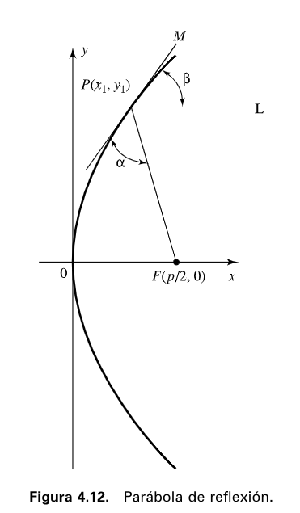

# Trabajo Práctico N°3

**Integrantes del Grupo:**

| Name                            | DNI      | Mail UNC                          | Github                                                             |
| ------------------------------- | -------- | --------------------------------- | ------------------------------------------------------------------ |
| Viberti, Benjamin               | 46224179 | b.viberti@mi.unc.edu.ar           | [@benjaviberti](https://github.com/benjaviberti)                   |
| Espinoza Sutta, Aaron Alejandro | 96009173 | aaron.espinoza_4500@mi.unc.edu.ar | [@Aaron45000](https://github.com/Aaron45000)                       |
| Cleri, Juan Ignacio             | 46452662 | ignacio.cleri@mi.unc.edu.ar       | [@IgnaCleri](https://github.com/IgnaCleri)                         |
| Pineda, Juan Ignacio            | 45591343 | juan.ignacio.pineda@mi.unc.edu.ar | [@juanignaciopineda-dot](https://github.com/juanignaciopineda-dot) |
| Grafión, Atilio Leonel          | 43940195 | atilio.grafion@mi.unc.edu.ar      | [@Aollgn](https://github.com/Aollgn)                               |
| Badenes, Tomas                  | 44785038 | tomasbadenes@mi.unc.edu.ar        | [@b-Tomas](https://github.com/b-Tomas)                             |
| Oviedo, Ignacio Nicolas         | 43940195 | ignacio.oviedo.239@mi.unc.edu.ar  | [@GIX02](https://github.com/GIX02)                                 |
| Mendez, Jorge Nicolas           | 41301342 | jorge.mendez@mi.unc.edu.ar        | [@jorge088](https://github.com/jorge088)                           |

# b) PREGUNTAS DE REPASO

## 4.1. ¿Por qué hay dos cables en un par trenzado de cobre?

Cada par de cables trenzados constituye un único enlace de comunicación. La razón de que sean dos conductores, y no uno solo, es eléctrica: para que la corriente circule se necesita un circuito cerrado, es decir, un camino de ida y otro de retorno hacia la fuente; un solo cable no puede transportar una señal sin ese segundo conductor que complete el circuito.

Además, al ser dos conductores trenzados entre sí y muy próximos, ambos quedan expuestos de forma prácticamente idéntica a las interferencias electromagnéticas externas. Esto es lo que permite, en el receptor, tomar la señal como la diferencia entre ambos cables: el ruido captado por igual en los dos se cancela, mejorando la inmunidad al ruido frente a un único conductor.

## 4.2. ¿Cuáles son las limitaciones del par trenzado?

Comparado con otros medios guiados (cable coaxial y fibra óptica), el par trenzado presenta varias limitaciones:

- **Menor ancho de banda, distancia y velocidad de transmisión**: su rango de frecuencias útil (hasta 1 MHz para cables multipar) y la separación entre repetidores (apenas 2 km) son mucho menores que los del cable coaxial (hasta 500 MHz, repetidores cada 1-9 km) o la fibra óptica (hasta 370 THz, repetidores cada 40 km).
- **Atenuación fuertemente dependiente de la frecuencia**: a mayor frecuencia de la señal, mayor es la pérdida de energía por unidad de longitud.
- **Alta susceptibilidad a interferencias y ruido**: al acoplarse fácilmente con campos electromagnéticos externos, un par trenzado tendido en paralelo a una línea de alta tensión, por ejemplo, capta la energía de 50/60 Hz de esa línea. También es vulnerable al ruido impulsivo.
- **Necesidad frecuente de regeneración de la señal**: para transmisión analógica requiere amplificadores cada 5-6 km, y para transmisión digital, repetidores cada 2-3 km, un espaciado mucho más corto que el de otros medios guiados.

## 4.3. ¿Cuál es la diferencia entre el par trenzado no apantallado y el par trenzado apantallado?

La diferencia está en si el par de cables está protegido o no por una malla metálica adicional:

- **Par trenzado no apantallado (UTP, *Unshielded Twisted Pair*)**: es el más común, sobre todo en telefonía. Es el medio de transmisión más económico de todos, y también el más simple de instalar y manipular, pero al no tener protección adicional resulta más vulnerable a interferencias electromagnéticas externas, incluyendo las de pares cercanos o fuentes de ruido próximas.
- **Par trenzado apantallado (STP, *Shielded Twisted Pair*)**: el par de cables se recubre con una malla metálica que reduce las interferencias externas. Esto le permite ofrecer mejores prestaciones a velocidades de transmisión más altas, a cambio de ser más costoso y más difícil de manipular que el UTP.

## 4.4. Describir los principales componentes del cable de fibra óptica.

La fibra óptica es un medio flexible y muy delgado (entre 2 y 125 μm), capaz de confinar un haz de luz en su interior. Se puede fabricar con distintos materiales, con una relación directa entre costo y pérdidas: las fibras de silicio ultrapuro fundido son las que menos pérdidas presentan, pero también las más difíciles de fabricar; las fibras de cristal multicomponente son más económicas a cambio de mayores pérdidas; y las fibras de plástico son las más baratas de todas, aptas para enlaces cortos donde son aceptables pérdidas más altas.

Un cable de fibra óptica tiene forma cilíndrica y está compuesto por tres secciones concéntricas:

- **Núcleo**: la sección más interna, formada por una o varias fibras de cristal o plástico, con un diámetro de entre 8 y 100 μm. Es por donde efectivamente viaja el haz de luz.
- **Revestimiento**: rodea a cada fibra individualmente. Es también cristal o plástico, pero con propiedades ópticas distintas a las del núcleo. La frontera entre núcleo y revestimiento actúa como un reflector que confina el haz de luz dentro del núcleo, sin el cual la luz escaparía.
- **Cubierta**: la capa más exterior, que envuelve a uno o varios revestimientos. Está hecha de plástico y otros materiales dispuestos en capas, con una función puramente de protección física: contra la humedad, la abrasión, aplastamientos y otros daños.

## 4.5. ¿Qué ventajas y desventajas tiene la transmisión de microondas?

**Ventajas:**

- Para una distancia dada, requiere menos repetidores o amplificadores que el cable coaxial.
- Su atenuación crece con el cuadrado de la distancia, no exponencialmente como en el par trenzado o el coaxial, por lo que los repetidores pueden espaciarse mucho más: entre 10 km y 100 km, frente a los pocos km de los medios guiados.
- A mayor frecuencia utilizada, mayor ancho de banda potencial y, por lo tanto, mayor velocidad de transmisión alcanzable.
- A frecuencias más altas, las antenas necesarias son más pequeñas y más económicas.

**Desventajas:**

- Exige que las antenas estén perfectamente alineadas entre sí, siguiendo la línea visual directa, y montadas de forma rígida.
- La atenuación aumenta con la lluvia, un efecto especialmente marcado por encima de los 10 GHz.
- Al ser un medio cada vez más popular, las áreas de cobertura tienden a solaparse, generando riesgo de interferencias, lo que exige una regulación estricta en la asignación de bandas.

## 4.6. ¿Qué es la difusión directa por satélite (DBS, Direct Broadcast Satellite)?

DBS es la aplicación más reciente de la tecnología satelital a la televisión, en la que la señal de video se transmite directamente desde el satélite a los domicilios de los usuarios, sin pasar por estaciones terrestres intermedias que redistribuyan la programación. Se volvió económicamente viable gracias a la reducción en costo y tamaño de las antenas receptoras domésticas, lo que a su vez permitió aumentar la cantidad de canales disponibles.

## 4.7. ¿Por qué un satélite debe usar frecuencias ascendentes y descendentes distintas?

Porque un satélite no puede transmitir y recibir simultáneamente en el mismo rango de frecuencias sin generar interferencia entre ambas señales: si usara la misma banda para el canal ascendente (estación terrestre → satélite) y el descendente (satélite → estación terrestre), la propia retransmisión del satélite se mezclaría con la señal entrante. Por eso, la señal recibida en una frecuencia dada debe reenviarse necesariamente en una frecuencia distinta.

## 4.8. Indique las diferencias más significativas entre la difusión de radio y las microondas.

- **Direccionalidad**: las ondas de radio son omnidireccionales, mientras que las microondas tienen un diagrama de radiación mucho más direccional. Por eso las ondas de radio no requieren antenas parabólicas ni montajes rígidos para mantener la alineación, a diferencia de las microondas.
- **Rango de frecuencias**: las ondas de radio (en el sentido informal usado aquí, VHF y parte de UHF) ocupan de 30 MHz a 1 GHz, un rango bastante más bajo que el de las microondas terrestres (1 a 40 GHz).
- **Sensibilidad a la lluvia**: las microondas se ven significativamente afectadas por la atenuación por lluvia, sobre todo por encima de los 10 GHz; las ondas de radio son mucho menos sensibles a este efecto.
- **Atenuación con la distancia**: ambas siguen la misma relación con la distancia, pero al tener una longitud de onda mayor, las ondas de radio sufren, en términos relativos, menor atenuación que las microondas.
- **Aplicación característica**: la naturaleza omnidireccional de las ondas de radio las hace ideales para difusión simultánea a múltiples destinos (por ejemplo, radio FM o TV VHF/UHF); las microondas, en cambio, se usan típicamente para enlaces punto a punto, ya que necesitan que ambas antenas estén alineadas entre sí.
- **Interferencia característica**: las ondas de radio son propensas a interferencias por multitrayectoria (reflexiones en el suelo, el mar u otros objetos, que pueden generar imágenes fantasma en receptores de TV); las microondas, en cambio, son más susceptibles a interferencias por solapamiento de áreas de cobertura entre enlaces cercanos.

## 4.9. ¿Qué dos funciones realiza una antena?

Una antena es un conductor eléctrico (o un conjunto de conductores) que sirve para radiar o captar energía electromagnética, y cumple dos funciones opuestas:

- **Transmitir**: convierte la energía eléctrica que le llega del transmisor en energía electromagnética, y la radia hacia el entorno cercano (la atmósfera, el espacio o el agua).
- **Recibir**: captura energía electromagnética del entorno y la convierte en energía eléctrica, que entrega al receptor.

En comunicaciones bidireccionales suele usarse la misma antena para ambas funciones, ya que sus características de transferencia de energía son idénticas en los dos sentidos, transmitiendo o recibiendo, siempre que se use la misma frecuencia.

## 4.10. ¿Qué es una antena isotrópica?

Es una antena ideal, sin equivalente físico real, definida como un punto en el espacio que radia potencia de igual forma en todas las direcciones. Su diagrama de radiación (la representación gráfica de cómo radia potencia según la dirección) es, por lo tanto, una esfera perfecta centrada en la posición de la antena. Al ser el caso más simple e igual en todas direcciones, se usa como referencia para medir la ganancia de otras antenas reales.

## 4.11 ¿Cuál es la ventaja de una antena parabólica por reflexión?

Su geometría consigue un haz paralelo sin dispersión. De igual forma, y en la recepción, si las ondas recibidas entran paralelas al eje de la parábola reflectante, la señal resultante se concentrará en el foco de la antena. Tambien cuanto mayor sea el diámetro de la antena parabólica, más direccional será el haz generado

## 4.12 ¿Qué factores determinan la ganancia de una antena?

Los factores que determinan la ganancia de una antena pueden sacarse de la ecuacion para determinar la ganancia de una antena:

$$ \frac{4\pi A_e}{\lambda²} = \frac{4 \pi f² A_e}{c^2}$$

- $G$: ganancia de la antena.

- $f$: frecuencia de la portadora.

- $c$: velocidad de la luz ( $3 108 m s$).

- $\lambda$: longitud de onda de la portadora

- $A_e$: área efectiva.

el área efectiva de una antena isotrópica ideal es $\frac{\lambda^2}{4\pi}$, siendo la ganancia en potencia igual a 1;

Y el área efectiva de una antena parabólica de área $A$ será $0,56A$, siendo la ganancia en
potencia igual a $\frac{7A}{\lambda²}$

## 4.13 ¿Cuál es la principal causa de la pérdida de señal en comunicaciones vía satélite?

La principal causa es la pérdida en el espacio libre, la cual es la atenuacion dada por la distancia entre las antenas emisoras y receptoras. En comunicaciones vía satélite ésta es la principal causa de las pérdidas. Esta perdida se puede expresar en terminos de la potencia radiada $P_t$ y la recibidad $P_r$.

## 4.14 ¿Qué es la refracción?

La refracción es el fenómeno físico que ocurre cuando una onda electromagnética pasa de un medio con una densidad a otro con una densidad distinta, lo que provoca un cambio en su velocidad y una desviación en su dirección.

## 4.15 ¿Qué diferencia hay entre difracción y dispersión?

La difracción es fenómeno físicoo en el que una onda se desvía, dobla o esparce al encontrar un obstáculo o al atravesar una abertura pequeña. En cambio la dispersion es el fenomeno en el que una onda se separa en distintas componentes de distinta frecuencia o longitud de onda cuando atraviesan un medio material.

# c) PROBLEMAS

## 4.1

### Pregunta

Supóngase que unos datos se almacenan en disquetes de $1,4 Mb$ que pesan $30 g$ cada
uno y que una compañía aérea transporta $10^4 kg$ de disquetes a una velocidad de $1.000 km/h$
sobre una distancia de $5.000 km$. ¿Cuál es la velocidad de transmisión en bits por segundo
de este sistema?

### Respuesta

Primero tenemos que que ver cuantos disquetes se pueden tranportar en cada viaje:

$$ \frac{30g}{(10⁴* 1000)g} = 333333.333$$

Entonces por cada viaje viajan: $$\text{Total de bytes} = 333.333{,}33 \text{ disquetes} \times (1{,}4 \times 10^6 \text{ bytes/disquete}) \approx 4{,}66667 \times 10^{11} \text{ bytes}$$

En bits eso seria: $$\text{Total de bits} = 4{,}66667 \times 10^{11} \text{ bytes} \times 8 \text{ bits/byte} \approx 3{,}73333 \times 10^{12} \text{ bits}$$

Ahora el tiempo que le toma el avion para recorrer esa distancia es: $$\text{Tiempo } (t) = \frac{5.000 \text{ km}}{1.000 \text{ km/h}} = 5 \text{ horas}$$

La velocidad de transmision en $bps$ es: 

$$\text{Velocidad} = \frac{3{,}73333 \times 10^{12} \text{ bits}}{5h*3600 \text{s/h}} \approx 207.407.407 \text{ bps}$$

Entonces la velocidad de transmision en Mbps seria: $207,41\text{Mbps}$

## 4.2

### Pregunta

Sea una línea telefónica caracterizada por una pérdida de $20 dB$. La potencia de la señal a
la entrada es de $0,5 W$ y el nivel del ruido a la salida es de $4,5 \mu W$ Calcule la relación
señal ruido para la línea en $dB$.

### Respuesta

$$10 *\log_{10}(\frac{0,5}{P_s}) = 20 \implies 10^2 = \frac{0{,}5}{P_{\text{salida}}} \implies 100 = \frac{0{,}5}{P_{\text{salida}}} \implies P_{\text{salida}} = \frac{0{,}5\text{ W}}{100} = 0{,}005\text{ W} = 5\text{ mW}$$

Entonces la relacion señal ruido va a ser:

$$\text{SNR}_{\text{dB}} = 10 \log_{10}\left(\frac{0{,}005\text{ W}}{4{,}5 \times 10^{-6}\text{ W}}\right) = 10 \log_{10}(1.111{,}11) \approx \mathbf{30{,}46\text{ dB}}$$

## 4.3

### Pregunta

Dada una fuente de 100 W, determine la máxima longitud alcanzable en los siguientes me-
dios de transmisión, si la potencia a recibir es 1 vatio:
- a) Un par trenzado de 0,5 mm (24 gauges) a 300 kHz.
- b) Un par trenzado de 0,5 mm (24 gauges) a 1 MHz.
- c) Un cable coaxial de 9,5 mm a 1 MHz.
- d) Un cable coaxial de 9,5 mm a 25 MHz.
- e) Una fibra óptica trabajando a su frecuencia óptima.

### Respuesta

Potencia de Transmision:

$$P_{\text{(dBW)}} = 10 \log_{10}(100) \implies 20 \text{dB} $$

Potencia Recibida:

$$P_{\text{(dBW)}} = 10 \log_{10}(1) \implies 0 \text{dB} $$

Perdida total de Potencia:

$$L_{\text{máx (dB)}} = 20\text{dB} - 0\text{dB} \implies 20\text{dB}$$

Entonces la distancia se calcula de esta manera para cada Alpha especifico.

$$d = \frac{L_{\text{máx}}}{\alpha}$$

- a) $d = \frac{20\text{dB}}{18\text{dB/km}} \implies d = 1,11\text{Km}$
- b) $d = \frac{20\text{dB}}{29\text{dB/km}} \implies d = 0,69\text{Km}$
- c) $d = \frac{20\text{dB}}{2,5\text{dB/km}} \implies d = 8\text{Km}$
- d) $d = \frac{20\text{dB}}{11\text{dB/km}} \implies d = 1,82\text{Km}$
- e) $\alpha = 0{,}2 \text{ a } 0{,}5\text{ dB/km}$ , 

    Distancia máxima: Para $\alpha = 0{,}5\text{ dB/km}$: $d = \frac{20\text{ dB}}{0{,}5\text{ dB/km}} = \mathbf{40\text{ km}}$
    
    Para $\alpha = 0{,}2\text{ dB/km}$: $d = \frac{20\text{ dB}}{0{,}2\text{ dB/km}} = \mathbf{100\text{ km}}$
    Entonces va de 40km a 100km

## 4.4

### Pregunta

El cable coaxial es un sistema de transmisión con dos conductores. ¿Qué ventaja tiene co-
nectar la malla exterior a tierra?

### Respuesta

Conectar la malla exterior a tierra en un cable coaxial hace que esta absorba las interferencias electromagnéticas del entorno y las deriva a tierra. Tambien evita que señales o cables vecinos acoplen ruido en la línea de transmisión.

## 4.5

### Pregunta

Demuestre que duplicando la frecuencia de transmisión o duplicando la distancia entre las antenas de transmisión y recepción, la potencia recibida se atenúa en 6 dB

### Respuesta

La formula para calcular la perdida en el espacio libre es:

$$L_{\text{dB}} = 20 \log_{10}\left(\frac{4\pi \cdot f \cdot d}{c}\right) \implies L_{\text{dB}} = 20 \log_{10}(f) + 20 \log_{10}(d) + 20 \log_{10}\left(\frac{4\pi}{c}\right)$$

Entonces al duplicar la distancia:

$$L_{\text{dB}} = 20 \log_{10}(f) + 20 \log_{10}(2d) + 20 \log_{10}\left(\frac{4\pi}{c}\right) \implies L_{\text{dB}} = 20 \log_{10}(f) + 20( \log_{10}(d) + \log_{10}(2)) + 20 \log_{10}\left(\frac{4\pi}{c}\right)$$

Entonces podemos decir que para el caso de 2d tenemos
$$L_{\text{dB}_2} = L_{\text{dB}} + 20 \log_{10}(2) \approx L_{\text{dB}} + 20 \cdot (0{,}30103) \approx  L_{\text{dB}} + \mathbf{6{,}02\text{ dB}}$$

De la misma manera se puede llegar a la expresion con la frecuencia:

$$L_{\text{dB}} = 20 \log_{10}(2f) + 20 \log_{10}(d) + 20 \log_{10}\left(\frac{4\pi}{c}\right) \implies L_{\text{dB}} = 20 (\log_{10}(f)+ \log_{10}(2))  + 20\log_{10}(d) + 20 \log_{10}\left(\frac{4\pi}{c}\right)$$

Entonces:

$$L_{\text{dB}_2} = L_{\text{dB}} + 20 \log_{10}(2) \approx L_{\text{dB}} + 20 \cdot (0{,}30103) \approx  L_{\text{dB}} + \mathbf{6{,}02\text{ dB}}$$

## 4.6

### Pregunta

La profundidad en el océano a la que se detectan las señales electromagnéticas generadas desde aeronaves crece con la longitud de onda. Por tanto, los militares encontraron que usando longitudes de onda muy grandes, correspondientes a 30 Hz, podrían comunicarse con cualquier submarino alrededor del mundo. La longitud de las antenas es deseable que sea del orden de la mitad de la longitud de onda. ¿Cuál debería ser la longitud típica de las antenas para operar a esas frecuencias?

### Respuesta

Para estas antenas la longitud de onda esta dada por:

$$\lambda = \frac{c}{f} \implies \lambda = \frac{3*10⁸\text{m/s}}{30\text{Hz}} = 10.000.000 \text{ m} = 10.000 \text{Km}$$

Como la longitud tiene que ser de el orde de la mitad de la longitud de onda nos queda:

$$\text{Longitud de la antena} = \frac{\lambda}{2} = \frac{10.000\text{ km}}{2} = \mathbf{5.000\text{ km}}$$

## 4.7

### Pregunta

La potencia de la señal de voz está concentrada en torno a los 300 Hz. Las antenas para transmitir esta frecuencia deberían tener un tamaño enormemente grande. Esto hace que, para transmitir voz por radio, la señal deba enviarse modulando una señal de frecuencia superior (portadora) para la que la antena correspondiente requiera un tamaño menor.

a) ¿Cuál debe ser la longitud de una antena, equivalente a la mitad de la longitud de onda, para enviar una señal de 300 Hz?

b) Una posible alternativa es emplear algún esquema de modulación, como los descritos en el Capítulo 5, de tal manera que la señal a transmitir tenga un ancho de banda estrecho, centrado en torno a la frecuencia portadora. Supóngase que quisiéramos una antena de 1 metro de longitud. ¿Qué frecuencia de portadora debería utilizarse?

### Respuesta

#### a)

$$\lambda = \frac{c}{f} \implies \lambda = \frac{3*10⁸\text{m/s}}{300\text{Hz}} = 1.000.000 \text{ m} = 1.000 \text{Km}$$

Como la longitud tiene que ser de el orde de la mitad de la longitud de onda nos queda:

$$\text{Longitud de la antena} = \frac{\lambda}{2} = \frac{1.000\text{ km}}{2} = \mathbf{500\text{ km}}$$

#### b)

$$\text{Longitud de la antena} = \frac{\lambda}{2} \implies 2 * \text{Longitud de la antena} = \lambda$$

Entonces $\text{Longitud de la antena} = 1 \text{m}$:

$$ 2 * 1 = \lambda \implies \lambda = 2$$

Ahora despejamos la frencuencia de:

$$\lambda = \frac{c}{f} \implies 2\text{m} = \frac{3*10⁸\text{m/s}}{f} \implies f = \frac{3*10⁸\text{m/s}}{2 \text{m}} = 150 \text{Mhz}$$

## 4.8

### Pregunta

### Respuesta

## 4.9

### Pregunta

### Respuesta

## 4.10

### Pregunta

### Respuesta

## 4.11

### Pregunta

En la Sección 4.2 se ha establecido que si una fuente de energía electromagnética se sitúa en el foco de un paraboloide, y que si el paraboloide tiene una superficie reflectante, entonces, la onda se reflejará en líneas paralelas al eje del paraboloide. Para demostrar esto considérese, por ejemplo, la parábola mostrada en la Figura 4.12. Sea $P(x_1, y_1)$ un punto de la parábola y sea $PF$ la línea que une $P$ con el foco. Construya la línea $L$ que pasa por $P$ paralela al eje $x$ y la recta $M$ tangente a la parábola en $P$. El ángulo entre $L$ y $M$ es $\beta$ y el ángulo entre $PF$ y $M$ es $\alpha$. El ángulo $\alpha$ es el ángulo con el que el rayo que pasa por $F$ incide en la parábola en $P$. Debido a que el ángulo de incidencia es igual al ángulo de reflexión, el rayo reflejado por $P$ debe ser igual al ángulo $\alpha$. Por tanto, si se demuestra que $\alpha = \beta$, se habrá demostrado que los rayos que se emitan desde $F$ y sean reflejados por la parábola serán paralelos al eje $x$.

a) Demuestre primero que $\tan \beta = (p/y_1)$. *Sugerencia*: recuérdese de trigonometría que la pendiente de una recta es igual a la tangente del ángulo que forma esa recta con el eje $x$ positivo. Igualmente, recuérdese que la pendiente de una recta tangente a una curva en un punto dado es igual a la derivada de la curva en ese punto.

b) Ahora demuéstrese que $\tan \alpha = (p/y_1)$, lo que demostraría que $\alpha = \beta$. *Sugerencia*: recuérdese de trigonometría que la fórmula de la tangente de la diferencia entre dos ángulos $\alpha_1$ y $\alpha_2$, es

$$\tan(\alpha_2 - \alpha_1) = \frac{\tan \alpha_2 - \tan \alpha_1}{1 + \tan \alpha_2 \cdot \tan \alpha_1}$$

### Respuesta

a)

Se busca probar que $\tan \beta = (p/y_1)$. Siguiendo la sugerencia, $\tan \beta$ será igual a la pendiente de la recta $M$.

Dado el foco de la parábola, esta se puede modelar como $y^2 = 2px$. Luego para obtener la recta tangente a la parábola para una abscisa arbitraria se deriva la ecuación en función de $x$:

$$\begin{aligned}

\frac{dy}{dx} y^2 &= \frac{dy}{dx} 2px \\
2y \frac{dy}{dx}(x)  &= 2p \\
 \frac{dy}{dx}(x) &= \frac{p}{y}

\end{aligned}$$

La pendiente de la recta $M$ será la pendinte de la recta tangente a la parábola de reflexión en el punto $(x_1, y_1)$, y se obtiene evaluando la ecuación anterior en $x_1$:

$$\frac{dy}{dx}(x_1) = \frac{p}{y_1}$$

luego

$$\tan \beta = \frac{dy}{dx}(x_1) = \frac{p}{y_1}$$

b) Se busca demostrar que $\tan \alpha = \tan \beta = (p/y_1)$.

Definiendo al ángulo $\alpha_1$ como el ángulo entre el eje $x$ y la recta $PF$ (o la inclinación de $PF$) y recordando que $\beta$ es la inclinación de $M$, se tiene que el ángulo comprendido entre $PF$ y $M$ es $\alpha = \alpha_1 - \beta$.

La pendiente de $PF$ es $m_{PF} = \frac{y_1}{x_1-p/2}$. Despejando $x_1$ en la ecuación de la parábola tenemos que:

$$
x_1=\frac{y_1^2}{2p} \implies m_{PF} = \frac{y_1}{\frac{y_1^2}{2p}-\frac{p}{2}} = \frac{2p y_1}{y_1^2-p^2} \\
\tan(\alpha_1) = m_{PF} = \frac{2p y_1}{y_1^2-p^2}
$$

Luego, aplicando la propiedad sugerida:

$$\begin{aligned}

\tan(\alpha) &= \tan(\alpha_1 - \beta) \\
             &= \frac{\tan(\alpha_1) - \tan(\beta)}{1 + \tan(\alpha_1) \cdot \tan(\beta)} \\
             &= \frac{\frac{2p y_1}{y_1^2 - p^2} - \frac{p}{y_1}}{1 + \left(\frac{2p y_1}{y_1^2 - p^2}\right)\left(\frac{p}{y_1}\right)} \\
             &= \frac{\frac{2p y_1^2 - p(y_1^2 - p^2)}{y_1(y_1^2 - p^2)}}{1 + \frac{2p^2}{y_1^2 - p^2}} \\
             &= \frac{\frac{p y_1^2 + p^3}{y_1(y_1^2 - p^2)}}{\frac{(y_1^2 - p^2) + 2p^2}{y_1^2 - p^2}} \\
             &= \frac{\frac{p(y_1^2 + p^2)}{y_1(y_1^2 - p^2)}}{\frac{y_1^2 + p^2}{y_1^2 - p^2}} \\
             &= \frac{p(y_1^2 + p^2)}{y_1(y_1^2 - p^2)} \cdot \frac{y_1^2 - p^2}{y_1^2 + p^2} \\
\tan(\alpha) &= \tan(\beta) = \frac{p}{y_1} \\
\end{aligned}$$

Concluyendo en que el ángulo de incidencia es igual al ángulo de reflexión: $\alpha = \beta$.

## 4.12

### Pregunta

### Respuesta

## 4.13

### Pregunta

### Respuesta

## 4.14

### Pregunta

### Respuesta

## 4.15

### Pregunta

### Respuesta

## 4.16

### Pregunta

### Respuesta

## 4.17

### Pregunta

### Respuesta

# Bibliografía

Stallings, W. *Comunicaciones y Redes de Computadoras*.
