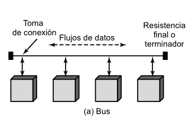
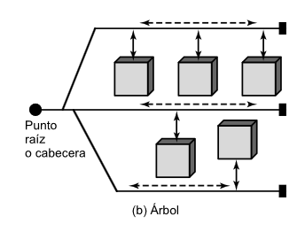
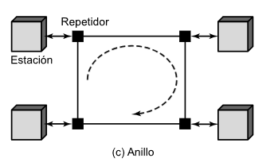
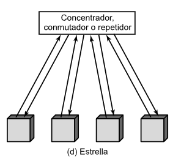

# Trabajo Práctico N°4

**Integrantes del Grupo:**

| Name                            | DNI      | Mail UNC                          | Github                                                             |
| ------------------------------- | -------- | --------------------------------- | ------------------------------------------------------------------ |
| Viberti, Benjamin               | 46224179 | b.viberti@mi.unc.edu.ar           | [@benjaviberti](https://github.com/benjaviberti)                   |
| Espinoza Sutta, Aaron Alejandro | 96009173 | aaron.espinoza_4500@mi.unc.edu.ar | [@Aaron45000](https://github.com/Aaron45000)                       |
| Cleri, Juan Ignacio             | 46452662 | ignacio.cleri@mi.unc.edu.ar       | [@IgnaCleri](https://github.com/IgnaCleri)                         |
| Pineda, Juan Ignacio            | 45591343 | juan.ignacio.pineda@mi.unc.edu.ar | [@juanignaciopineda-dot](https://github.com/juanignaciopineda-dot) |
| Grafión, Atilio Leonel          | 43940195 | atilio.grafion@mi.unc.edu.ar      | [@Aollgn](https://github.com/Aollgn)                               |
| Badenes, Tomás                  | 44785038 | tomasbadenes@mi.unc.edu.ar        | [@b-Tomas](https://github.com/b-Tomas)                             |
| Oviedo, Ignacio Nicolas         | 43940195 | ignacio.oviedo.239@mi.unc.edu.ar  | [@GIX02](https://github.com/GIX02)                                 |
| Mendez, Jorge Nicolas           | 41301342 | jorge.mendez@mi.unc.edu.ar        | [@jorge088](https://github.com/jorge088)                           |

# PREGUNTAS DE REPASO - Capítulo 15

## 15.1. ¿Qué diferencias hay entre los requisitos clave para las redes existentes en salas de computadores de aquellos necesarios para redes de área local de computadores personales?

El libro relaciona "redes en salas de computadores" con redes de respaldo o *backend* comunicando centalizaciones de cómputo o almacenamiento de datos. Situándonos temporalmente en el año 2004 en el que se editó el libro, las redes "exitentes" eran redes de este tipo, y las redes LAN eran consideradas "recientes".

Teniendo esto en cuenta, podemos decir que las diferencias entre los requisitos de las redes *backend* y las redes LAN de computadoras personales son:
- Coste de la conexión a la red: En redes de computadoras personales el coste de acceso a la red debe ser significativamente menor que el coste del propio equipo, en general limitando la velocidad de la red.
- Velocidad de la red: Como resultado del punto anterior las redes LAN de computadoras personales pueden estar limitadas en velocidad, mientras que para las redes de respaldo y almacenamiento la velocidad es un requisito clave.
- Cobertura y cantidad de dispositivos: Una red LAN de computadoras personales puede abarcar una o varias oficinas y múltiples estaciones u otros dispositivos como impresoras, mientras que en redes *backend* la cobertura suele limitarse a unos pocos dispositivos de alto rendimiento ubicados en un mismo lugar.
- Fiabilidad: En redes de *backend* se prioriza la fiabilidad para maximiza la productividad de los sistemas, mientas que en redes LAN la fiabilidad puede no ser crítica. Esto implica que para redes *backend* puede implementarse un acceso al medio distribuido mas eficiente que el control centralizado típico de una red LAN personal.

## 15.2. ¿Qué diferencias hay entre una red LAN de respaldo, una red SAN y una red LAN troncal?

- Red LAN *backend*: conecta sistemas grandes como servidores, sistemas de cómputo y almacenamiento de datos priorizando velocidad y fiabilidad para la transferencia de datos entre pocos dispositivos.
- Red SAN (*Storage Area Network*): es una red independiente de uso exclusivo para gestión y almacenamiento de datos, ofreciendo un servicio de almacenamiento compartido. A diferencia de una LAN típica donde los servidores tienen su sistema de almacenamiento local, en una SAN no hay servidor entre los dispositivos de almacenamiento y la red sino que los servidores y los dispositivos de almacenamiento están directamente conectados a la red. La red prioriza la comunicación entre dispositivos de almacenamiento (para, por ejemplo, crear réplicas de datos) y la eficiencia de acceso de los clientes al almacenamiento.
- Red LAN troncal: su objetivo es interconectar distintas redes LAN de una misma organización, por lo que debe ser fiable y rápida, aunque por razones distintas que los otros tipos de redes LAN.

## 15.3. ¿Qué es la topología de una red?

La topología de una red define la manera en que se conectan entre sí las estaciones de la red.

## 15.4. Enumere cuatro topologías comunes para redes LAN y describa brevemente su principio de funcionamiento.

Las topologías mas comunes para redes LAN son cuatro:
- **Bus**: las estaciones se conectan mediante *taps* *full-duplex* a un medio lineal (generalmente un cable coaxial) con terminadores resistivos en ambos extremos para evitar las reflexiones de la señal. Las transisiones de cualquier estación se propagan a todas las demás estaciones, que identifican si el mensaje está dirigido a ellas. Requiere arbitraje del medio para evitar colisiones.

- **Árbol**: es una generalización del bus, donde el medio lineal se ramifica mediante concentradores (*hubs*) en segmentos.

- **Anillo**: las estaciones se conectan en un anillo cerrado mediante repetidores. Una trama viaja a través del anillo completo, siendo copiada al pasar por la estación destino, y es eliminada del anillo al volver al emisor. También requiere control de acceso al medio para evitar colisiones.

- **Estrella**: las estaciones se conectan a un nodo central común mediante dos enlaces punto a punto (uno para transmisión y el otro para recepción). En el caso de que el nodo central sea un *hub*, la red actúa como un bus produciendo la difusión de tramas en toda la red. En el caso de que el nodo central sea un conmutador (*switch*), las tramas viajan (en lo posible) únicamente al destino. Conectando varios nodos centrales entre sí se logran topologías mas complejas que requieren la implementación de sistemas de encaminamiento.

## 15.5. ¿Cuál es el propósito del comité IEEE 802?

Tener un estándares para regular las redes de área local (LAN) y redes de área metropolitana (MAN) principalmente

## 15.6. ¿Por qué existen diferentes normativas para redes LAN?

Estas existen para cubrir los distintos medio fisicos de forma optima, los requerimentos del entorno (si es de bajo costo o maximo rendimiento). 

## 15.7. Enumere y describa brevemente los servicios proporcionados por LLC.

Los servicios proporcionados por el Control de Enlace Logico son lo siguientes:

- **Servicio no orientado a conexión sin confirmación:** este servicio es de tipo datagrama. Es muy sencillo, puesto que no incluye mecanismos de control de flujo ni de errores, por lo que no está garantizada la recepción de los datos.

- **Servicio en modo conexión:** En este servicion se establece una conexión lógica entre dos usuarios que intercambian datos, existiendo control de flujo y de errores.

- **Servicio no orientado a conexión con confirmación:** es una mezcla de los dos anteriores. Los datagramas son confirmados, pero no se establece conexión lógica previa.

## 15.8. Enumere y describa brevemente los modos de operación proporcionados por el protocolo LLC.

### Operacion de Tipo 1:

Transmite las tramas de datos sin establecer una sesión o conexión previa y sin requerir acuses de recibo. Tampoco implementa control de flujo ni corrección de errores en la subcapa LLC, aunque existe detección de errores y rechazo a nivel MAC.

### Operacion de Tipo 2:

En este modo se requiere el establecimiento previo de un enlace lógico entre los puntos de acceso al servicio (SAP) del emisor y del receptor antes de iniciar la transferencia de datos.

### Operacion de Tipo 3:

En este modo los datos se envían en sucesivas PDU de orden AC, y deben ser confirmadas usando una PDU de respuesta AC.

## 15.9. Enumere algunas funciones básicas que se realicen en la capa MAC.

1. Encapsulado de datos: Ensamblado y desarmado de tramas (agrega encabezado con direcciones MAC y tráiler de control).
2. Control de acceso al medio: Regulación de la transmisión para compartir el canal físico entre múltiples dispositivos.
3. Detección de errores: Identificación de tramas alteradas usando la secuencia de comprobación de trama.
4. Direccionamiento físico: Identificación unívoca del emisor y receptor dentro de la red local.

## 15.10. ¿Qué funciones lleva a cabo un puente?
* Filtrado y reenvío: Lee la dirección MAC de destino para decidir si transmite la trama a otro segmento o la descarta.
* Aprendizaje automático: Inspecciona las direcciones de origen para construir dinámicamente una tabla de direcciones MAC asignadas a sus puertos.
* Segmentación de red: Divide una red grande en dominios de colisión independientes para reducir el tráfico innecesario.

## 15.11. ¿Qué es un árbol de expansión?
Es una topología lógica sin bucles generada por el protocolo STP. Bloquea de forma selectiva los puertos de enlaces redundantes para evitar tormentas de difusión (broadcast storms) y bucles de capa 2, garantizando una única ruta activa entre cualquier par de nodos.

## 15.12. ¿Qué diferencias existen entre un concentrador y un conmutador de capa 2?
Hub (Capa 1): Es un repetidor pasivo que retransmite las señales a todos sus puertos por igual. Todos los equipos comparten un único dominio de colisión y el mismo ancho de banda.
Switch L2 (Capa 2): Examina la trama y la reenvía únicamente al puerto de destino correspondiente. Otorga un dominio de colisión independiente por puerto y permite transmisiones simultáneas.

## 15.13. ¿Cuál es la diferencia entre un conmutador de almacenamiento y envío y uno rápido?
Almacenamiento y envío: Recibe la trama completa en su memoria intermedia, verifica que no tenga errores mediante el código CRC/FCS y luego la reenvía. Mayor latencia, pero no propaga tramas corruptas.
Conmutación rápida: Lee solo los primeros bytes para obtener la dirección MAC de destino y comienza a reenviar la trama de inmediato. Menor latencia, pero puede reenviar tramas dañadas.

# Bibliografía

Stallings, W. *Comunicaciones y Redes de Computadoras*, 7ma Edición, Pearson, 2004.
