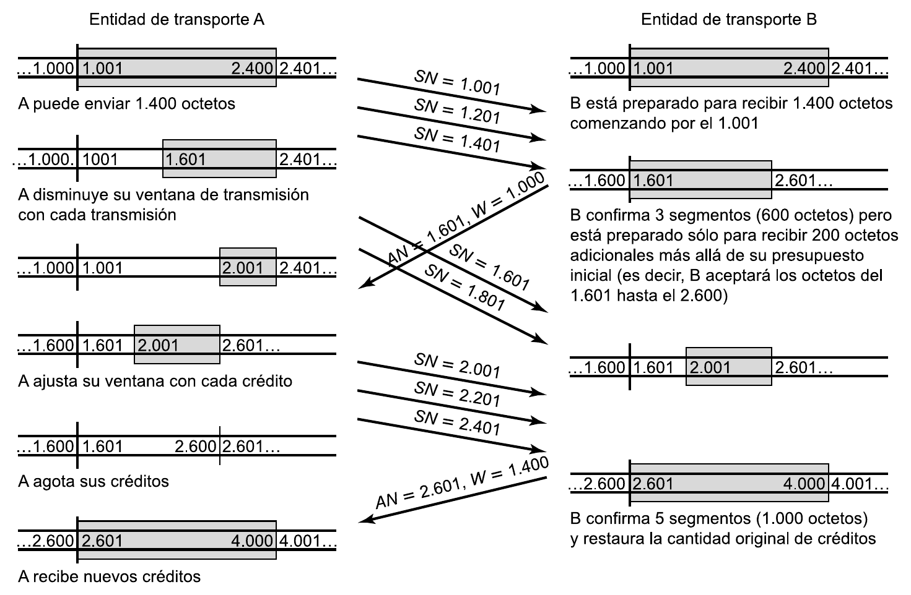
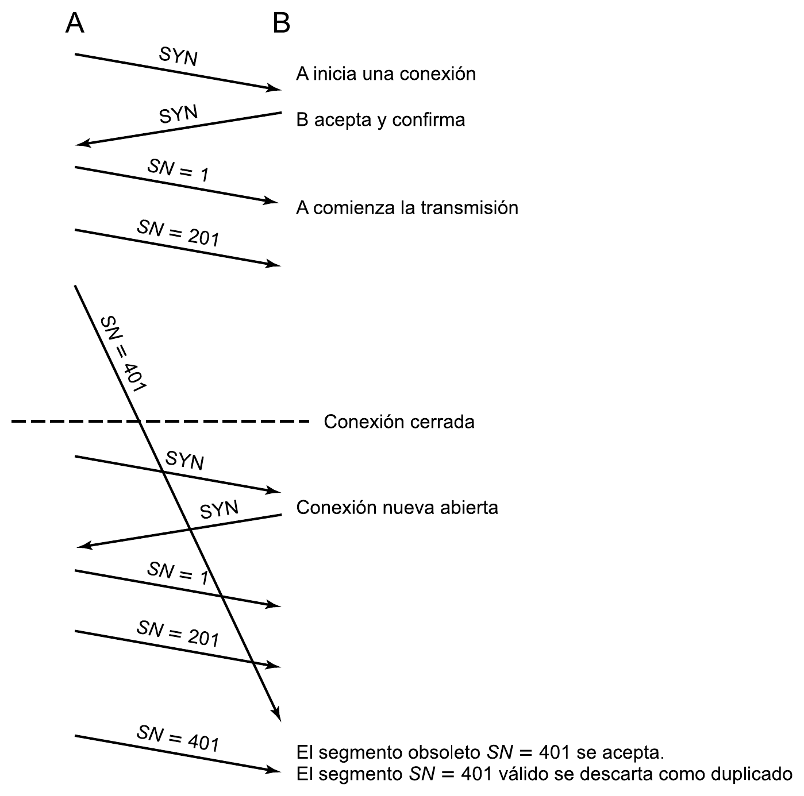
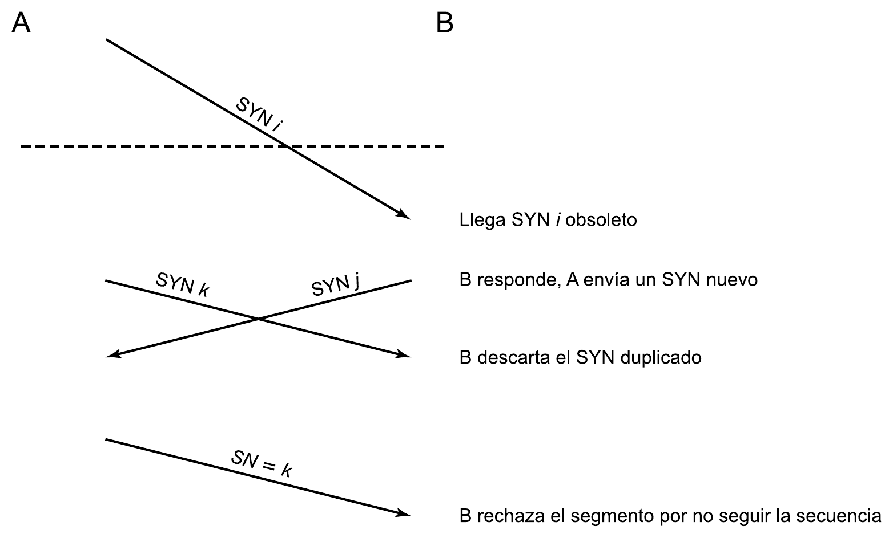
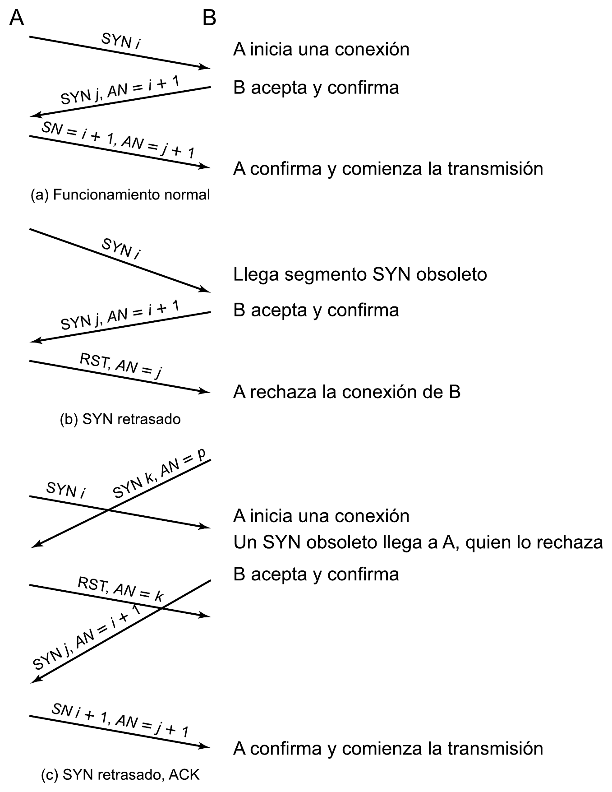

# Protocolos de capa de transporte

Capítulo 20. Protocolos de transporte, Stallings - Comunicaciones y Redes de Computadores 7ed.

> Cada uno responde **solo debajo de su pregunta**, reemplazando `_Respuesta pendiente._`. No modificar títulos ni secciones ajenas, así no hay conflictos al hacer merge.

---

## Actividad 1: Preguntas de repaso (pág. 718)

### Pregunta 20.1

¿Qué elementos de direccionamiento son necesarios para especificar un usuario de servicio de transporte (TS) destino?

_Respuesta pendiente._

### Pregunta 20.2

Describa cuatro estrategias por las que un usuario TS emisor pueda averiguar la dirección de un usuario TS receptor.

_Respuesta pendiente._

### Pregunta 20.3

Explique el uso de la multiplexación en el contexto de un protocolo de transporte.

_Respuesta pendiente._

### Pregunta 20.4

Describa brevemente el esquema de créditos utilizado por TCP para el control de flujo.

Es un control de flujo extremo a extremo donde el receptor le indica explícitamente al emisor cuántos datos puede enviar. Cada octeto tiene un número de secuencia y los segmentos llevan tres campos: número de secuencia (SN, el del primer octeto de datos del segmento), número de confirmación (AN) y ventana (W). Un segmento con (AN = i, W = j) significa:

- Se confirman todos los octetos hasta i − 1; el siguiente esperado es el i.
- Se concede crédito para enviar j octetos más, del i al i + j − 1.

El emisor avanza el borde final de su ventana a medida que transmite y el borde inicial solo cuando recibe crédito nuevo (la ventana se achica al transmitir y se amplía con cada crédito). El receptor no está obligado a confirmar cada segmento: puede enviar una confirmación acumulada.

*Ejemplo del mecanismo de asignación de crédito de TCP.*

El receptor puede ser *conservador* (conceder solo el espacio libre real en su memoria temporal) u *optimista* (conceder espacio que espera liberar, mejorando el rendimiento con retardos grandes; pero si el emisor es más rápido que el receptor se descartan segmentos y hay que retransmitir, lo que complica el protocolo).

### Pregunta 20.5

¿Cuál es la diferencia principal entre el esquema de créditos de TCP y el esquema de control de flujo de ventana deslizante utilizada por muchos otros protocolos, como por ejemplo HDLC?

En la ventana deslizante fija (como en X.25) confirmar y dar permiso de envío son lo mismo: cada confirmación avanza automáticamente una ventana de tamaño fijo, y para frenar al emisor el receptor retiene las confirmaciones. En el esquema de créditos de TCP la **confirmación y el control de flujo están desacoplados**: se puede confirmar un segmento sin conceder crédito nuevo (W = 0) y conceder crédito sin confirmar datos nuevos. Además, la ventana es variable y se mide en octetos, no en tramas.

Esto pesa en redes no fiables: con ventana fija, si el receptor frena reteniendo confirmaciones, el emisor no puede distinguir si la falta de confirmaciones se debe al control de flujo o a una pérdida. Con créditos el receptor confirma aunque no conceda crédito, y la pérdida de un segmento de confirmación/crédito se corrige con las confirmaciones posteriores. El único riesgo es un bloqueo mutuo si se pierde el (AN = i, W = j) que reabre una ventana cerrada con W = 0; se evita con un temporizador de ventana que obliga a reenviar un segmento al expirar.

### Pregunta 20.6

Explique los mecanismos de diálogo en dos y tres pasos.

**Diálogo en dos pasos:** A envía un SYN (solicitud de conexión); si B está en LISTEN, responde con un SYN que funciona como confirmación y pasa a ESTAB, y A pasa a ESTAB al recibirlo. La pérdida de un SYN se cubre con un temporizador de retransmisión, y los SYN duplicados se ignoran una vez establecida la conexión. Basta con un servicio de red fiable, pero sobre una red no fiable falla:

- Un segmento de datos obsoleto de una conexión anterior puede llegar durante una nueva y aceptarse en lugar del válido, que se descarta como duplicado. Para evitarlo, cada conexión empieza con un número de secuencia distinto, que se anuncia en el SYN (SYN i).
- Eso no resuelve un SYN i obsoleto: B lo toma como una solicitud nueva y responde, descarta el SYN real de A como duplicado, y ambos creen tener una conexión válida con números de secuencia distintos, por lo que B rechaza los datos de A.

*Diálogo en dos pasos: un segmento de datos obsoleto se acepta en una conexión nueva.*

*Diálogo en dos pasos: un SYN obsoleto desincroniza los números de secuencia.*

**Diálogo en tres pasos (usado por TCP):** cada extremo confirma explícitamente el SYN y el número de secuencia inicial (ISN) del otro. El SYN ocupa el número i, por lo que el primer octeto de datos es el i + 1:

1. A → B: SYN, SN = i
2. B → A: SYN, SN = j, AN = i + 1
3. A → B: SN = i + 1, AN = j + 1 (es el primer segmento de datos de A)

Se agrega el estado SYN RECEIVED, para no declarar la conexión establecida hasta que ambos SYN estén confirmados, y el segmento RST. La regla es enviar RST si la conexión todavía no está en ESTAB y llega un ACK inválido (que no referencia nada enviado):

- Si un SYN i obsoleto llega a B, este responde SYN j, AN = i + 1; A no pidió esa conexión y responde RST, AN = j. El AN en el RST evita que un RST obsoleto cancele una apertura legítima.
- Si un SYN/ACK obsoleto (SYN k, AN = p) llega a A mientras abre una conexión, A responde RST, AN = k y la apertura real sigue sin problemas, porque las confirmaciones llevan números de secuencia.

*Diálogo en tres pasos: (a) funcionamiento normal, (b) SYN retrasado, (c) SYN/ACK obsoleto durante una apertura.*

### Pregunta 20.7

¿Cuál es el beneficio del mecanismo de diálogo en tres pasos?

_Respuesta pendiente._

### Pregunta 20.8

Defina las características de urgencia y forzado de TCP.

_Respuesta pendiente._

### Pregunta 20.9

¿Qué es una opción en los criterios de implementación de TCP?

_Respuesta pendiente._

### Pregunta 20.10

¿Cómo puede utilizarse TCP para tratar la congestión de red o de interconexión de red?

_Respuesta pendiente._

### Pregunta 20.11

¿Qué proporciona UDP que no ofrezca IP?

_Respuesta pendiente._

---

## Actividad 2: Ejercicios (pág. 719) — mínimo 11

### Ejercicio 20.1

Es una práctica común en la mayoría de los protocolos de transporte (en realidad, en la mayoría de los protocolos de todas las capas) que los datos y la señalización de control se multiplexen sobre el mismo canal lógico en cada conexión por usuario. Una alternativa consiste en establecer una única conexión de control de transporte entre cada par de entidades de transporte que se comuniquen. Esta conexión se usaría para transmitir las señales de control de todas las conexiones de los usuarios de transporte entre las dos entidades. Discuta las implicaciones de esta estrategia.

_Respuesta pendiente._

### Ejercicio 20.2

La discusión sobre control de flujo con un servicio de red fiable, referido como mecanismo de contrapresión, utiliza un protocolo de control de flujo de una capa inferior. Discuta las desventajas de esta estrategia.

_Respuesta pendiente._

### Ejercicio 20.3

Dos entidades de transporte se comunican a través de una red fiable. Supongamos que el tiempo normalizado para transmitir un segmento es igual a 1. Supongamos que el retardo de propagación extremo a extremo vale 3 y que la entrega de un segmento recibido al usuario de transporte requiere un tiempo de 2. El emisor tiene inicialmente concedido un crédito de siete segmentos. El receptor utiliza un criterio de control de flujo conservador y actualiza su asignación de créditos en cuanto puede. ¿Cuál es el máximo rendimiento alcanzable?

_Respuesta pendiente._

### Ejercicio 20.4

Dibuje un diagrama similar al de la Figura 20.4 para los siguientes casos (suponga un servicio de red fiable ordenado):

- a) Cierre de la conexión: activo/pasivo.
- b) Cierre de la conexión: activo/activo.
- c) Rechazo de la conexión.
- d) Cancelación de la conexión: un usuario emite un Open a un usuario que está preparado y entonces emite un Close antes de que se intercambie ningún dato.

_Respuesta pendiente._

### Ejercicio 20.5

Con un servicio de red fiable y ordenado, ¿son estrictamente necesarios los números de secuencia de los segmentos? ¿Qué capacidad se pierde sin ellos?

_Respuesta pendiente._

### Ejercicio 20.6

Considere un servicio de red orientado a conexión que sufre un reinicio. ¿Cómo podría ser tratado por un protocolo de transporte que suponga que el servicio de red es fiable excepto en el caso de un reinicio?

_Respuesta pendiente._

### Ejercicio 20.7

La discusión de la política de retransmisión hizo referencia a tres problemas asociados con el cálculo dinámico del valor del temporizador. ¿Qué modificaciones sobre la política ayudarían a aliviar estos problemas?

_Respuesta pendiente._

### Ejercicio 20.8

Considere un protocolo de transporte que usa un servicio de red orientado a conexión. Suponga que ese protocolo de transporte utiliza un esquema de asignación de créditos para el control de flujo y que el protocolo de red usa un esquema de ventana deslizante. ¿Qué relación, si existe, debería haber entre la ventana dinámica del protocolo de transporte y la ventana fija del protocolo de red?

_Respuesta pendiente._

### Ejercicio 20.9

En una red que tiene un tamaño máximo de paquete de 128 bytes, un tiempo de vida máximo de 30 s y un número de secuencia de paquetes de 8 bits, ¿cuál es la máxima tasa de transmisión de datos por conexión?

_Respuesta pendiente._

### Ejercicio 20.10

¿Es posible que se produzca un bloqueo mutuo utilizando un diálogo en dos pasos en lugar de un diálogo en tres pasos? Dé un ejemplo o demuéstrelo en caso contrario.

_Respuesta pendiente._

### Ejercicio 20.11

A continuación, se enumeran cuatro estrategias que se pueden utilizar para proporcionar a un usuario de transporte las direcciones de un usuario de transporte destino. Para cada una, describa una analogía con el usuario del servicio de correo postal.

- a) Conocer la dirección de antemano.
- b) Hacer uso de una dirección «bien conocida».
- c) Utilizar un servidor de nombres.
- d) El destinatario se genera al realizar la solicitud.

_Respuesta pendiente._

### Ejercicio 20.12

En un esquema de créditos para control de flujo como el de TCP, ¿qué provisión de créditos se podría hacer para la asignación de créditos que se pierdan o se desordenen durante la transmisión?

_Respuesta pendiente._

### Ejercicio 20.13

¿Qué ocurre en la Figura 20.3 si llega un SYN mientras el usuario solicitado está en el estado CLOSED? ¿Hay alguna forma de llamar la atención del usuario cuando no esté preparado?

_Respuesta pendiente._

### Ejercicio 20.14

En la discusión sobre el cierre de la conexión con referencia a la Figura 20.8, se estableció que además de recibir una confirmación de su segmento FIN y enviar una confirmación del segmento FIN recibido, una entidad TCP debe esperar un intervalo de tiempo igual al doble del máximo tiempo de vida esperado de un segmento (el estado TIME WAIT). La recepción de un ACK de su segmento FIN le asegura que todos los segmentos que ha enviado han sido recibidos por el otro extremo. El envío de un ACK del segmento FIN del otro extremo asegura a la otra entidad que todos sus segmentos han sido recibidos. Dé una razón por la que se necesite aún esperar antes de cerrar la conexión.

_Respuesta pendiente._

### Ejercicio 20.15

Normalmente, el campo «ventana» de la cabecera TCP da una asignación de créditos en octetos. Cuando se utiliza la opción de «escalado de ventana», el valor del campo «ventana» se multiplica por 2^F, donde F es el valor de la opción de escalado de ventana. El valor máximo de F que acepta TCP es 14. ¿Por qué se limita esta opción a 14?

_Respuesta pendiente._

### Ejercicio 20.16

La elección de un valor inicial del estimador original de SRTT de TCP constituye un problema. En ausencia de alguna información especial sobre las condiciones de la red, la opción habitual es la de elegir un valor arbitrario, como 3 segundos, y esperar que converja rápidamente a un valor preciso. Si la estimación es demasiado baja, TCP llevará a cabo retransmisiones innecesarias. Si es demasiado alta, TCP esperará demasiado tiempo antes de retransmitir en caso de que el primer segmento se pierda. Es más, la convergencia puede ser lenta, como indica este problema.

- a) Elija α = 0,85 y SRTT(0) = 3 segundos, suponga que todos los valores de RTT medidos son iguales a 1 segundo y que no se producen pérdidas de paquetes. ¿Cuál es el valor de SRTT(19)? Sugerencia: la Ecuación (20.3) se puede reescribir para simplificar los cálculos, utilizando la expresión (1 − αⁿ)/(1 − α).
- b) Sea ahora SRTT(0) = 1 segundo y suponga que los valores medidos de RTT son 3 segundos y que no se produce pérdida de paquetes. ¿Cuál es el valor de SRTT(19)?

_Respuesta pendiente._

### Ejercicio 20.17

Una mala implementación del esquema de ventana deslizante de TCP puede llevar a un rendimiento extremadamente malo. Existe un fenómeno conocido como el «síndrome de la ventana absurda» (SWS, Silly Window Syndrome), que puede fácilmente causar una degradación del rendimiento en varios factores de 10. Como ejemplo de SWS, considere una aplicación que está ocupada en la transferencia de un fichero largo y que TCP está transfiriendo el fichero en segmentos de 200 octetos. El receptor inicialmente asigna un crédito de 1.000. El emisor agota esta ventana con 5 segmentos de 200 octetos. Ahora suponga que el receptor devuelve una confirmación por cada segmento y proporciona un crédito adicional de 200 octetos por cada segmento recibido. Desde el punto de vista del receptor, esto abre la ventana de nuevo a 1.000 octetos. Sin embargo, desde el punto de vista del emisor, si la primera confirmación llega tras haber enviado cinco segmentos, se dispone de una ventana de sólo 200 octetos. Suponga que en algún momento el receptor calcula una ventana de 200 octetos pero tiene sólo 50 octetos para enviar hasta llegar a un punto de forzado. Por tanto, envía 50 octetos en un segmento, seguido de 150 octetos en el siguiente segmento, y reanuda la transmisión de segmentos de 200 octetos. ¿Qué podría ahora ocurrir para dar lugar a un problema de rendimiento? Plantee el SWS en términos más generales.

_Respuesta pendiente._

### Ejercicio 20.18

TCP impone que tanto el receptor como el emisor incorporen mecanismos para hacer frente al SWS.

- a) Sugiera una estrategia para el receptor. Sugerencia: permita al receptor «mentir» sobre la capacidad de memoria temporal de que dispone bajo ciertas circunstancias. Plantee una regla razonable experimental para esto.
- b) Sugiera una estrategia para el emisor. Sugerencia: considere la relación entre la ventana máxima posible de envío y lo que hay disponible para enviar.

_Respuesta pendiente._

### Ejercicio 20.19

En la Ecuación (20.5), reescriba la definición de SRTT(K+1) en función de SERR(K+1). Interprete el resultado.

_Respuesta pendiente._

### Ejercicio 20.20

Una entidad TCP abre una conexión y utiliza el arranque lento. Aproximadamente, ¿cuántos tiempos de ida y vuelta se necesitan antes de que TCP pueda enviar N segmentos?

_Respuesta pendiente._

### Ejercicio 20.21

Aunque el arranque lento con supresión de congestión es una técnica efectiva para hacer frente a la congestión, puede traducirse en largos tiempos de recuperación en redes de alta velocidad, como demuestra este problema:

- a) Suponga un retardo de ida y vuelta de 60 ms (lo que podría ocurrir a través de un continente), un enlace con un ancho de banda disponible de 1 Gbps y un tamaño de segmento de 576 octetos. Determine el tamaño de ventana necesario para mantener lleno el cauce y el tiempo que tardaría en alcanzar el tamaño de ventana después de la expiración del temporizador utilizando el criterio de Jacobson.
- b) Repita (a) para un tamaño de ventana de 16 kbytes.

_Respuesta pendiente._
