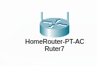

# 4 Red simple en Packet Tracer

## Router

En nuestro caso el router que utilizamos para la red fue el generico home router con la siguiente configuracion:

IP y mascara subred:

Seguridad WPA2-PSK:

