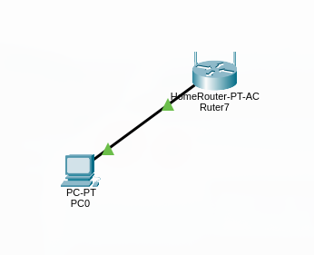
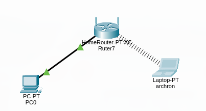
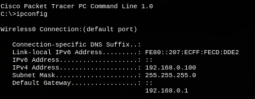
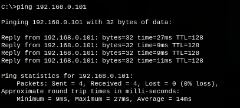

# 4 Red simple en Packet Tracer

## Router

En nuestro caso, el router que utilizamos para la red fue el genérico Home Router con la siguiente configuración:

IP y máscara de subred:

Seguridad WPA2-PSK:

Este router está trabajando con una frecuencia de 2.4 GHz (este router también tiene la posibilidad de trabajar con frecuencia de 5 GHz, pero la desactivé para mantener la simplicidad).

El router, independientemente de si es 2.4 GHz o 5 GHz, está trabajando en la banda de microondas del espectro electromagnético.

## PC de escritorio

La PC de escritorio ya está conectada a la red con la IP 192.168.0.101 vía Ethernet.

## Laptop

La laptop ya está conectada a la red con la IP 192.168.0.100 vía Wi-Fi.

Ahora comprobemos si tiene conexión con la PC que está conectada a la red vía Ethernet.

## Comprobación de conexiones

Ahora comprobaremos la conexión entre la PC y la laptop en distintas posiciones:

### Caso 1: Ambas en la oficina

En este caso, el ping salió de esta manera:

### Caso 2: En el borde interno del límite

En este caso, el ping salió de esta manera:

Un poco mayor al anterior.

### Caso 3: Fuera del límite

En este caso, el comando ping con la PC de escritorio no devolvió nada, ya que al estar fuera del límite de operación del router la laptop se desconectó.

